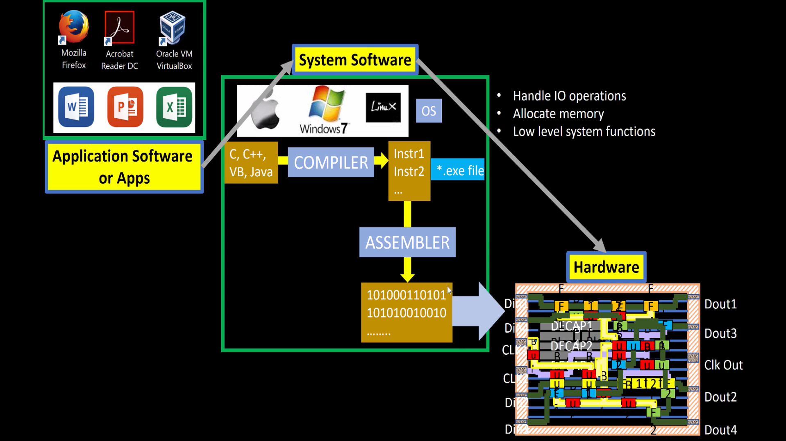
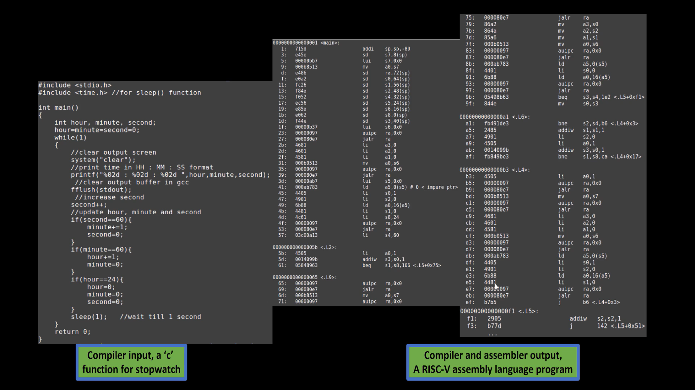

# 1-RV_D1SK1_L2_From_Apps_To_Hardware

## Overview

This lecture explains how software applications are ultimately translated into hardware-level execution inside a processor system.

The lecture establishes the connection between:
- high-level applications
- operating systems
- compilers
- assembly language
- hardware implementation

---

## Key Concepts

### Software to Hardware Flow

The execution flow discussed in the lecture is:

```text
Applications
    ↓
Operating System
    ↓
Compiler
    ↓
Assembly Language
    ↓
Instruction Set Architecture (ISA)
    ↓
Hardware
```



---

### Applications
Applications are programs written using high-level programming languages such as:

- C
- C++
- Python

Examples:

- Browser applications
- Games
- Operating system utilities
- Embedded software

These programs are easy for humans to understand but cannot execute directly on hardware.

---

### Operating System (OS)

The Operating System acts as an interface between:

- applications
- hardware resources

Responsibilities of the OS include:

- process scheduling
- memory management
- file handling
- hardware resource allocation

Examples:

- Linux
- Windows
- macOS

---

### Compiler

A compiler converts high-level language programs into lower-level instructions.

Example:

The GCC compiler:

 - optimizes code
 - generates assembly instructions
 - targets a specific ISA

Example flow:
```text
C Program → Compiler → Assembly Code
```



---

### Assembly Language

Assembly language is a human-readable representation of machine instructions.

Characteristics:

- ISA-specific
- low-level
- closely related to hardware operations

Example RISC-V instruction:
```text
add x5, x1, x2
```

Meaning:

- read x1
- read x2
- perform addition
- store result in x5

---

### Instruction Set Architecture (ISA)

ISA acts as the interface between:

- software
- hardware

It defines:

- supported instructions
- registers
- instruction formats
- addressing modes

The workshop uses:

- RISC-V ISA

---

### Importance of RISC-V

RISC-V is:

- open-source
- modular
- extensible
- simple to learn
- suitable for research and industry

Advantages:

- no licensing restrictions
- customizable architecture
- growing ecosystem

---

### Hardware Execution

- Hardware executes the machine instructions generated from software.
- The processor performs operations on instructions.

---

## Key Learning Outcome

After this lecture, the learner understands:

- how software reaches hardware
- the role of compilers
- why ISA is important
- how processors execute instructions
- why RISC-V is widely used

This understanding is essential before studying:

- assembly programming
- RISC-V ISA
- processor microarchitecture

---

## Notes

This lecture serves as the conceptual bridge between software engineering and hardware/system design and prepares the learner for topics involving RISC-V ISA and RTL design, syntesis and physical design of a RISC-V based CPU core.