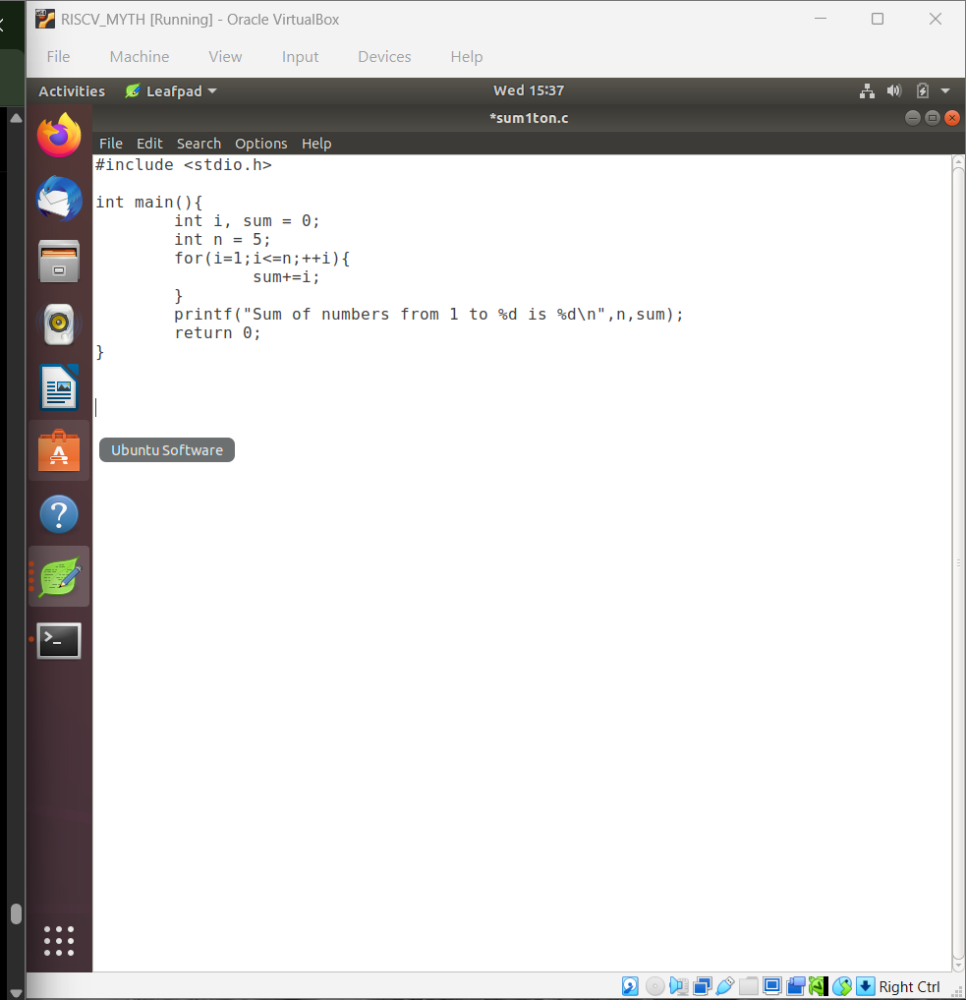
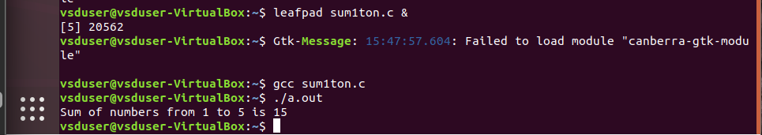

# 3-RV_D1SK2_L1_C_Program_To_Compute_Sum_From_1_to_N

## Overview

This lecture introduces a simple C program used to compute the sum of numbers from 1 to N.

The purpose of this lecture is to:
- understand basic C program structure
- observe how high-level programs are compiled
- prepare for RISC-V compilation and assembly analysis
- connect software execution with hardware implementation

This program will later be compiled using the RISC-V GCC toolchain.

---

# Problem Statement

Compute:

```text
1 + 2 + 3 + ... + N
```

For example:
```text
If N = 5

Sum = 1 + 2 + 3 + 4 + 5
    = 15
```

---

# C Program



---

# Program Explanation

## Variable Declaration


```text
int i, sum = 0, n = 5;
```

- i → loop counter
- sum → stores running total
- n → upper limit

---

## For Loop Operation

```text
for(i = 1; i <= n; i++)
```

Loop behavior:

- starts from 1
- increments by 1
- stops at n

---

## Accumulation Logic

```text
sum = sum + i;
```

At every iteration current value of i is added to sum.

Example execution:

| Iteration | i | sum |
|------------|---|-----|
| 1 | 1 | 1 |
| 2 | 2 | 3 |
| 3 | 3 | 6 |
| 4 | 4 | 10 |
| 5 | 5 | 15 |



---

# Flow of Execution

The overall execution flow is:
```text
C Source Code
      ↓
Compiler
      ↓
Assembly Code
      ↓
Machine Code
      ↓
Processor Execution
```

This forms the basis for future lectures involving:

- RISC-V compilation
- disassembly
- Spike simulation

---

# Importance of This Example

This simple program helps demonstrate:

- loops
- arithmetic operations
- variable storage
- program flow
- compiler translation

---

# Connection to Hardware

The processor eventually performs:

- register reads
- additions using ALU
- branch comparisons
- loop control

Even a simple C program ultimately becomes hardware operations inside the CPU.

---

# Key Learning Outcome

After this lecture, the learner understands:

- how a basic C program is structured
- how loops execute
- how arithmetic operations work
- how software programs eventually execute on processor hardware

This prepares the learner for:

- RISC-V ISA and GCC compilation
- assembly analysis
- ISA understanding

---

# Notes

This lecture introduces the first practical software example used throughout the workshop to demonstrate the transition from software to assembly, and then to hardware execution.