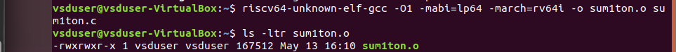
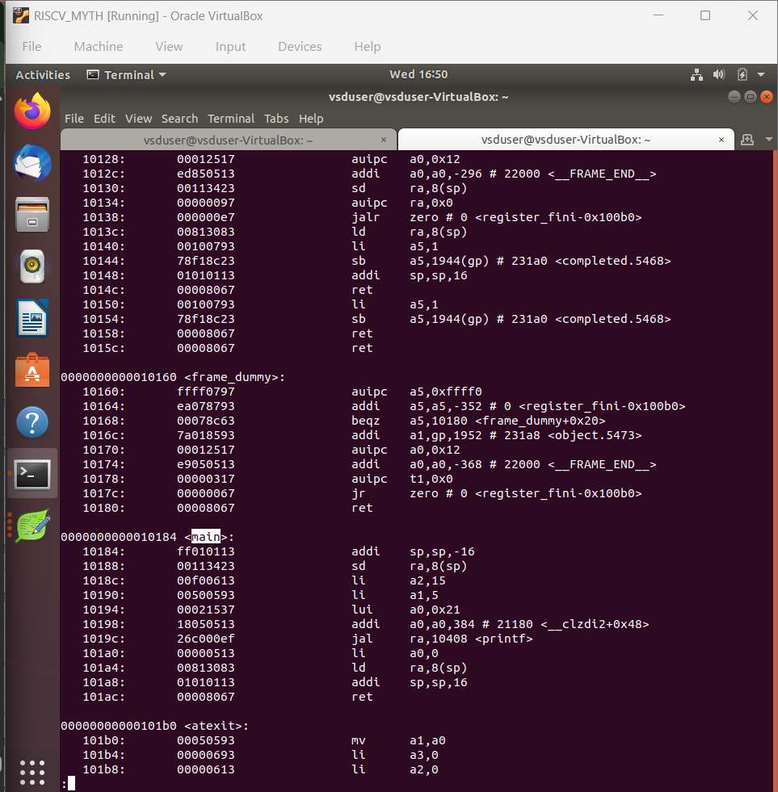
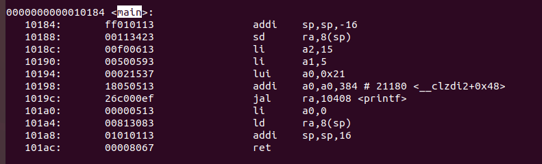

# 4-RV_D1SK2_L2_RISCV_GCC_compile_And_Disassemble

## Overview

This lecture introduces the RISC-V GCC compiler toolchain and demonstrates how a simple C program is:
- compiled for the RISC-V architecture
- converted into assembly instructions
- disassembled for analysis

The lecture forms the foundation for understanding:
- compiler flow
- assembly generation
- instruction-level execution
- software-to-hardware translation

---

# Objectives

The main objectives of this lecture are:

- compile a C program using the RISC-V GCC compiler
- generate assembly code
- understand disassembly output
- analyze generated RISC-V instructions

---

# Compilation Flow

The compilation flow discussed in the lecture is:

```text
C Program
    ↓
RISC-V GCC Compiler
    ↓
Object File / Executable
    ↓
Disassembly
    ↓
RISC-V Assembly Instructions
```

---

## RISC-V GCC Compiler

The workshop uses the RISC-V GCC cross-compiler.

Compiler used:
```text
riscv64-unknown-elf-gcc
```

This compiler generates binaries specifically for RISC-V ISA.

---

## Compiling the C Program



---

## Command Breakdown 

| Option         | Meaning                    |
| -------------- | -------------------------- |
| `-O1`          | Optimization level 1       |
| `-mabi=lp64`   | ABI selection              |
| `-march=rv64i` | Target RISC-V architecture |
| `-o`           | Output executable name     |

---

## Disassembly

Disassembly converts machine code back into readable assembly instructions.


The disassembly output helps analyze:

- generated instructions
- register usage
- loops
- arithmetic operations
- branch instructions



---

## Assembly-Level View of the Loop

The original C loop:
```text
for(i = 1; i <= n; i++)
```

gets translated into:

- compare instructions
- branch instructions
- arithmetic updates
- loop control logic

This demonstrates how high-level constructs become low-level processor operations.



---

## Importance of Disassembly

Disassembly is important because it allows us to:

- analyze compiler optimizations
- debug programs
- understand processor execution
- inspect generated instructions
- connect software with hardware execution

---

## Optimization Levels

Compiler optimizations affect:

- instruction count
- execution speed
- generated assembly structure

---

## Software to Hardware Connection

The generated assembly instructions eventually execute as:

- ALU operations
- register reads/writes
- memory accesses
- branch decisions

inside the processor hardware.

---

# Key Learning Outcome

After this lecture, the learner understands:

- how GCC compiles programs for RISC-V
- how executables are generated
- how disassembly works
- how assembly instructions are formed
- how software maps to hardware execution

---

# Notes

This lecture establishes the complete transition from C source code to assembly instructions, and then to processor execution.