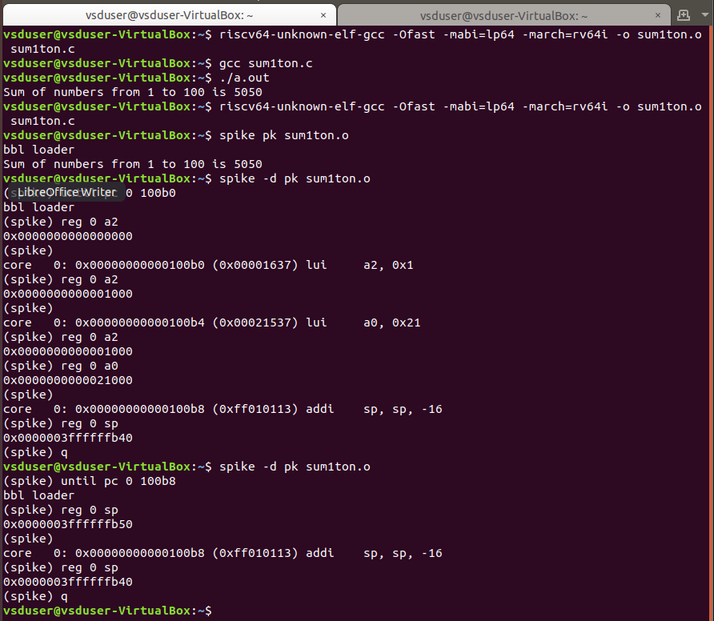
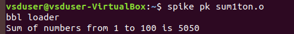
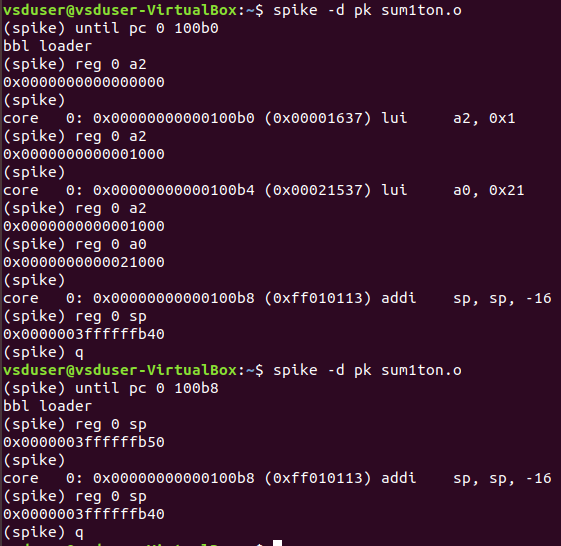

# 5-RV_D1SK2_L3_Spike_Simulation_And_Debug

## Overview

This lecture introduces:
- Spike RISC-V simulator
- program execution on a simulated RISC-V processor
- debugging using Spike
- instruction-level analysis

The lecture demonstrates how compiled RISC-V programs can be:
- executed
- traced
- debugged
- analyzed instruction-by-instruction

This forms a major step towards understanding processor execution behavior.

---

# What is Spike?

Spike is the official RISC-V ISA simulator.

It is used to:
- execute RISC-V binaries
- simulate processor behavior
- debug instructions
- inspect registers and memory

Spike helps learners understand how instructions execute internally inside a RISC-V processor.

---

# Simulation Flow

The overall execution flow is:

```text
C Program
    ↓
RISC-V GCC Compiler
    ↓
RISC-V Executable
    ↓
Spike Simulator
    ↓
Instruction Execution
```



---

# Executing a Program Using Spike

Command:



Where:

- spike → RISC-V simulator
- pk → proxy kernel
- sum1ton.o → compiled executable

This executes the program on the simulated RISC-V processor.

---

# Debug Mode in Spike

Spike also supports instruction-level debugging.

Command:



The -d option enables:

- interactive debug mode
- instruction stepping
- register inspection

---

# Instruction Stepping

Spike allows step-by-step instruction execution.

Operations include:

- executing one instruction at a time
- inspecting registers
- analyzing program counter movement

This helps understand:

- how loops execute
- register updates
- ALU operations
- control flow

---

# Important Debug Commands

Common Spike debug commands:

| Command | Purpose                    |
| ------- | -------------------------- |
| `reg`   | View register contents     |
| `pc`    | View program counter       |
| `q`     | Quit debugger              |
| `until` | Run until specific address |
| `run`   | Continue execution         |

---

# Register Observation

The lecture demonstrates how:

- registers change during execution
- arithmetic instructions update registers
- loop variables are stored internally

---

# Program Counter (PC)

The Program Counter:

- stores address of current instruction
- increments during sequential execution
- changes during branches/jumps

Understanding PC movement is critical for instruction flow analysis.

---

# Importance of Spike

Spike is important because it allows:

- ISA-level verification
- instruction debugging
- compiler output validation
- hardware/software understanding

It bridges the gap between assembly instructions and processor execution behavior.

---

# Connection to Hardware

Each instruction executed in Spike corresponds to actual processor operations. This helps learners visualize how software executes on hardware.

---

# Key Learning Outcome

After this lecture, the learner understands:

- how to execute RISC-V programs using Spike
- how instruction-level simulation works
- how to debug assembly execution
- how registers and PC change during execution
- how processor execution flow operates

---

# Notes

This lecture introduces:

- instruction-level debugging
- processor execution visibility
- ISA simulation

These may be fundamental for understanding how processors execute software internally.


