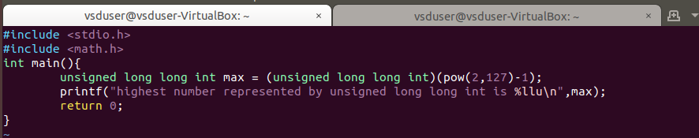
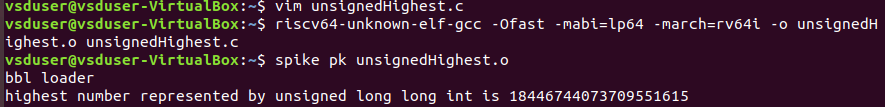
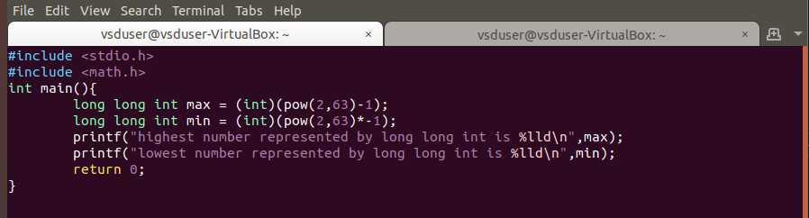
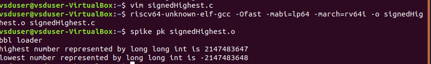
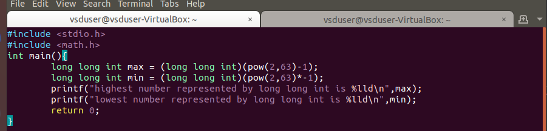
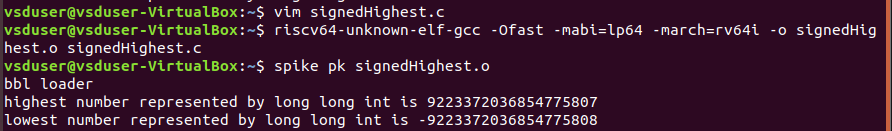

# 8-RV_D1SK3_L3_Lab_For_Signed_And_Unsigned_Numbers

## Overview

This lecture demonstrates practical laboratory exercises involving:
- signed numbers
- unsigned numbers
- binary arithmetic
- overflow conditions
- 2’s complement operations

The session helps learners understand how numerical representations behave inside digital hardware systems and processors.

The lecture builds upon previous concepts involving:
- binary representation
- unsigned number systems
- signed number systems
- 2’s complement arithmetic

---

# Objectives

The main objectives of this lab are:

- understand practical binary arithmetic
- observe signed and unsigned behavior
- analyze overflow conditions
- understand 2’s complement calculations

---

# Unsigned Number Arithmetic

Unsigned arithmetic operates only on:
- positive values
- zero

---

# Signed Number Arithmetic

Signed arithmetic, using 2’s complement representation, allows:

- positive values
- negative values

---

# 2’s Complement Verification

The lecture demonstrates:

- how negative numbers are represented
- how arithmetic operations work internally
- why 2’s complement simplifies hardware design

---

# Overflow in Unsigned Numbers

Overflow occurs when arithmetic result exceeds representable range.





---

# Overflow in Signed Numbers

Signed overflow occurs when result exceeds signed representable range.

---

# Issue Observation — Incorrect Range for `long long int`

During the lab, a C program was written to calculate the highest and lowest values representable using `long long int`.





## Expected Output

For a 64-bit signed long long int, the correct range should be:

- Maximum =  9223372036854775807
- Minimum = -9223372036854775808

## Why the Error Occurs

The issue is caused by:
```text
(int)(pow(2,63)-1)
```
and
```text
(int)(pow(2,63)*-1)
```
The values are explicitly typecast to:
```text
int
```
instead of:
```text
long long int
```
## Problem with int

On most systems:
```text
int = 32 bits
```
Range:
```text
-2147483648 to 2147483647
```
Therefore the 64-bit value gets truncated, overflow occurs, and incorrect output is produced.

## Corrected Version





---

# Importance of Signed vs Unsigned Arithmetic

Processors treat signed and unsigned values differently.

Examples:

- comparison instructions
- branch operations
- arithmetic instructions
- overflow detection

RISC-V also contains:

- signed operations
- unsigned operations

---

# Lab Observations

The lecture demonstrates:

- binary arithmetic behavior
- practical overflow examples
- signed/unsigned differences

---

# Key Learning Outcome

After this lecture, the learner understands:

- signed arithmetic
- unsigned arithmetic
- overflow behavior
- 2’s complement calculations

---

# Notes

This lecture is important because processor hardware fundamentally relies on:

- binary arithmetic
- signed/unsigned interpretation
- overflow handling

for nearly all computation operations.