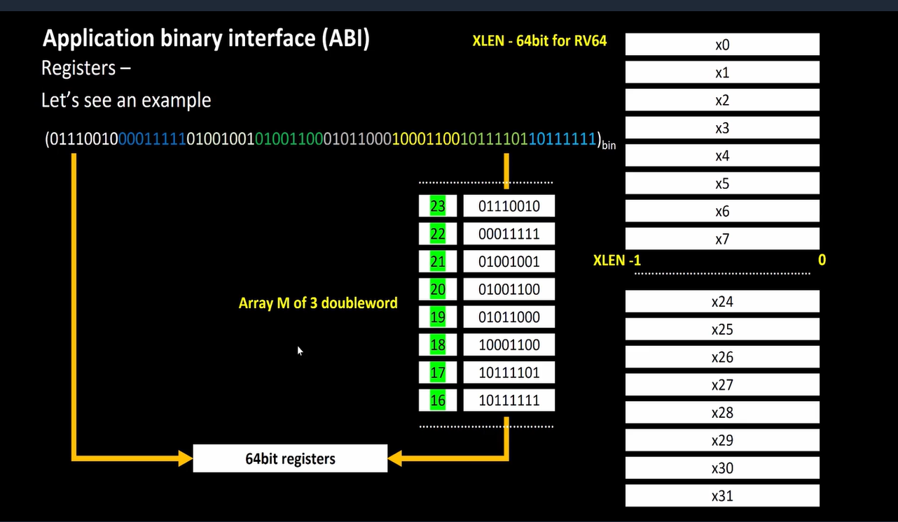

# 10-RV_D2SK1_L2_Memory_Allocation_For_Double_Words

## Overview

This lecture explains:
- memory allocation for double words
- 64-bit register organization
- little endian memory addressing
- byte-wise memory arrangement
- loading data from memory into registers

The lecture also begins answering an important question:

> Why does RISC-V architecture contain only 32 registers?

The concepts discussed in this lecture form the foundation for:
- memory addressing
- load/store instructions
- ISA understanding
- processor datapath operations

---

# 64-Bit RISC-V Architecture

The lecture considers a:

```text id="jlwm72"
RISC-V 64-bit architecture
```

This means:

- all registers are 64 bits wide
- data paths are 64 bits wide
- register bit indexing starts from bit 0 and ends at bit 63

---

# 64-Bit Register Representation

A 64-bit number contains:
```text
Bit 63 ................................ Bit 0
```

Where:

- Bit 63 → Most Significant Bit (MSB)
- Bit 0 → Least Significant Bit (LSB)

The lecture uses previously discussed signed/unsigned number examples to explain memory organization.

---

# Positive 64-Bit Number

The lecture explains:

If the MSB is 0, the number is positive.

Therefore:

MSB determines sign in signed number representation.

---

# Loading Data into Registers

The lecture explains that a 64-bit number can be loaded into a register in two ways:

## Method 1 — Directly Available in Register

The data may already exist inside a register.

However:

- registers are limited in number
- registers can store only limited data

## Method 2 — Load from Memory

Data can also be:

- stored in memory
- loaded into registers when required

This introduces the concept of:

- load instructions
- memory addressing



---

# Memory Addresses a Byte

Each memory address stores exactly 1 byte.
Example: 
| Address | Stores |
| ------- | ------ |
| M[0]    | 1 byte |
| M[1]    | 1 byte |
| M[2]    | 1 byte |

---

# Problem Statement

The lecture asks:

If memory stores only 1 byte per address, how is a 64-bit value stored in memory?

Since:
```text
64 bits = 8 bytes
```
the entire double word must be split across 8 consecutive memory addresses.

---

# Byte-Wise Arrangement in Memory

The lecture explains that the least significant byte (LSB) is stored first.

Meaning:

- lowest byte goes to lowest memory address
- next byte goes to next address

and so on

---

# Little Endian Memory Addressing

The lecture introduces Little Endian Memory Addressing System

In Little Endian:

- Least Significant Byte is stored at lowest address
- Most Significant Byte is stored at highest address

Example:
| Memory Address | Stored Byte            |
| -------------- | ---------------------- |
| M[0]           | Least Significant Byte |
| M[1]           | Next Byte              |
| ...            | ...                    |
| M[7]           | Most Significant Byte  |


---

# Most Significant Byte vs Least Significant Byte

The lecture clearly differentiates:
| Term                   | Meaning               |
| ---------------------- | --------------------- |
| MSB                    | Most Significant Bit  |
| Most Significant Byte  | Highest byte          |
| LSB                    | Least Significant Bit |
| Least Significant Byte | Lowest byte           |

---

# Big Endian Memory Addressing

- The lecture also briefly introduces Big Endian Memory Addressing System.
- In Big Endian, Most Significant Byte is stored first
- This is the reverse of Little Endian addressing

---

# RISC-V Uses Little Endian

The lecture explicitly mentions RISC-V belongs to the Little Endian memory addressing system This is part of RISC-V ISA specification.

---

# Double Word Addressing

The lecture explains A double word occupies 8 bytes. Therefore addresses increase in multiples of 8.

Example:
| Double Word | Starting Address |
| ----------- | ---------------- |
| First       | M[0]             |
| Second      | M[8]             |
| Third       | M[16]            |

---

# Array Example

The lecture uses an array example storing 3 double words.

Address ranges:
| Double Word | Address Range |
| ----------- | ------------- |
| First       | 0 → 7         |
| Second      | 8 → 15        |
| Third       | 16 → 23       |

The lecture specifically discusses:

M[16] holding least significant byte
M[23] holding most significant byte

---

# Loading Data into Registers

The lecture concludes by introducing the need for:

- RISC-V ISA instructions
- load operations
- register loading commands

The instructor mentions that the next lecture will discuss:

- exact ISA commands
- actual instructions used for loading data
- relation between memory and registers

---

# Important Observation

The lecture repeatedly emphasizes that registers are limited in number, and therefore most data resides in memory, and registers are used for fast temporary access. This leads the toward understanding of why RISC-V contains only 32 registers.

# Hardware Perspective

The concepts discussed directly relate to:

- datapath design
- memory systems
- cache organization
- load/store architecture
- processor register files

Processors internally:

- fetch bytes from memory
- assemble them into larger words
- load them into registers

according to endian conventions.

---

# Key Learning Outcome

After this lecture, the learner understands:

- 64-bit register organization
- byte-addressable memory
- little endian memory addressing
- double word memory allocation
- memory layout of large data
- relationship between memory and registers

---

# Notes

This lecture introduces how actual data is physically organized inside memory systems in a RISC-V architecture.