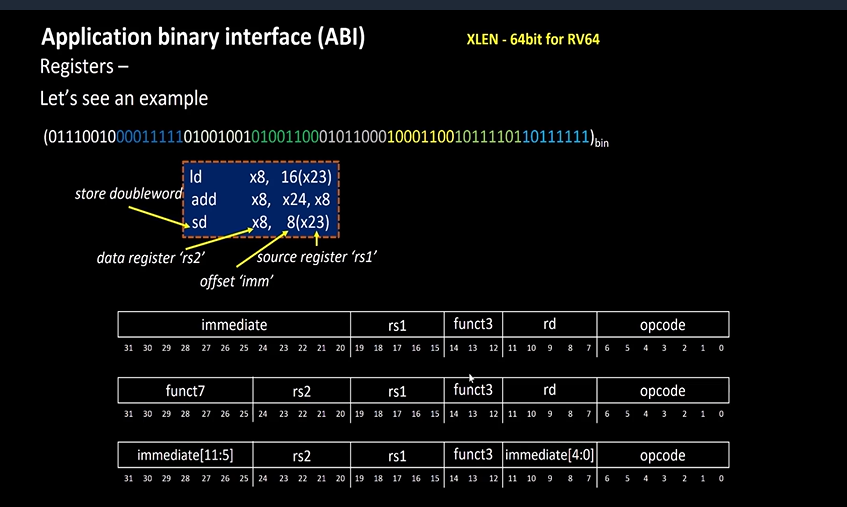

# 11-RV_D2SK1_L3_Load_Add_And_Store_Instructions_With_Example

## Overview

This lecture continues the previous memory allocation example and introduces actual RISC-V ISA instructions used to:
- load data from memory into registers
- perform arithmetic operations
- store results back to memory

The lecture specifically discusses:
- `LD` instruction
- `ADD` instruction
- `SD` instruction
- opcode representation
- instruction bit-fields
- source and destination registers
- immediate values
- instruction encoding

The lecture also begins connecting:
- assembly instructions
- memory operations
- register operations
- instruction bit patterns

---

# Problem Statement

The lecture considers:
- an array containing 3 double words
- memory locations from:
  - 0 → 7
  - 8 → 15
  - 16 → 23

Goal:

```text id="jlwm92"
Load a double word from memory into register x8.
```

---

# Base Address Register

The lecture uses:
```text
x23
```
to store base address of memory.

Example:
```text
x23 = 0
```
This means memory starts from address 0.

The instructor repeatedly refers to x23 as the source register/base address register.

---

# Loading Data from Memory

The RISC-V instruction introduced is:
```text
ld x8, 16(x23)
```
## Meaning of the Instruction

| Field | Meaning                 |
| ----- | ----------------------- |
| `LD`  | Load Double Word        |
| `x8`  | Destination register    |
| `16`  | Immediate offset        |
| `x23` | Source register (`rs1`) |

## Effective Address Calculation

The lecture specifically explains:
```text
Final Address = Offset + Contents of x23
```
Example:
```text
16 + 0 = 16
```
Therefore memory pointer reaches address 16.

Since instruction is load, processor loads 8 bytes (double word) from:
```text
address 16 → 23
```
into register x8.

## Little Endian Loading

The lecture again emphasizes RISC-V uses Little Endian memory system.

Therefore:

- least significant byte loads first
- bytes are reconstructed inside register according to little endian arrangement

## Instruction Representation Inside Computer

The lecture then explains how instructions themselves are represented inside hardware.

All RISC-V instructions are generally 32 bits even though registers are 64-bit.

This applies to:

- RV32
- RV64

## ld Instruction Format

The lecture explains the bit-fields of the ld instruction.

### Opcode Fields

The instructor explains:
```text
Opcode = combination of opcode bits + func3
```

## ld Instruciton Fields

| Bits    | Field                  |
| ------- | ---------------------- |
| 0 → 6   | Opcode                 |
| func3   | Additional opcode bits |
| rs1     | Source register        |
| rd      | Destination register   |
| 20 → 31 | Immediate value        |

## Register Encoding

The lecture specifically discusses:
```text
rd = x8
```
Binary representation:
```text
01000
```
which corresponds to decimal value 8.

Similarly x23 is encoded using 5-bit register representation.

---

# ADD Instruction

Next instruction introduced:
```text
add x8, x24, x8
```

## Meaning of add Instruction

| Field | Meaning                     |
| ----- | --------------------------- |
| `ADD` | Addition instruction        |
| `x8`  | Destination register (`rd`) |
| `x24` | Source register (`rs1`)     |
| `x8`  | Source register (`rs2`)     |

Operation performed:
```text
x8 = x24 + x8
```
## add Instruction Encoding

The lecture explains:
```text
Opcode = opcode bits + func3 + func7
```

Fields discussed:

- opcode
- func3
- func7
- rd
- rs1
- rs2

---

# Store Double Word Instruction

The lecture then introduces storing data back to memory.

Instruction:
```text
sd x8, 8(x23)
```

## Meaning of sd Instruction
| Field | Meaning               |
| ----- | --------------------- |
| `SD`  | Store Double Word     |
| `x8`  | Data register         |
| `8`   | Immediate offset      |
| `x23` | Base address register |

The lecture specifically calls:
```text
x8 → data register
```
because it holds the actual 64-bit data.

## Effective Address for Store

Calculation:
```text
8 + contents(x23)
```
Since:
```text
x23 = 0
```
Final address becomes 8.

Therefore data from x8 is stored into memory locations:
```text
8 → 15
```

## SD Instruction Encoding

The lecture explains Immediate value is split across instruction fields.

For immediate value 8:

- lower bits stored in one field
- upper bits stored in another field

This is part of RISC-V instruction encoding format.



---

# Register and Memory Relationship

Registers are limited. Therefore results must frequently be stored back into memory because memory can hold much larger amounts of data.

This explains the importance of:

- load operations
- store operations

in RISC-V architecture.

---

# Hardware Perspective

The lecture directly connects:

- ISA instructions
- instruction encoding
- memory access
- register operations

to actual processor hardware implementation.

The processor internally performs:

- address calculation
- opcode decoding
- register access
- memory read/write
- ALU operations

based on the instruction bit patterns.

---

# Key Learning Outcome

After this lecture, the learner understands:

- how RISC-V loads data from memory
- how arithmetic instructions operate
- how results are stored back to memory
- instruction encoding basics
- opcode representation
- source/destination register concepts
- immediate addressing

---

# Notes

This lecture introduces actual RISC-V ISA instructions and explains how instructions are represented internally inside computer hardware.