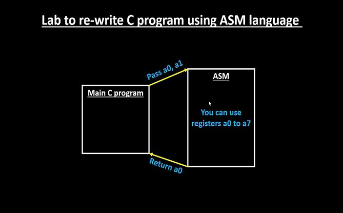

# 13-RV_D2SK2_L1_Study_New_Algorithm_For_Sum_1_to_N_Using_ASM

## Overview

This lecture introduces a new approach for calculating:

```text id="jlwm302"
Sum of numbers from 1 to N
```
using:

- ABI registers
- function calls
- RISC-V assembly language

The lecture demonstrates:

- interaction between C and Assembly
- usage of ABI names
- passing arguments through registers
- returning results through registers
- loop implementation using assembly logic

The instructor repeatedly emphasizes the power of the ABI and explains how ABI conventions simplify:

- function communication
- register usage
- assembly integration

---

# Main Objective of the Lab

The goal is to:

- modify the original C program
- make function calls to assembly code
- perform computations in assembly
- return final result back to C program

The lecture specifically says that we are going to take advantage of the ABI.

---

# Original Problem

Compute:
```text
1 + 2 + 3 + ... + N
```
Previously the entire computation was done in C. Now the computation logic is moved into assembly language.

---

# Interaction Between C and Assembly

The lecture explains the complete flow:
```text
Main C Program
      ↓
Function Call
      ↓
Assembly Language Program
      ↓
Perform Computation
      ↓
Return Final Result
      ↓
Back to Main C Program
```



---

# Function Argument Passing Using ABI

Arguments are passed using a0 and a1 registers.

The lecture also states that the final result is returned through a0 register.

This demonstrates practical usage of:

- ABI conventions
- argument registers
- return value registers

---

# ABI Registers Used

| Register | Purpose                          |
| -------- | -------------------------------- |
| `a0`     | Initial argument / return value  |
| `a1`     | Final count                      |
| `a2`     | Stores final count temporarily   |
| `a3`     | Counter register                 |
| `a4`     | Accumulator / summation register |

---

# Algorithm Overview

The lecture develops the following algorithm.

## Step 1 — Pass Initial Values

From the main C program:
```text
pass:
0
10
```
through:
```text
a0
a1
```
This corresponds to summation from 0 to 9.

## Step 2 — Initialize Registers

The lecture initializes:
```text
a4 = 0
a3 = 0
```
The instructor specifically mentions x0/zero register for initialization.

Purpose:
```text
a4 → stores temporary summation
a3 → loop counter
```

## Step 3 — Store Final Count

The lecture stores final count from a1 into a2. The purpose is to preserve upper limit for comparison.

## Step 4 — Perform Addition

Core computation:
```text
a4 = a3 + a4
```
Initially:
| Register | Value |
| -------- | ----- |
| a3       | 0     |
| a4       | 0     |

Result:
```text
0 + 0 = 0
```
So:
```text
a4 = 0
```

## Step 5 — Increment Counter

The lecture then increments:
```text
a3 = a3 + 1
```
Now:
```text
a3 = 1
```

## Step 6 — Loop Comparison

Condition checked:
```text
a3 < a2
```
Initially:
| Register | Value |
| -------- | ----- |
| a3       | 1     |
| a2       | 10    |

Since:
```text
1 < 10
```
the loop continues.

## Loop Execution Example

The lecture walks through multiple iterations.

Iteration 1
| Register | Value |
| -------- | ----- |
| a3       | 1     |
| a4       | 0     |


Calculation:
```text
0 + 1 = 1
```
Updated:
```text
a4 = 1
```

Iteration 2
| Register | Value |
| -------- | ----- |
| a3       | 2     |
| a4       | 1     |

Calculation:
```text
1 + 2 = 3
```
Updated:
```text
a4 = 3
```

## Loop Exit Condition

The lecture explains that the loop continues as long as:
```text
a3 < a2
```
The moment:
```text
a3 = 10
```
the program exits the loop.

## Returning Final Result

Final summation exists in a4. But ABI convention requires that the return value be in a0. Therefore the result is  copied from a4 to a0.

The lecture specifically mentions:
```text
a4 + 0 → a0
```
to return the result.


---

# Important Observation from Lecture

The instructor explicitly says that there are multiple ways to write the same assembly language program, and also mentions that one might come up with a better way.

Therefore:

- assembly optimization is flexible
- multiple implementations are possible

---

# Relationship Between C and Assembly

The lecture demonstrates practical:

- C-to-assembly interaction
- ABI-based communication
- register-based argument passing

This is an example where:

- high-level software
- low-level assembly
- ABI conventions

all interact together.

---

# Hardware Perspective

The assembly implementation directly maps to:

- register operations
- ALU additions
- branch comparisons
- loop execution
- register transfers

inside actual processor hardware.
The processor internally performs:

- register reads
- arithmetic operations
- comparison operations
- branching

according to ISA instructions.

---

# Key Learning Outcome

After this lecture, the learner understands:

- how ABI registers are practically used
- how arguments are passed to assembly functions
- how results are returned
- how loops are implemented in assembly logic
- how C interacts with assembly code

---

# Notes

This lecture demonstrates a practical example of:

- ABI-based programming
- C and assembly interaction
- register-based function communication

inside RISC-V architecture.