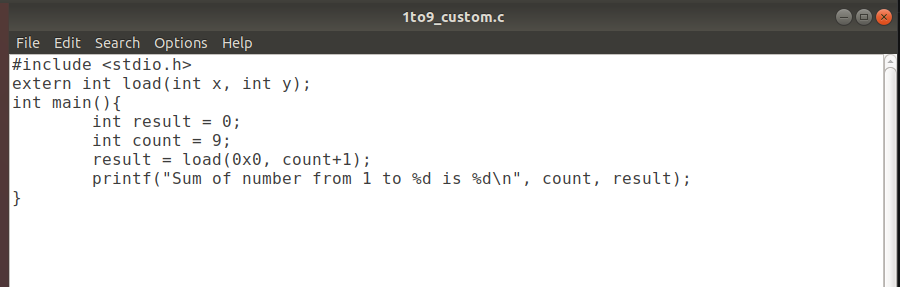
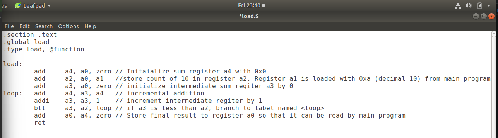

# 14-RV_D2SK2_L2_Review_ASM_Function_Call

## Overview

This lecture implements the previously discussed:
- ABI-based summation algorithm
- C-to-Assembly interaction
- assembly function call mechanism

The lecture demonstrates:
- modified C program
- assembly language implementation
- argument passing through ABI registers
- returning results through `a0`
- loop implementation using RISC-V assembly

The instructor repeatedly emphasizes:
- practical usage of ABI
- function calls
- interaction between C and Assembly

---

# Main Goal of the Lab

The objective is to:
- modify the original C program
- call an assembly language function
- perform computations in assembly
- return the final result back to C

The instructor specifically says:

```text id="jlwm402"
We are going to simulate it in the next video.
```

---

# Files Created in the Lab

The lecture creates two files:
| File            | Purpose                 |
| --------------- | ----------------------- |
| `1toN_custom.c` | Main C program          |
| `load.s`        | RISC-V assembly program |

---

# Main C Program

The instructor creates:
```text
1toN_custom.c
```
using leafpad editor.

## Structure of Main C Program

The C program:

- initializes variables
- performs function call
- receives result
- prints final output

## Function Initialization

The lecture mentions:
```text
This is the one which is going to initialize the function.
```
The C program declares the external assembly function.

## Variables Used

The lecture initializes:
| Variable | Purpose                |
| -------- | ---------------------- |
| `count`  | Final count value      |
| `result` | Stores returned result |

## Function Call

We are going to pass 0 and count + 1. The function call passes:

- 0
- 10

to the assembly language program.

## ABI Argument Passing

The lecture explicitly states:
| Register | Value |
| -------- | ----- |
| `a0`     | 0     |
| `a1`     | 10    |

## Receiving Result from Assembly

The lecture explains that the Result will be returned in a0 register. The returned value from a0 is stored into the result variable inside the main C program.

## Printing Final Result

The lecture prints the sum of numbers from 1 to 9 using the returned value stored in result.



---

# Assembly Language Program

The lecture creates:
```text
load.s
```
inside the same directory.

## Assembly Labels

The lecture introduces labels:
| Label  | Purpose              |
| ------ | -------------------- |
| `load` | Function name        |
| `loop` | Loop branch location |

### Register Initialization

The lecture initializes:
```text
add a4, zero, zero
```
to initialize:
```text
a4 = 0
```

### Initializing Counter Register

The lecture initializes:
```text
add a3, zero, zero
```
to initialize:
```text
a3 = 0
```

### Storing Final Count

The lecture explains:
```text
Store count 10 in a2
```
Instruction:
```text
add a2, a0, a1
```
Since:
```text
a0 = 0
a1 = 10
```
Result:
```text
a2 = 10
```

## Loop Label

The lecture defines a loop label. This label is used for:

- branch operation
- repeated execution

### Summation Operation

Core operation:
```text
add a4, a3, a4
```
Meaning:
```text
a4 = a3 + a4
```
The lecture repeatedly walks through:

- iterative accumulation
- temporary storage in a4

### Increment Operation

The lecture uses:
```text
addi a3, a3, 1
```
Purpose:
```text
increment counter by 1
```
The instructor specifically mentions:
```text
Increment a3 by 1.
```

### Branch Condition

The lecture uses:
```text
blt a3, a2, loop
```
Meaning:
```text
If a3 is less than a2, go back to loop.
```

### Returning Final Result

After loop completion the final summation exists in a4. The lecture transfers result using:
```text
add a0, a4, zero
```
to return result through a0.

### Return to Main Program

The lecture then performs:
```text
ret
```
to return control back to main C program.



---

# Complete Execution Flow

The complete execution flow demonstrated in lecture:
```text
Main C Program
      ↓
Pass Arguments Through A0/A1
      ↓
Assembly Function (load.s)
      ↓
Loop Computation
      ↓
Store Result in A0
      ↓
Return to Main C Program
      ↓
Print Final Output
```

---

# Hardware Perspective

The lecture demonstrates actual:

- ABI-based execution
- register operations
- branch execution
- ALU arithmetic
- function-call behavior

inside processor architecture.

The processor internally performs:

- register reads
- additions
- branch comparisons
- loop execution
- return-address handling

using RISC-V ISA instructions.

---

# Key Learning Outcome

After this lecture, the learner understands:

- how C interacts with assembly code
- how ABI registers pass arguments
- how assembly loops are implemented
- how return values are transferred
- how branch instructions work
- how assembly functions return to C programs

---

# Notes

This lecture is a practical demonstration of:

- C-to-Assembly interaction
- ABI-based function communication
- loop implementation using RISC-V assembly language.