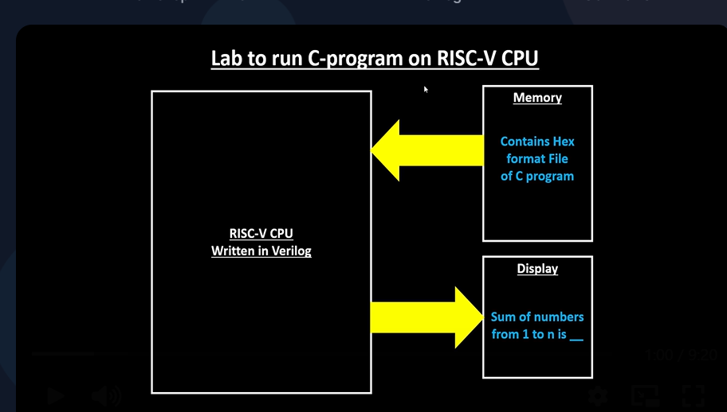
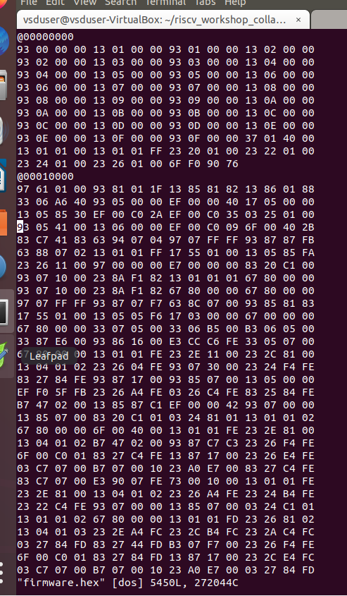
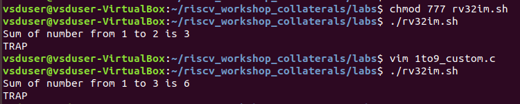

# 16-RV_D2SK3_L1_C_Program_On_RISCV_CPU

## Overview

This lecture transitions from simulations to actual RISC-V CPU execution flow.

The instructor demonstrates how:
- a C program
- assembly program
- generated hex file

can be executed on a RISC-V CPU written in Verilog.

This lecture introduces:
- Verilog CPU core
- testbench
- hex file generation
- memory loading
- Icarus Verilog simulation
- firmware loading
- bitstream representation

The instructor emphasizes that the whole agenda of the workshop is running a C program on a RISC-V CPU.

---

# Transition From Simulation to CPU Execution

Previously, C program executed using:
- GCC
- Spike
- Assembly simulations

Now program will execute on actual RISC-V CPU hardware model.

---

# Overall Flow

The lecture demonstrates the complete execution flow:
```text
C Program
      ↓
Assembly Program
      ↓
Hex File Generation
      ↓
Load Into Memory
      ↓
RISC-V CPU Reads Memory
      ↓
CPU Executes Instructions
      ↓
Display Final Output
```



---

# RISC-V CPU Core

The lecture introduces RISC-V CPU written in Verilog. This Verilog CPU:

- executes instructions
- reads memory
- processes hex file contents

---

# Testbench Introduction

The lecture introduces:
```text
testbench.v
```
The testbench:

- verifies CPU behavior
- loads memory
- initializes simulation

## Unit Under Test (UUT)

The lecture introduces Unit Under Test (UUT). The CPU core acts as UUT. UUT mentioned:
```text
picorv32
```

## Loading Hex File Into Memory

The testbench loads firmware hex file into simulation memory before execution begins.

---

# Script File

The lecture introduces:
```text
rv32im.sh
```
This shell script:

- automates compilation
- creates hex files
- runs simulations

## Purpose of Script

The instructor explains that these are the commands needed to convert to hex file and run it.

The script:

- compiles C + assembly
- generates firmware
- loads into memory
- runs simulation

---

# Files Mentioned 

| File            | Purpose           |
| --------------- | ----------------- |
| `1to9_custom.c` | Main C program    |
| `load.S`        | Assembly program  |
| `testbench.v`   | Testbench         |
| `picorv32.v`    | RISC-V CPU core   |
| `rv32im.sh`     | Automation script |

---

# Hex File Generation

The lecture explains that at the end of the script we get hex files. These hex files contain:

- binary instruction patterns
- firmware bitstream

These bitstreams:

- get loaded into memory
- executed by CPU



---

# Icarus Verilog

The lecture introduces iverilog, whose purpose is to compile Verilog simulation.

Inputs:

- testbench.v
- picorv32.v

Output:

- VVP simulation file

---

# VVP File

The lecture explains that iverilog dumps a VVP file. This VVP file is executed for simulation.

---

# Simulation Commands

The lecture executes:
```text
chmod 777 rv32im.sh
```
then:
```text
./rv32im.sh
```
Purpose:

- grant permissions
- execute automation script

---

# Progrm Output

The lecture demonstrates outputs like:



demonstrating successful CPU execution.

---

# Memory Loading Concept

The lecture emphasizes that Hex file gets loaded into memory through the testbench. Then:

- CPU fetches instructions
- processes memory contents
- executes program

---

# Relationship Between Components

The lecture demonstrates interaction between:
| Component      | Purpose               |
| -------------- | --------------------- |
| Hex File       | Machine instructions  |
| Memory         | Stores instructions   |
| Testbench      | Loads memory          |
| CPU Core       | Executes instructions |
| VVP Simulation | Runs hardware model   |

---

# Hardware Perspective

This lecture is a major bridge between software and actual processor hardware. The CPU now:

- fetches instructions from memory
- decodes machine code
- executes instructions
- produces output

exactly like a real processor.

---

# Key Learning Outcome

After this lecture, the learner understands:

- how software runs on a RISC-V CPU
- how hex files are generated
- how firmware is loaded into memory
- how testbenches work
- how Verilog CPU simulations operate
- relationship between:
    - C programs
    - assembly
    - bitstreams
    - hardware execution

---

# Notes

This lecture moves from ISA/software understanding to actual processor hardware execution.