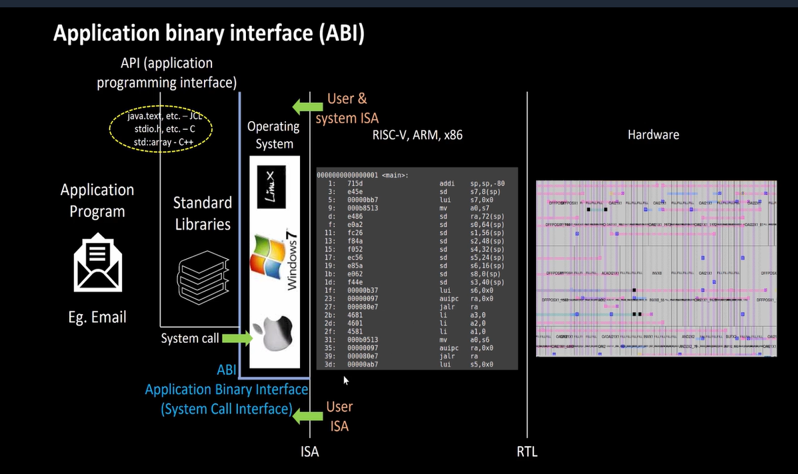

# 9-RV_D2SK1_L1_Introduction_To_Application_Binary_Interface

## Overview

This lecture introduces the concept of the Application Binary Interface (ABI).

The ABI acts as the interface between:
- application programs
- operating systems
- compilers
- processor architecture

The lecture explains:
- why ABI is required
- software-hardware interaction
- binary compatibility

---

# What is an ABI?

ABI stands for:

```text id="a6jlwm"
Application Binary Interface
```

It defines how:

- software communicates with hardware
- programs interact at binary level
- functions pass arguments
- registers are used
- memory is accessed

ABI ensures compatibility between:

- compiled programs
- operating systems
- hardware architectures

---

# Software Stack

The lecture explains the relationship between:
```text
Applications
    ↓
Operating System
    ↓
ABI
    ↓
Instruction Set Architecture (ISA)
    ↓
Hardware
```

ABI acts as the bridge between high-level software and low-level processor execution.



---

# Importance of ABI

ABI is important because it standardizes:

- register usage
- function calling conventions
- stack organization
- memory access conventions
- binary interfaces

Without ABI:

- compiled programs would not execute correctly
- libraries would become incompatible
- operating systems could not interface properly with applications

---

# ABI vs ISA

The lecture differentiates between ISA and ABI.

| ISA                            | ABI                          |
| ------------------------------ | ---------------------------- |
| Defines processor instructions | Defines software conventions |
| Hardware-focused               | Software-focused             |
| Instruction encoding           | Register/memory usage        |
| Example: RISC-V ISA            | Example: RISC-V ABI          |

---

# Binary Compatibility

ABI ensures that binaries compiled by different compilers, libraries and operating systems can still interact correctly.

---

# ABI in RISC-V

RISC-V defines standard ABI specifications.

Examples:

- RV32 ABI
- RV64 ABI

Common ABI names:

| ABI     | Description                   |
| ------- | ----------------------------- |
| `lp64`  | 64-bit long and pointers      |
| `ilp32` | 32-bit integer, long, pointer |

Example compiler option:
```text
-mabi=lp64
```

---

# Hardware Perspective

From the hardware side, ABI affects:

- register usage
- memory organization
- stack access
- function execution

The processor hardware must support instruction execution, register access and stack manipulation according to ABI conventions.

---

# Key Learning Outcome

After this lecture, the learner understands:

- what ABI is
- why ABI is important
- difference between ABI and ISA

---

# Notes

- Applications are written in high-level languages like C/C++.
- The compiler converts the source code into assembly instructions.
- The assembler converts assembly into machine code. 
- The operating system loads and executes the binary.
- ABI standardizes how software communicates at the binary level with processor hardware and operating systems.
- The API, on the other hand, allows applications to access OS services and libraries at source-code level.