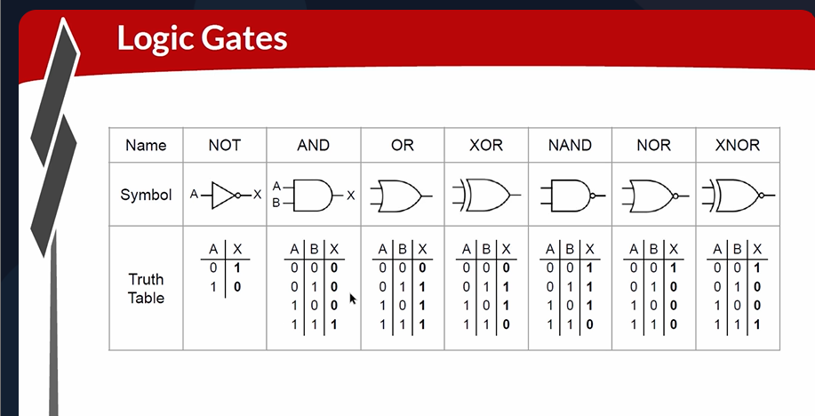
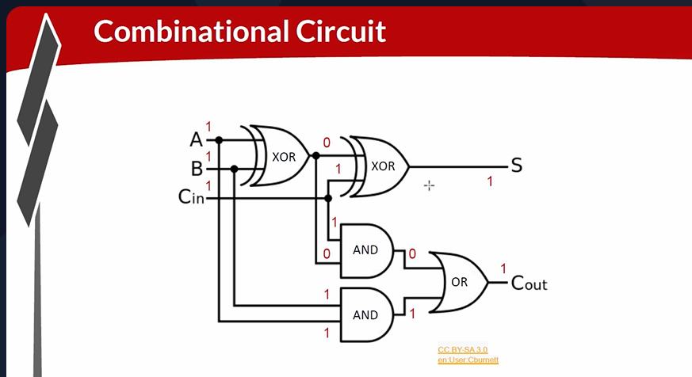
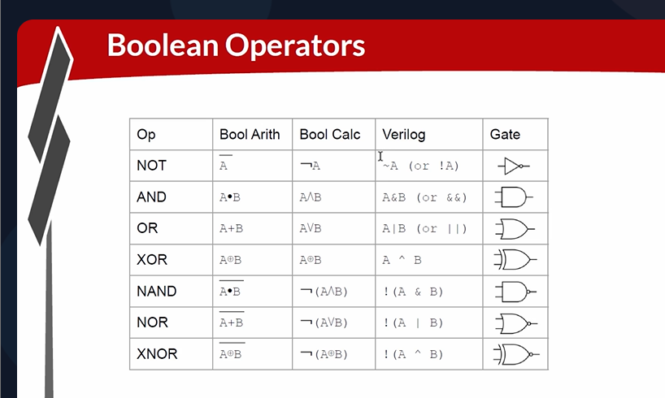

# 18-RV_D3SK1_L1_Introduction To Logic Gates

## Overview

This lecture introduces the foundations of:
- digital logic
- logic gates
- combinational circuits
- Boolean operations
- full adders
- Verilog logic syntax

The lecture explains:

- how logic gates operate
- how complex circuits are built
- how adders are constructed
- how digital systems scale

---

# Logic Gates

The lecture introduces that logic gates are the fundamental building blocks of digital circuits. All digital circuits are ultimately constructed using logic gates.

## NOT Gate

Its purpose is to invert a bit.

## AND Gate

Output becomes 1 only when both inputs are 1.

## OR Gate

Output becomes 1 if at least one input is 1.

## XOR Gate

Output becomes 1 only when exactly one input is 1.

## NAND, NOR, XNOR

- NAND = inverted AND
- NOR = inverted OR
- XNOR = inverted XOR

## Universal Gates

With only a NAND gate or with only a NOR you can construct all other gates.



---

# Combinational Logic

The lecture introduces Combinational Circuits, where outputs depend only on current inputs. The instructor explains that complex functions are created using multiple interconnected gates.

---

# Full Adder Circuit

The lecture introduces Full Adder.

Inputs:

- A
- B
- C

Each input is single-bit. The full adder adds three bits together. Possible output range:
```text
0 to 3
```
Therefore 2 output bits are required.

Outputs:

- S
- Cout

The lecture explains that S is lower bit and Cout is upper bit.

## Building Larger Adders

The lecture then chains multiple full adders to create larger adder circuits. The instructor says that we can chain these indefinitely to allow arbitrary-width adders.



---

# Verilog Syntax

The instructor explains that the syntax differs for:

- single-bit operations
- multi-bit operations



---

# Hardware Perspective

This lecture introduces the hardware foundation of computation. The circuits demonstrated directly correspond to:

- silicon hardware
- processor datapaths
- ALUs
- arithmetic units

All modern CPUs fundamentally operate using interconnected logic gates constructed from transistor-based digital logic.

---

# Key Learning Outcome

After this lecture, the learner understands:

- fundamental logic gates
- truth tables
- combinational logic
- full adder circuits
- multi-bit addition
- Verilog Boolean syntax
- scalable digital arithmetic

---

# Notes

This lecture introduces the basic logic structures from which all modern processors are ultimately built.