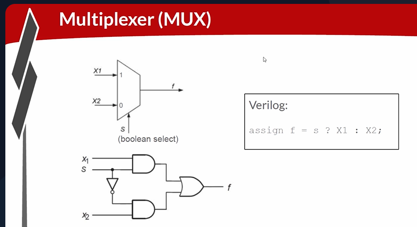
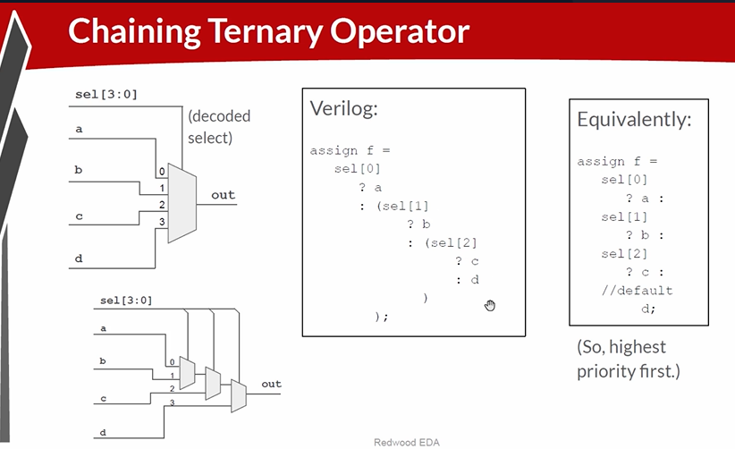
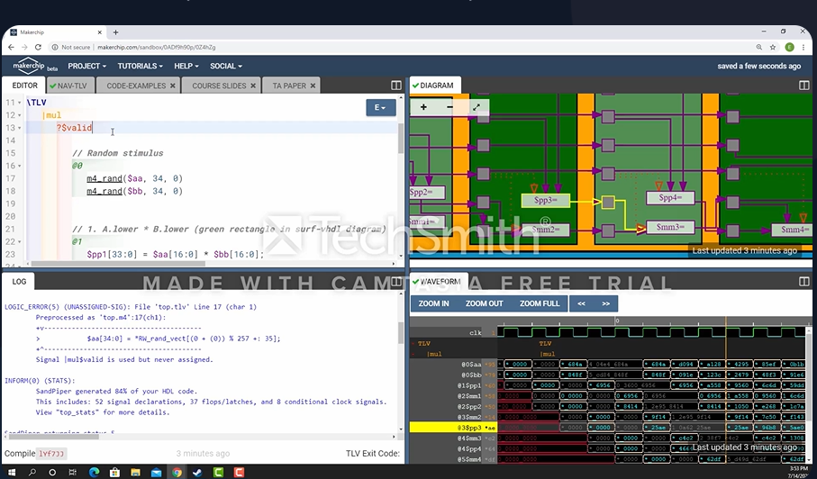

# 19-RV_D3SK1_L2_Basic Mux Implementation And Introduction To Makerchip

## Overview

This lecture introduces:
- multiplexers (MUX)
- ternary operators in Verilog
- one-hot select vectors
- chained multiplexers
- Makerchip IDE platform
- waveform debugging
- cloud-based simulation
- TL-Verilog debugging flow

The lecture transitions from basic logic gates
to practical digital design using Makerchip.

---

# Multiplexer (MUX)

The lecture introduces a very important digital logic component:
```text id="’wini1102"
Multiplexer
```
The instructor says that a multiplexer is like a switch.

## Basic MUX Operation

The lecture demonstrates 2 input values:

- x1
- x2

and one select signal s. 

Behavior:
| Select (`s`) | Output (`f`) |
| ------------ | ------------ |
| 0            | x2           |
| 1            | x1           |
Meaning - output propagates one selected input.



---

# Verilog Ternary Operator

The lecture introduces the Ternary Operator. MUX representation in Verilog:
```text
assign f = s ? x1 : x2;
```
Meaning:
| Condition | Output        |
| --------- | ------------- |
| `s = 1`   | `x1` selected |
| `s = 0`   | `x2` selected |

---

# Larger Multiplexers

The lecture then extends 2-input mux to 4-input mux.

Inputs:

- a
- b
- c
- d

## One-Hot Select Vector

The lecture introduces One-hot vector.
Meaning - only one select bit should be asserted.

Example:
| Select Vector | Selected Input |
| ------------- | -------------- |
| 0001          | a              |
| 0010          | b              |
| 0100          | c              |
| 1000          | d              |



## Chained Multiplexer Construction

The lecture demonstrates that larger muxes can be built using smaller 2-input muxes. The instructor explains mux decomposition.

## Priority Behavior

Rightmost select gets priority.
Meaning - if select vector is incorrectly not one-hot, one select dominates. The lecture explains that d becomes default value.

## Chained Ternary Operators

The lecture expresses mux behavior using chained ternary operators:
```text
s0 ? A :
s1 ? B :
s2 ? C :
D;
```
The instructor explains:

- default selection behavior
- chaining readability

---

# Makerchip IDE

- Makerchip opens with TL-Verilog shell code
- Tutorials and examples can be loaded for an understanding of the platform

## Automatic Circuit Diagram Generation

Makerchip automatically generates circuit diagrams.
The platform:

- compiles TL-Verilog
- generates hardware diagrams
- simulates design
- produces waveforms

## Cloud-Based Simulation

Makerchip sends the design to the cloud.
The cloud:

- compiles design
- runs simulation
- returns results

## Waveform Window

The lecture demonstrates splitting windows to display waveform viewer below circuit diagram. The waveform shows signal behavior over time.

## Signal Highlighting

The lecture demonstrates that upon selecting a signal, the signal becomes highlighted:

- in waveform
- in circuit diagram
- in code view

This provides an interactive debug flow.

## NavTLV Debug View

The lecture introduces NavTLV.
Purpose - debug-oriented code navigation.
The instructor demonstrates:

- selecting highlighted expressions
- navigating directly to source lines

## Editor Navigation

Click line number → jump to editor
This enables:

- rapid debugging
- quick error fixing

## Project Cloning

The lecture demonstrates: 
```text
Project → Clone
```
Purpose:

- create editable copy
- modify projects safely

This may especially be important when viewing someone else’s project.



---

# Hardware Perspective

This lecture introduces multiplexers, which are extensively used in:

- CPUs
- datapaths
- ALUs
- control units
- pipeline routing

The lecture also introduces practical hardware development workflow using:

- TL-Verilog
- Makerchip
- waveform debugging
- circuit visualization

---

# Key Learning Outcome

After this lecture, the learner understands:

- multiplexer behavior
- ternary operator syntax
- one-hot select vectors
- chained mux implementation
- Makerchip IDE workflow
- waveform debugging
- cloud-based hardware simulation
- TL-Verilog project management

---

# Notes

This lecture introduces multiplexers as fundamental digital routing structures and Makerchip-based hardware development workflow.
