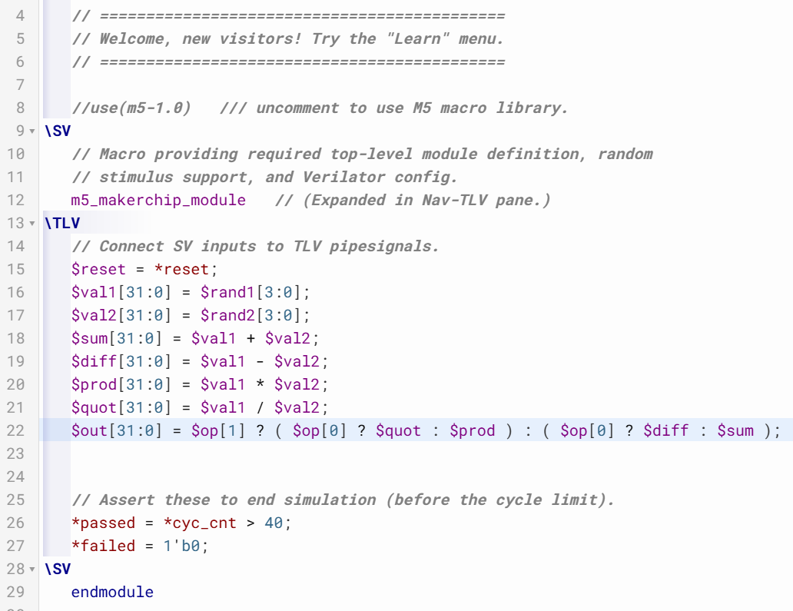
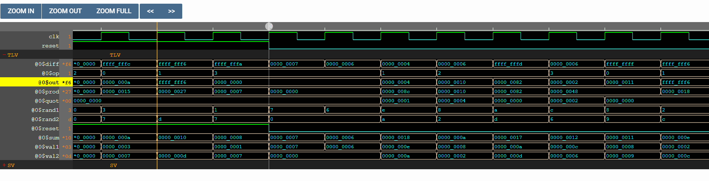

# 20-RV_D3SK1_L3_Labs_For_Combinational_Logic

## Overview

This lecture introduces:
- practical Makerchip lab exercises
- combinational logic coding
- vector operations in Verilog
- multiplexer implementation
- arithmetic operators
- simple calculator design

The lecture transitions from basic digital logic theory to hands-on TL-Verilog coding exercises.

---

# Combinational Logic Lab

The lab focuses on simple combinational expressions. Students are asked to:

- code logic gates
- implement Boolean expressions
- observe circuit behavior

---

# Vector Operations in Verilog

The lecture then transitions from single-bit expressions to vector operations. One can operate on vectors of bits as binary numbers.

---

# Why Explicit Ranges Were Used

On the right-hand side it is generally not necessary to provide explicit bit ranges because signals already have definitions. The lecture explains that the variables used did not have previous assignments. Therefore Makerchip needed explicit bit definitions to generate random stimulus. Makerchip invents input values. 
Meaning - unassigned signals automatically receive random stimulus during simulation.

---

# Multiplexer Lab

The next exercise asks students to implement a multiplexer. We start with a single-bit 2-input multiplexer and then extend the design to vector inputs/outputs.

---

# Calculator Design

We then design a Simple Calculator.

## Calculator Functionality

The calculator performs:

- addition
- subtraction
- multiplication
- division

on two 32-bit input vectors.

## Calculator Inputs

| Signal | Description    |
| ------ | -------------- |
| `val1` | First operand  |
| `val2` | Second operand |
Both are 32-bit vectors.

---

# Parallel Hardware Execution

Circuits operate in parallel unlike programs. All arithmetic units can operate simultaneously. Meaning:

- add
- subtract
- multiply
- divide

can all compute at the same time.

---

# Performance vs Power Tradeoff

You can trade off power for performance. The lecture explains that computing all operations simultaneously:

- improves performance
- increases power usage

---

# Zero Extension

Zero Extension is when the upper bits become 0 when smaller vectors are assigned into larger vectors.

---

# Hardware Perspective

This lecture introduces practical arithmetic datapath concepts. The calculator architecture resembles:

- ALU structures
- arithmetic execution units
- processor datapaths

Important hardware concepts introduced:

- parallel computation
- multiplexed output selection
- vector arithmetic
- arithmetic operators

which are fundamental to CPU arithmetic hardware.

---

# Key Learning Outcome

After this lecture, the learner understands:

- vector operations in Verilog
- explicit bit ranges
- random stimulus generation
- multiplexer implementation
- arithmetic operators
- parallel circuit execution
- simple calculator datapath design

---

# Notes

This lecture transitions from simple logic gates to actual arithmetic hardware structures similar to real processor ALUs.