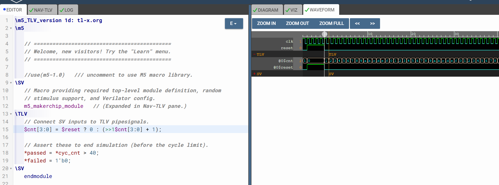

# 21-RV_D3SK2_L1_Introduction_To_Sequential_Logic_And_Counter_Lab

## Overview

This lecture introduces:
- sequential logic
- clocks
- D flip-flops
- state machines
- reset logic
- Fibonacci sequence circuit
- previous-cycle state notation
- free-running counter circuit

The lecture marks the transition from combinational logic to time-dependent digital circuits.

---

# Transition to Sequential Logic

Sequential logic introduces a clock. This is the fundamental difference between combinational circuits and sequential circuits.

---

# Purpose of the Clock

The clock is used to sequence your logic.
Meaning:

- computations happen in steps
- each clock cycle advances circuit state

---

# D Flip-Flop

The D flip-flop, often simply referred to as a flip-flop, holds onto a value. A flip-flop stores one bit of state. Possible values:

- 0
- 1

## Clock Edge Triggering

On the rising edge of the clock the next state propagates.
Meaning - state updates only on clock edge.

---

# Sequential Logic

The instructer says that logic with flip-flops is sequential logic. This is because:

- flip-flops store state
- outputs depend on previous cycle values

---

# Reset Signal

Reset Signal is used to initialize circuit into a known state.

---

# Sequential Circuit as State Machine

A sequential circuit can be viewed as a big state machine.
Meaning - state evolves every clock cycle.

## Sequential Computation Flow

The lecture explains the cycle:
```text
Current State
      ↓
Combinational Logic
      ↓
Next State
      ↓
Clock Edge
      ↓
Updated State

This repeats:

every clock cycle
```

---

# Fibonacci Sequence Circuit

The Fibonacci sequence:
```text
1, 1, 2, 3, 5, 8 ...
```
Each value equals sum of previous two values.

## Fibonacci Circuit Operation

The lecture demonstrates:

- storing previous values in flip-flops
- adding values every cycle

| Previous | Current | Next |
| -------- | ------- | ---- |
| 1        | 1       | 2    |
| 1        | 2       | 3    |
| 2        | 3       | 5    |
| 3        | 5       | 8    |

## State Propagation

Values propagate forward on clock edge:
```text
3 + 2 = 5
```
then:

- 5
- 3

become stored state values.

## Waveform Behavior

The lecture shows Fibonacci waveform progression:
```text
1 → 1 → 2 → 3 → 5 → 8
```
over successive clock cycles.

## Reset-Based Initialization

As long as reset is asserted, we're injecting "1"s.

## TL-Verilog Previous-State Notation

The lecture introduces new TL-Verilog syntax:
```text
>>1
```
and:
```text
>>2
```
This notation references prior cycle values used for sequential logic implementation.

## Fibonacci Expression

The lecture expresses Fibonacci logic as:
```text
if reset:
    value = 1
else:
    value = previous + previous_previous
```

---

# Free Running Counter

The counter:

- starts from 0
- increments every cycle

Operation:
```text
count = count + 1
```
every clock cycle.



---

# Hardware Perspective

This lecture introduces the foundation of synchronous digital hardware. All modern CPUs fundamentally operate using:

- sequential logic
- clocked state updates
- flip-flop storage
- iterative state transitions

---

# Key Learning Outcome

After this lecture, the learner understands:

- difference between combinational and sequential logic
- role of clocks
- D flip-flop operation
- reset logic
- state machines
- sequential computation
- Fibonacci hardware implementation
- free-running counters
- previous-state notation in TL-Verilog

---

# Notes

This lecture introduces the concept of:

- time
- state
- clocked computation

which are the core principles behind all modern digital processors.