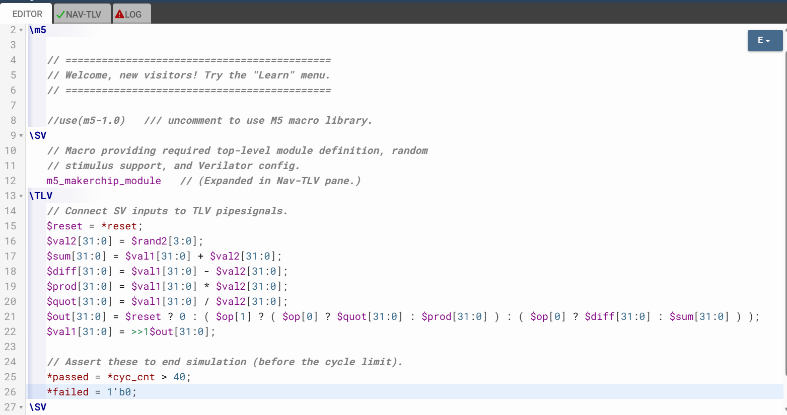
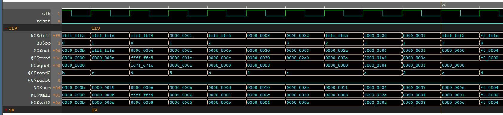

# 22-RV_D3SK2_L2_Sequential_Calculator_Lab

## Overview

This lecture introduces:
- Verilog constant syntax
- bit-width specification
- decimal, hexadecimal and binary notation
- don't care (`X`) values
- automatic bit extension and truncation
- Verilator simulation limitations
- sequential calculator design
- calculator state memory using flip-flops

The lecture continues the transition from combinational logic to sequential logic with state retention.

---

# Verilog Constant Syntax

Hardware values can have arbitrary bit widths unlike software where values are usually:

- 32-bit
- 64-bit

## Bit Width Specification

syntax rule:
```text
<number_of_bits>'<format><value>
```
Explicit width declaration is common in hardware design.

## Verilog Number Formats

The lecture introduces:
| Format | Meaning     |
| ------ | ----------- |
| `d`    | Decimal     |
| `h`    | Hexadecimal |
| `b`    | Binary      |
Examples:
```text
8'd15
8'h0F
8'b00001111
```

## Automatic Width Determination

Shortcut syntax:
```text
'0
```
Meaning - compiler determines required bit width automatically.

## Don't Care Values

The lecture introduces don't care values represented using:
```text
X
```

### Purpose of X Values

X means value unknown - neither 0 nor 1.

### X Propagation

The X will propagate through your logic. This helps identify:

- circuit bugs
- invalid signal usage
- uninitialized state

## Integer Values

If you specify a value without width, it's taken as a 32-bit integer.

## Automatic Bit Extension and Truncation

Tools may automatically extend values with zeros or truncate excess bits without warnings.
Example - Assigning larger value into smaller signal causes truncation and data loss.

---

# Simulation Environment

Makerchip uses Verilator, which is an open-source simulator.

## Verilator Limitation

Only supports two-state simulations.
Meaning - supports:

- 0
- 1

Does not support X values.

---

# Sequential Calculator

Real calculators must remember previous result.
Example sequence:
```text
result = 5 + 2
then
result - 3
```
This requires memory/state.

## Adding State Using Flip-Flops

Flip-flop stores previous calculator result. State register contains 32 bits of individual flip-flops.
Meaning - each bit is stored separately, forming 32-bit register.

## Sequential Calculator Operation

every clock cycle, a new operation is computed.

## Previous Result as Operand

The value computed previously becomes the next source operand.
Meaning - current output feeds future computation

## Reset

As always in sequential logic, we need a reset value. The reset acts like a calculator clear button. Reset initializes calculator output to 0 before sequential operations begin.





---

# Hardware Perspective

This lecture introduces real stateful hardware computation. The sequential calculator directly resembles:

- accumulator architectures
- processor register feedback paths
- iterative arithmetic datapaths

The lecture also introduces important RTL coding concerns:

- bit widths
- truncation
- extension
- simulator behavior

---

# Key Learning Outcome

After this lecture, the learner understands:

- Verilog constant syntax
- bit-width notation
- hexadecimal/binary representation
- X values and propagation
- truncation/extension behavior
- Verilator limitations
- sequential calculator design
- state retention using flip-flops
- iterative sequential computation

---

# Notes

This lecture combines RTL syntax with sequential stateful computation.
