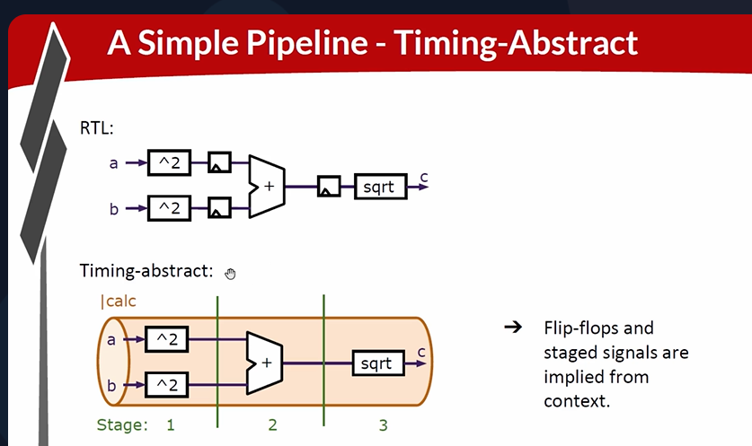
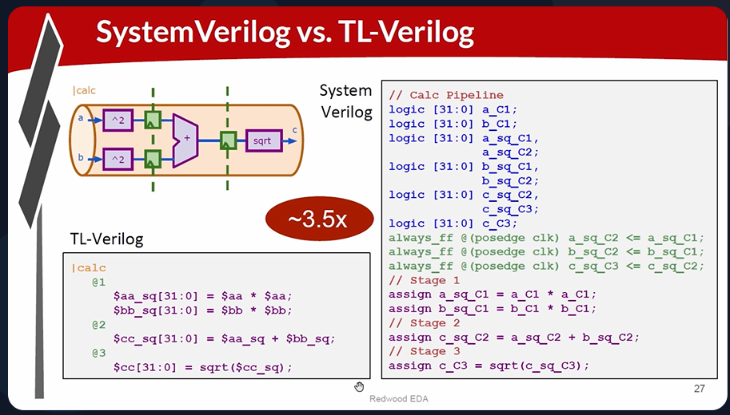
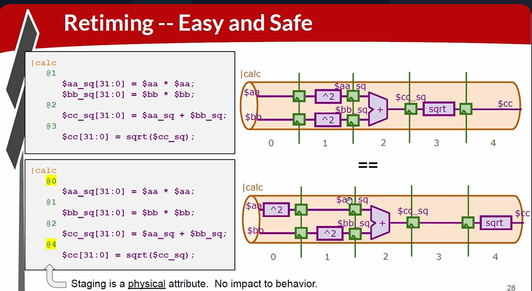

# 23-Timing

## Overview

This lecture introduces:
- pipeline logic
- timing abstraction
- multi-stage computations
- TL-Verilog pipelines
- stage boundaries
- pipeline retiming
- code reduction advantages
- timing vs functionality separation

The lecture demonstrates implementing Pythagoras theorem in hardware using pipelined computation stages. This lecture introduces pipelined hardware execution.

---

# Pythagoras Theorem Hardware Example

The computation implemented:
```text
c = sqrt{a^2 + b^2}
```
The lecture explains:

- square a
- square b
- add results
- compute square root

using hardware pipeline stages.



## Deep Logic Problem

Modern processors run at gigahertz frequencies. Therefore too much logic cannot fit inside one clock cycle.

## Timing Violation Concept

if logic takes too long signals miss next clock edge. 
Meaning - timing failure occurs.

## Distributing Computation Across Cycles

The solution introduced is distributing this computation over multiple cycles. This is pipelining.

## Pipeline Stages

The lecture divides computation into stages:
| Stage   | Operation      |
| ------- | -------------- |
| Stage 1 | Square A and B |
| Stage 2 | Add results    |
| Stage 3 | Square root    |
Each stage is separated by flip-flops.


## Flip-Flop Between Stages

Intermediate values get captured in flip-flops after computation at each stage. Stage boundaries imply flip-flops automatically.

---

# RTL Mentality vs TL-Verilog

The lecture compares traditional RTL with TL-Verilog timing abstraction. TL-Verilog allows logic expression definition without manually coding every flip-flop. TL-verilog ensures pipeline code simplicity:

- cleaner representation
- fewer lines of code
- easier readability

Reducing code reduces bugs. Advantages:

- simplified debugging
- faster design process
- easier maintenance



---

# Functional Behavior vs Timing

The overall behavior of your circuit isn't affected by timing. This is a timing abstraction principle. 
Meaning:

- functionality remains same
- timing placement can change

without changing circuit behavior. Logic can be redistributed across more stages without changing actual computation. Additional stages may be added to model long-distance signal propagation.



---

# Silicon Distance Problem

It takes time to get signals to propagate from one corner of silicon to another.

---

# Timing-Abstraction Advantage

Stage bucketing is assigning logic into different pipeline stages. In order to modify timing, we only need to change the stage bucketing of our logic without modifying logic expressions themselves. The lecture contrasts this with traditional RTL retiming, which may be a fairly significant surgery with plenty of opportunities for bugs. RTL retiming is difficult and error-prone.

---

# Hardware Perspective

This lecture introduces pipelining. All high-performance CPUs fundamentally rely on:

- deep pipelining
- stage partitioning
- timing optimization
- register insertion

The lecture also introduces timing abstraction, which is a key productivity advantage of TL-Verilog hardware modeling.

---

# Key Learning Outcome

After this lecture, the learner understands:

- why pipelining is necessary
- logic depth limitations
- multi-stage computation
- stage boundaries
- automatic flip-flop insertion
- timing abstraction
- stage retiming
- timing vs functionality separation
- benefits of TL-Verilog pipelines

---

# Notes

This lecture introduces:

- pipeline abstraction
- timing abstraction
- retiming flexibility