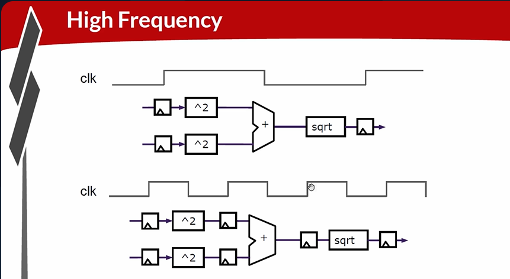

# 24-RV_D3SK3_L2_Pipeline_Logic_Advantages_And_Demo_In_Platform

## Overview

This lecture explains:
- advantages of pipelining
- throughput improvement
- high-frequency operation
- waveform interpretation
- timing alignment
- pipeline stages in MakerChip
- TL-Verilog timing visualization
- staged signals
- feedback paths in pipelines

The lecture also demonstrates Pythagoras theorem pipeline example inside MakerChip waveform viewer.

---

# Pipeline Performance Advantage

Pipelines are not only required because logic is too deep, but also because pipelines improve performance.

## High Frequency Operation

pipelining allows higher clock frequencies. This is because shorter logic paths exist between flip-flops.

## Throughput Improvement

We're able to run our clock faster and therefore we're able to present more data. This improves throughput. One new input set can be provided every clock cycle. Higher clock frequency means more computations completed per second.

## Pipeline vs Non-Pipeline Computation

The instructor compares non-pipelined logic
with pipelined logic. Shorter stage delays allow faster clocks.

---

# MakerChip Demonstration

The lecture then switches to MakerChip platform demonstration. The instructor loads Pythagoras theorem pipeline example.

## Waveform Viewer Introduction

The lecture explains waveform viewer usage. Pipeline logic is described as distributed in time.

## Same Stage Computation

The instructor first places all logic in stage 1.
Meaning - no pipelining and pure combinational logic.
All computations occur in the same cycle.
Pythagoras Example:
| A | B      | C      |
| - | ------ | ------ |
| 9 | C (12) | F (15) |

## Introducing Pipeline Stages

The design is then pipelined. The computation is distributed across multiple stages. The waveform viewer shows timing tags such as:
| Signal | Tag |
| ------ | --- |
| A      | @1  |
| C      | @3  |
Meaning - signal generated in corresponding pipeline stage.

## Pipeline Delay Observation

There are two stages of flip-flops.
Meaning - stage 1 values affect stage 3 outputs
two cycles later.

## TL-Verilog Timing Representation

TL-Verilog waveform viewer shows signals at assigned stage timing. TL-Verilog treats staged versions of the same signal as unified pipe signals.
Example - The instructor demonstrates the stage 1 version and stage 2 version of A squared. The stage 2 signal appears one cycle later.

## Diagram Utility

Diagrams help visualize:

- implied flip-flops
- timing movement
- feedback paths.

## Pipeline Feedback Arrows

- short arrow - direct feedback
- long arrow - delayed staged feedback

## Multi-Stage Delay Concept

Signals can be referenced many stages later. This is useful for:

- deep pipelines
- long latency operations.

---

# Hardware Perspective

This lecture demonstrates one of the biggest advantages of pipelining - higher throughput. The lecture also teaches:

- practical waveform debugging
- stage alignment interpretation
- staged signal understanding

---

# Key Learning Outcome

After this lecture, the learner understands:

- why pipelines improve performance
- throughput vs frequency relationship
- waveform timing interpretation
- stage tagging
- signal staging
- feedback delays
- timing alignment
- pipeline visualization in MakerChip
- TL-Verilog timing abstraction

---

# Notes

This lecture connects abstract pipeline concepts
with waveform-level hardware behavior. The MakerChip demonstrations make:

- timing abstraction
- staged execution
- flip-flop propagation

visually understandable.