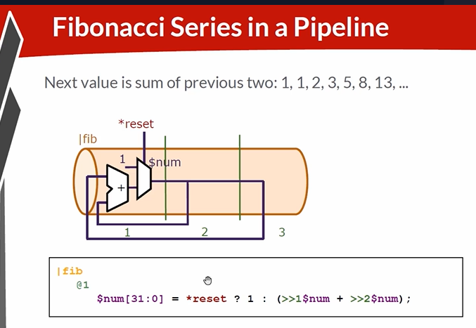
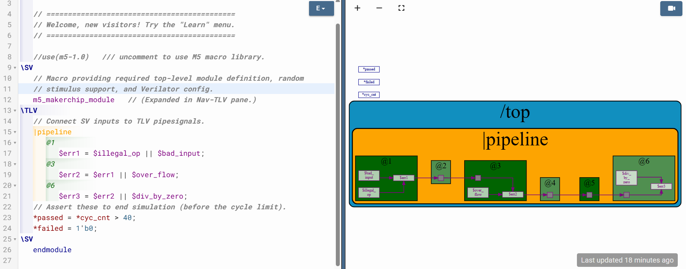

# 25-RV_D3SK3_L3_Lab_On_Error_Conditions_Within_Computation_Pipeline

## Overview

This lecture discusses:
- TL-Verilog naming syntax
- pipeline signal naming rules
- timing abstraction
- Fibonacci sequence in pipelines
- MakerChip lab submission workflow
- sandbox cloning
- pipeline error aggregation logic
- multi-stage error propagation

The lecture also introduces:
- a six-stage pipeline error handling lab.

---

# TL-Verilog Naming Syntax

## Pipe Signal Naming

Pipe signals begin with dollar sign ($)
Example:
```text
$signal_name
```

## Token-Based Naming

Identifiers are composed of tokens.
Example:
```text
$pipe_signal
```
where pipe and signal are individual tokens.

## Underscore Delimitation

The instructor explains lowercase pipe signals use underscore separation.
Example:
```text
$data_value
```

## Naming Styles in TL-Verilog

The lecture introduces three naming styles:
| Style                      | Meaning                |
| -------------------------- | ---------------------- |
| lowercase_with_underscores | Pipe signals           |
| PascalCase                 | State signals          |
| UPPERCASE_WITH_UNDERSCORES |  Keywords              |

## umbers in Identifiers

Numbers are allowed only at end of tokens.
Valid example:
```text
base64
```
Invalid:

- standalone numeric token
- starting identifier with number

---

# Fibonacci Pipeline Example

The lecture revisits Fibonacci sequence inside explicit pipeline structure.

## Explicit Pipeline Declaration

The previous examples used implicit default pipeline. Now pipeline is explicitly declared.

## Logic in Stage One

All of the logic in this example is in stage one. Remaining stages contain only flip-flops.

## Timing Abstract View

Flip-flops are not logic in timing abstract sense.

## Default Pipeline Concept

Everything in TL-Verilog is in a pipeline, even if not explicitly declared. Undeclared logic exists in:

- default pipeline
- stage zero.



---

# Error Conditions Pipeline

The pipeline contains multiple possible error conditions: 
| Stage       | Error             |
| ----------- | ----------------- |
| Stage 1     | Bad Input         |
| Stage 1     | Illegal Operation |
| Stage 3     | Overflow          |
| Stage 6     | Divide by Zero    |

## Error Aggregation Logic

The  objective is to aggregate these error conditions into single final error signal using an OR gate aggreagation.

## Final Error Signal

The final output signal is error3 in stage 6.



[Click Here To Open the Error Conditions Pipeline  in Makerchip](https://makerchip.com/v132/ide/~0gJflhzE/p-0r0hAp)

## Unassigned Signals

MakerChip may warn:
```text
signal consumed but not assigned.
```
Simulation still works because MakerChip generates random values.

---

# Hardware Perspective

This lecture combines TL-Verilog syntax
with real hardware pipeline concepts. The pipeline lab models distributed error handling which is extremely common in:

- CPUs
- DSP pipelines
- floating-point units
- ALUs
- memory systems

where error/status signals propagate across stages.

---

# Key Learning Outcome

After this lecture, the learner understands:

- TL-Verilog naming rules
- pipe signal syntax
- timing abstraction
- explicit pipelines
- default pipelines
- MakerChip cloning workflow
- multi-stage error propagation
- OR-based error aggregation
- staged error handling

---

# Notes

This lecture combines TL-Verilog language semantics with hardware pipeline debugging. The error propagation example closely resembles real CPU exception handling pipelines.


