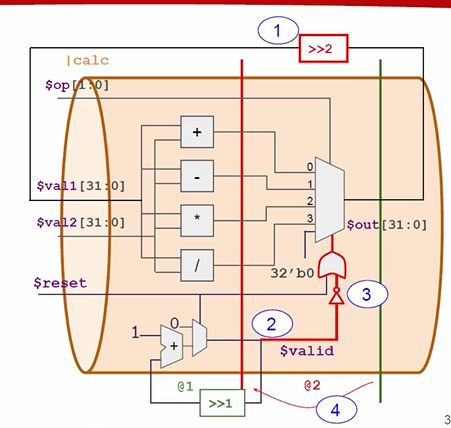
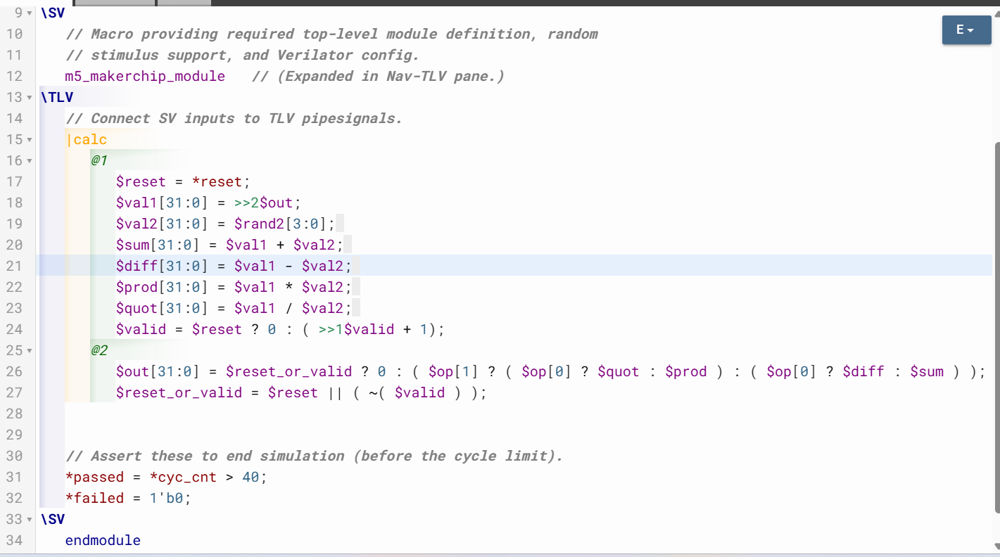
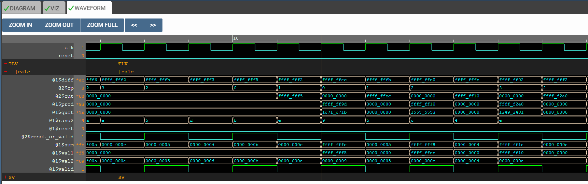

# 26-RV_D3SK3_L4_Cycle_Calculator

## Overview

This lecture extends the earlier sequential calculator and pipeline logic concepts to create a multi-cycle pipelined calculator. The lecture introduces:

- explicit pipelines
- pipeline stages
- retiming logic
- valid cycles
- invalid cycles
- two-cycle latency
- recirculation paths
- stage movement of multiplexers
- timing alignment
- iterative computation pipelines

The lecture demonstrates converting a single-cycle calculator into a two-cycle pipelined calculator.

---

# High Frequency Pipeline Motivation

In order to run this calculator in a high frequency circuit, one cycle may not be sufficient.

---

# Splitting Computation Across Cycles

The solution is to divide calculator operation across two pipeline stages.

---

# New Pipeline Structure

work is divided into:
| Stage   | Operation              |
| ------- | ---------------------- |
| Stage 1 | Arithmetic Computation |
| Stage 2 | Multiplexer Selection  |

## Multiplexer Retiming

Multiplexer is moved to a second pipeline stage.
Meaning - arithmetic is computed first and output selection is delayed by one cycle.

## Every Other Cycle Computation

Computation is only on alternate cycles.

## Meaningless Cycles

Intermediate cycles contain meaningless values. These cycles exist because computation now spans two stages.

## Iterative Calculator Feedback

The calculator still behaves iteratively.
Meaning - New computation depends on previous output.

## Two Cycle Feedback Latency

Previously, feedback latency was one cycle. Now, feedback latency becomes two cycles.

## Output Recirculation

output loops back into next computation input. This forms feedback path.

## Staging Flip-Flops

moving logic stages introduces additional staging flip-flops.

## Counter Modification

Change the counter to be a single bit counter. One-bit incrementer behaves like toggling oscillator.
| Cycle | Counter |
| ----- | ------- |
| 1     | 0       |
| 2     | 1       |
| 3     | 0       |
| 4     | 1       |

## Even and Odd Cycle Tracking

The counter now tracks:

- even cycles
- odd cycles

This generates valid signal.

## Valid Signal Generation

The valid signal determines whether current cycle contains meaningful computation.

## Valid and Reset Combination

Valid and reset is used in combination to control output behavior.

## Output Zeroing Logic

Output is driven with a zero value during:

- invalid cycles
- reset condition.

[Click Here To Open the Cycle Calculator in Makerchip](https://makerchip.com/v132/ide/~0gJflhzE/p-0JZh8E)

---

# Hardware Perspective

This lecture introduces several processor concepts: 

- multi-cycle execution
- staged arithmetic
- feedback latency
- valid signaling
- retiming
- iterative pipelines
- Computation latency changes feedback timing. As pipelines deepen recirculation paths require additional staging alignment.

---

# Key Learning Outcome

After this lecture, the learner understands:

- explicit pipeline declaration
- stage partitioning
- multi-cycle calculator design
- valid cycle generation
- oscillating one-bit counters
- two-cycle recirculation
- feedback latency
- mux retiming
- waveform verification
- timing-aware pipeline design

---

# Notes

This lecture combines:

- timing abstraction
- feedback alignment
- staged computation
 -valid-cycle management

into a realistic multi-cycle hardware datapath. The lecture demonstrates how processor datapaths are transformed from single-cycle designs into high-frequency pipelined implementations.
