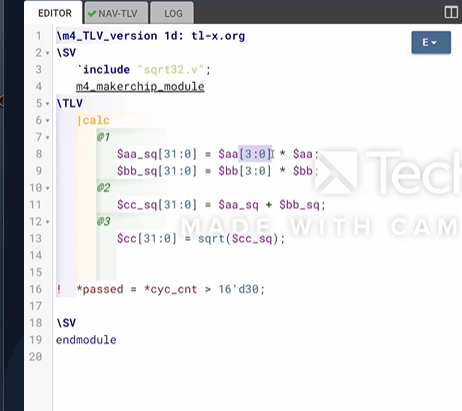
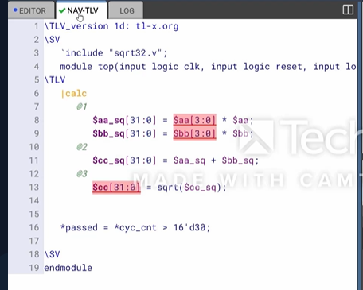
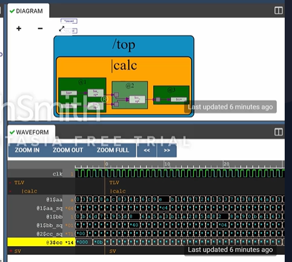

# 28-RV_D3SK4_L2_Lab_On_Validity_And_Valid_When_Condition

## Overview

This lecture demonstrates:
- practical usage of validity
- valid-when conditions
- pipeline validity propagation
- TL-Verilog syntax
- MakerChip environment behavior
- waveform interpretation
- accumulation pipelines
- recirculation state
- valid-controlled datapaths

The lecture continues using the Pythagorean theorem pipeline example and begins implementing validity-aware pipeline logic.

---

# Random Inputs

signals a and b have no explicit assignment.
Meaning - MakerChip environment generates random values automatically.

---

# Automatic Width Extension

Four bits multiplied by four bits results in eight bits. The compiler automatically:

- extends widths
- pads zeros
- matches signal sizes.

---

# TL-Verilog File Structure

## TL-Verilog Version Line

The first line:
```text
\m5_TLV_version 1d: tl-x.org
```
specifies:

- TL-Verilog version
- documentation URL

## M4 Macro Preprocessing

We're enabling macro preprocessing using a macro language called M4. Macros expand into larger code structures. The macro:
```text
m5_makerchip_module
```
expands into SystemVerilog module definition.

## Nav-TLV Window

Nav-TLV interpreted code view allows viewing:

- expanded macro output
- generated SystemVerilog.

## Generated Module Signals

The generated module contains:

- clock
- reset
- cycle counter
- pass signal
- fail signal

## Pass Signal

simulation ends when pass signal asserts.

## Cycle Count Condition

If the cycle count is greater than 30, then pass. The waveform therefore runs for 30 cycles.





---

# Pythagorean Distance Accumulator

The main objective is to extend Pythagorean computation into distance accumulation circuit.
Meaning:

- repeatedly compute distances
- continuously add them together

## Stateful Computation

The accumulated distance becomes stored state.

## Total Distance Register

The circuit maintains running total distance. Each valid computation updates total distance.

## Invalid Cycles

The lecture allows valid cycles and invalid cycles. If the cycle is not valid,
then we're just holding on to the distance.
Meaning - state remains unchanged during invalid cycles.
During valid cycles:

- new distance computed
- accumulated into total distance.

## Accumulator Adder

Accumulator adder performs:
```text
new_total = old_total + new_distance
```

## Valid-When Condition

valid-when condition is added:
```text
?$valid
```
The validity condition applies to entire pipeline section.

## Automatic Random Valid Signal

We don't assign valid. We let MakerChip make up a random valid signal.

## Validity Visualization

The waveform now clearly shows:

- valid computations
- invalid cycles

using validity propagation.

## Dotted Line Visualization

The diagram uses dotted lines to represent valid conditions.

## Waveform Debugging

The instructor demonstrates:

- selecting signals
- observing pipeline flow
- tracing computations.



---

# Hardware Perspective

Validity controls whether state updates should occur. This is critical in:

- pipelines
- accumulators
- processors
- DSP systems
- low-power hardware

because invalid computations must not corrupt state.

---

# Key Learning Outcome

After this lecture, the learner understands:

- practical validity implementation
- valid-when syntax
- MakerChip random stimulus generation
- TL-Verilog file structure
- M4 preprocessing
- Nav-TLV interpretation
- accumulation datapaths
- validity-controlled state updates
- pipeline debugging
- waveform interpretation

This lecture transitions validity from theoretical abstraction to practical hardware implementation.

# Notes

This lecture demonstrates interactive hardware development while introducing validity-aware state accumulation.


