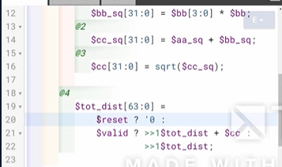
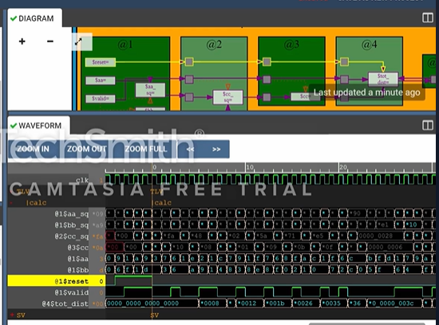

# 29-RV_D3SK4_L3_Lab_To_Compute_Total_Distance

## Overview

This lecture extends the earlier Pythagorean theorem pipeline to create a total distance accumulator. The lecture introduces:

- state retention
- accumulation logic
- pipeline recirculation
- ahead operators
- validity-aware accumulation
- reset propagation
- pipelined reset handling
- transaction consistency

The circuit repeatedly:
- computes distances
- accumulates them into total distance.

---

# Stateful Logic

total distance is state.
Meaning - value must persist across cycles.

---

# Validity Interaction

The total distance is meaningful always. Unlike, temporary pipeline signals the accumulated total remains valid continuously.

---

# Outside Valid Condition

One needs to go outside of the valid condition because total distance must retain value even during invalid cycles.

---

# Stage Four Logic

The accumulation logic is placed in:

pipeline stage 4.

---

# Ternary Operator MUX

Accumulation mux is implemented using ternary operator.

---

# SystemVerilog Signal Access

TL-Verilog accesses SystemVerilog signals using star notation.
Example:
```text
*reset
```

---

# Global Reset Connection

The total distance resets to zero during global reset.

---

# Valid vs Invalid Cases

The mux next handles:

- valid case
- invalid case.

## Valid Case

During valid cycles, new distance is added to previous total distance.

---

# Previous Transaction Usage

We're using a value from the previous transaction in the pipeline. The total distance loops back through pipeline stages. This creates accumulation state. Ahead-by-one operator is used:
```text
>>1
```
This accesses previous pipeline transaction. We're taking total distance from stage five and using it in stage four.
Meaning - flip-flop state retention.
The accumulation equation becomes:
```text
previous_total_distance + current_distance
```

## Retain Behavior

Invalid cycles - retain old total distance.



---

# Hexadecimal Accumulation

Example:
| Distance | Accumulated Total |
| -------- | ----------------- |
| F        | F                 |
| A        | 19                |
| 10       | 29                |
(all hexadecimal)

---

# Reset Handling

Reset is propagated through the pipeline, i.e., it marches through the pipeline. This ensures all stages observe reset consistently. This establishes association between the global reset signal and the computation. Benefits:

- all state resets coherently
- all pipeline stages align
- transactions remain consistent

## Reset Transactions

A given transaction will be reset or not.

---

# Hardware Perspective

Pipeline state must remain consistent across transactions.



---

# Key Learning Outcome

After this lecture, the learner understands:

- accumulation pipelines
- recirculating state
- previous transaction access
- ahead operators
- validity-aware accumulation
- reset propagation
- transaction consistency
- pipeline reset alignment
- stateful pipeline design

This lecture demonstrates how pipelined state machines are implemented in TL-Verilog.

---

# Notes

This lecture introduces transaction-level state retention inside pipelined hardware systems where state must persist correctly across valid and invalid pipeline transactions.


