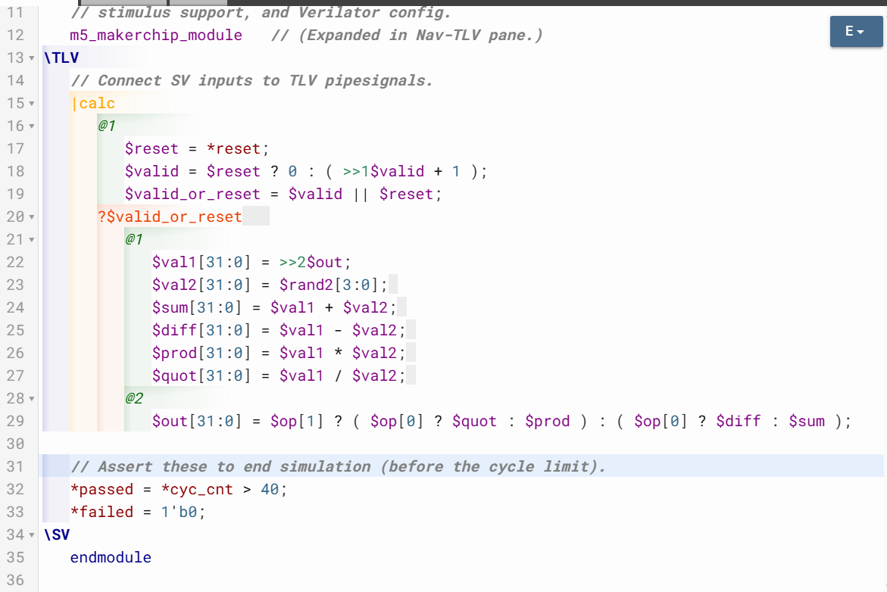
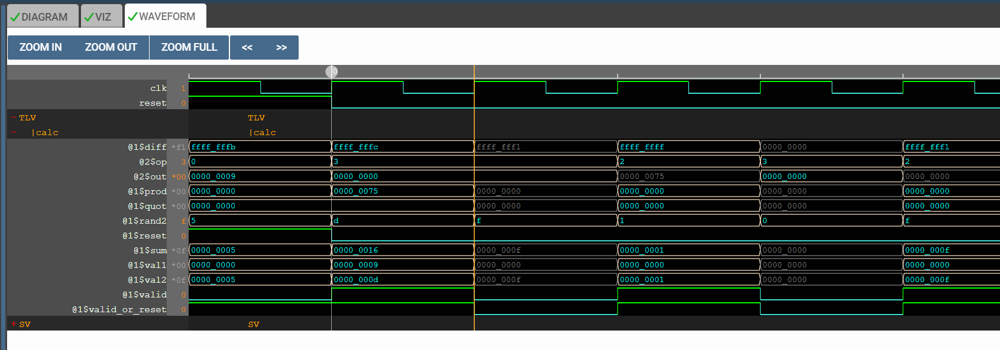

# 30-cycle_Calculator_with_Validity

## Overview

This lecture upgrades the earlier pipelined calculator by replacing explicit output zeroing with validity-aware computation. The lecture also introduces:

- MakerChip visualization tools
- waveform debugging
- visualization-based learning
- calculator visualization

---

# Replacing Output Zeroing With Validity

Instead of now zeroing out the output value every other cycle, we use validity. We thus transition from manually masking outputs to validity-aware computation.

---

# Alternate-Cycle Calculator

Every other cycle we have valid input.
Meaning - calculations occur every alternate cycle. Intermediate cycles become invalid cycles.

---

# Valid Signal

The pipeline already contains valid signal which indicates whether computation is meaningful.

---

# Reset Interaction With Validity

We have to make sure the logic is valid during reset.

## Why Reset Must Be Valid

The calculator output recirculates back into input. Therefore reset must propagate correctly
through feedback path.

---

# Stateful Output

The output value is state because output feeds future computations.

---

# Valid-Or-Reset Signal

This signal enables logic during:
- reset
- valid cycles.

---

# Garbage Values Are Acceptable

It's no longer necessary to explicitly zero out the output. Invalid cycles can safely contain:

- garbage values
- don't care values.

---

# Cycle Calculator With Validity





[Click Here To Open the Cycle Calculator With Validity in Makerchip](https://makerchip.com/v132/ide/~0ADf9hjY/p-02RhVk)

---

# Unsigned Underflow 

```text
0 - 12 = -12.
``` 
However the calculator interprets numbers as unsigned values. The unsigned number is underflowing. This produces very large positive values as no signed interpretation has been implemented.

----

# Recall Functionality

The recall operation loads stored value into calculator input.

