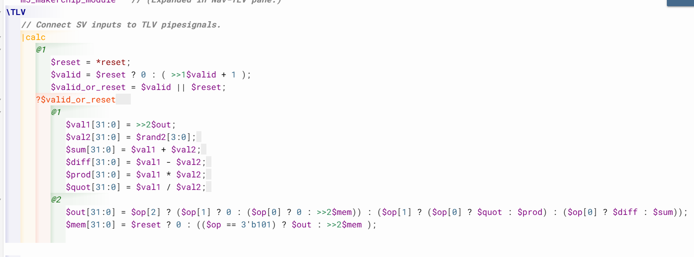

# 31-RV_D3SK4_L5_Calulator_Single_Value_Memory_Lab

## Overview

Weextend the pipelined calculator by introducing single-value memory support. The calculator now supports:

- MEM operation
- RECALL operation

This lecture introduces:
- state update logic
- recirculating state paths
- memory retention
- memory recall
- multi-cycle recirculation
- explicit recirculation in TL-Verilog
- functional clock gating concepts
- state update multiplexers
- memory pipeline timing

The calculator evolves from a pure arithmetic pipeline into a stateful programmable calculator.

---

# Goal of the Lecture

The calculator will now store a computed value retrieve that stored value later.

---

# MEM and RECALL Operations

Two new operations:
| Operation | Purpose                         |
| --------- | ------------------------------- |
| MEM       | Store current value into memory |
| RECALL    | Retrieve stored memory value    |

---

# Expanding the Operation Signal

Previously calculator supported 4 operations. Therefore $op required 2 bits. Now two additional operations are added. We need to add a bit here. So $op becomes 3-bit signal.

---

# Updated Operation Encoding

| op value | Operation    |
| -------- | ------------ |
| 000      | Add          |
| 001      | Subtract     |
| 010      | Multiply     |
| 011      | Divide       |
| 100      | Recall       |
| 101      | Memory Store |

---

# Introducing Memory State

The lecture introduces calculator memory state. The memory is state.
Meaning - memory persists across cycles.

---

# State Update Multiplexer

The memory uses mux-based state update logic. The mux decides between:

- reset value
- retained value
- new stored value

---

# Recirculation Path

The memory value loops back into itself through feedback path. Stored memory value reappears two cycles later. The calculator already uses 2-cycle cadence therefore memory also follows 2-cycle timing for design consistency.

---

# Memory Retain Case

if no memory update is requested, previous memory value is preserved.

---

# TL-Verilog vs Verilog

In Verilog state updates are often conditionally coded. In TL-Verilog recirculation is explicitly made visible.

---

# Functional Clock Gating

Functional clock gating avoids unnecessary flip-flop updates by controlling clock behavior.

---

# Gray Regions in Waveforms

We're going to see grays in the waveform. Gray regions indicate:

- invalid cycles
- don't-care behavior
- unused intermediate values

---

# Memory Update Cases

The memory supports three update cases.

## Case 1 — Reset

During reset memory becomes zero.

## Case 2 — Retain Existing Memory

If no MEM operation requested, then memory recirculates previous value. We take the value out of the memory and feed it back into the output value.

## Case 3 — Memory Store Operation

If we're doing a memory operation, then we want to grab the value of output and capture it in the memory. The memory captures output from two cycles ago.

[Click Here To Open The Calculator With Single Value Memory in Makerchip](https://makerchip.com/v132/ide/~0ADf9hjY/p-02RhVk)

---

# Hardware Perspective

| Concept                 | Meaning                            |
| ----------------------- | ---------------------------------- |
| Stateful Logic          | Hardware remembers previous values |
| Recirculation           | Feedback path preserves state      |
| Retain Case             | Preserve previous state            |
| Memory Update Mux       | Select next state value            |
| Functional Clock Gating | Avoid unnecessary updates          |
| Pipeline Cadence        | Timing alignment across stages     |
| Recall Path             | Reusing stored data                |

State is implemented using recirculation through flip-flops.

---

# Key Learning Outcome

After this lecture, the learner understands:

- stateful datapath design
- explicit state recirculation
- memory update logic
- retain behavior
- recirculation timing
- pipeline-consistent memory timing
- memory recall paths
- feedback-based hardware design
- visualization-assisted debugging
- TL-Verilog state modeling

---

# Notes

This lecture introduces state retention through recirculation.
