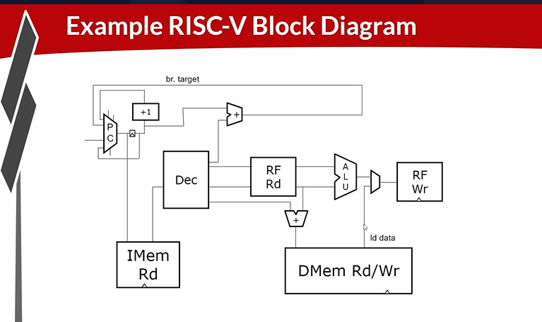

# 34-architecture_of_Single_Cycle_RISC-V_CPU

## Overview

The lecture introduces:

- CPU microarchitecture
- program counter
- instruction memory
- decode logic
- register file
- ALU
- branch computation
- load/store datapaths
- memory addressing
- writeback
- instruction flow

---

# RISC-V ISA vs Microarchitecture

RISC-V is the instruction set architecture, not the microarchitecture.
| Term              | Meaning                           |
| ----------------- | --------------------------------- |
| ISA               | Defines instructions and behavior |
| Microarchitecture | Hardware implementation of ISA    |

---

# CPU Microarchitecture

## Program Counter (PC)

The PC acts as a pointer into the instruction memory.
Meaning - points to next instruction to execute.

### Instruction Fetch

PC is sent into instruction memory. The instruction memory returns instruction bits.

## Instruction Memory

The PC acts as index into instruction memory. The data that comes back from the instruction memory is the instruction itself.

## Decode Logic

After fetching instruction CPU must interpret it. That's what the decode logic does.

### Instruction Fields

The decoder extracts:

- source registers
- destination register
- immediate values
- instruction type

### Immediate Values

Some instructions like a branch instruction
are going to have an immediate value. For branch instructions immediate field represents PC-relative offset. The branch target becomes:
```text
PC_next = PC + offset
```
The branch redirects execution flow to target instruction.

### Arithmetic Instructions

Most instructions operate on source registers.

## Register File

The register file stores CPU architectural registers. We need to access at least two source registers at a time. Therefore register file contains at least two read ports. The register file outputs two source operands. These operands feed ALU.

## Arithmetic Logic Unit (ALU)

The ALU performs:

- arithmetic
- logical operations

Examples:

- add
- subtract
- logical operations

### Calculator Analogy

| Calculator Concept    | CPU Equivalent |
| --------------------- | -------------- |
| Calculator memory     | Register file  |
| Calculator operations | ALU            |

### ALU Result

The ALU output becomes instruction result.

### Writeback

The result is written back into register file. The register file thus also contains write port.

---

# Load and Store Instructions

These are memory operations.

## Store instruction 

Store instruction computes memory address. Source register provides a base address and an offset is added to that. The address computation becomes:
```text
Address = Base + Offset
```
Store instructions write register value into memory.

## Load Instructions

Load instructions read memory value and write result back into register file.

---

# Single-Cycle Simplification

We initially assume that we can access all of this
in a single cycle.

---

# PC Cycle Boundary

PC is updated once per cycle. The next PC feeds back into current PC register. This creates an instruction sequencing loop.

---

# Instruction Memory Timing

Address is sent one cycle and instruction is received next cycle.

---



---

# Key Hardware Insight

A CPU is fundamentally a datapath plus control. This lecture introduces the datapath structure which later combines with:

- control logic
- pipelining
- hazard handling

to form a complete processor.

---

# Key Learning Outcome

After this lecture, the learner understands:

- RISC-V ISA vs microarchitecture
- CPU datapath structure
- instruction fetch
- decode
- register files
- ALU operation
- branch target computation
- load/store addressing
- writeback
- instruction sequencing
- simplified CPU timing

This forms the foundation for building a complete RISC-V CPU.

---

# Notes

The learner now begins implementing:

- actual CPU datapaths
- instruction execution flow
- architectural state updates

using TL-Verilog and MakerChip.


