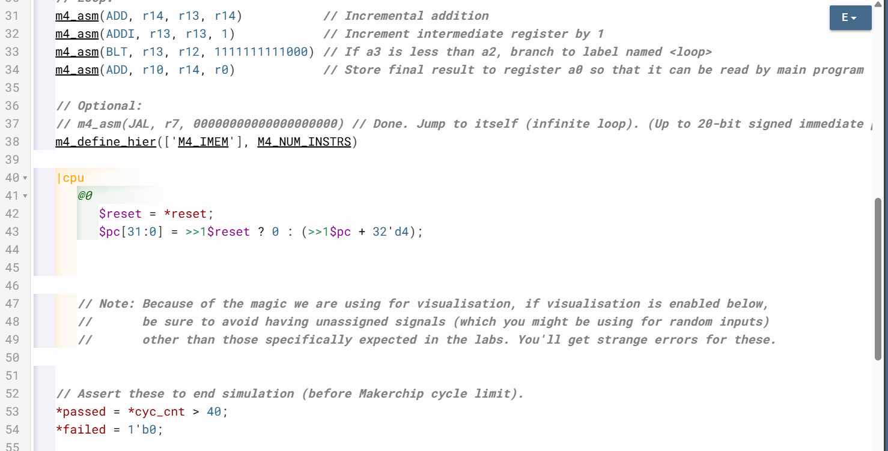
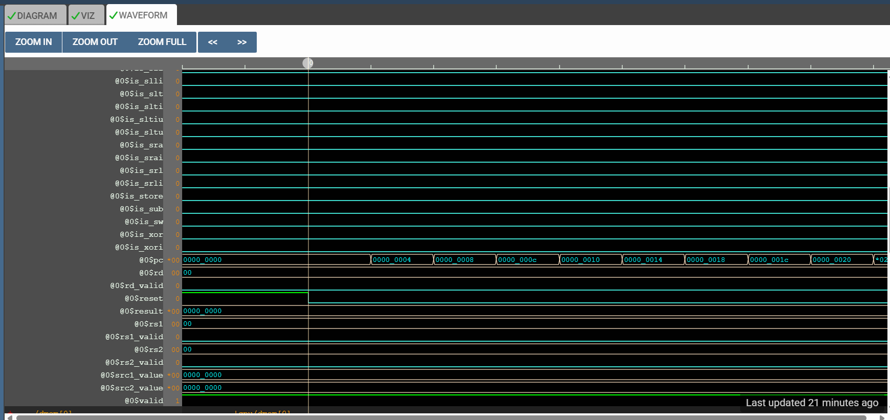

# 37-RV_D4SK2_L1_Implementation_Plan_and_Lab_for_PC

## Overview

This lecture begins the actual implementation of the RISC-V CPU datapath. This lecture specifically implements Next PC Logic, which controls:

- instruction sequencing
- program execution order
- instruction fetch progression

The lecture introduces:
- PC incrementing
- sequential execution
- byte-addressed PCs
- reset-aware PC initialization
- previous transaction reset handling
- first instruction correctness
- instruction sequencing

This is the first hardware block of the RISC-V processor implementation.

---

# Sequential Execution Assumption

Initially CPU assumes purely sequential execution. Branches will be handled later. This simplifies initial PC implementation.

---

# Goal of First PC Logic

Initial objective is to simply increment PC continuously.

---

# PC Recirculation

The next PC value becomes previous PC plus instruction increment.
Meaning - recirculation path through flip-flops.

---

# Byte Addressed PC

This is a byte addressed PC.

---

# PC Increment Amount

RISC-V instructions are 32 bits which equals 4 bytes. Therefore PC increments by 4 bytes. The next PC computation becomes:
```text
PC_next = PC_prev + 4
```

---

# First Instruction Correctness

CPU must begin execution at PC = 0.

---

# Problem With Naive Reset Logic

A naive implementation might be:
```text
if reset:
    PC = 0
else:
    PC = old_PC + 4
```
But this causes first executed instruction to become instruction 1. On the first non-reset cycle,
we're actually going to get 0 plus 1 is 1.
Meaning - increment happens too early.
Without special handling execution starts at:
```text
PC = 4
```
instead of:
```text
PC = 0.
```

---

# Using Previous Reset

We use previous instruction reset handling. We reset to zero based on the previous instruction's reset. This ensures first non-reset instruction
still receives:
```text
PC = 0.
```
The reset belongs to previous pipeline transaction. This produces:
| Cycle                 | Reset | PC |
| --------------------- | ----- | -- |
| Reset cycle           | 1     | 0  |
| First non-reset cycle | 0     | 0  |
| Next cycle            | 0     | 4  |
| Next cycle            | 0     | 8  |

---

# Reset MUX Input

During reset mux selects zero, otherwise selects incremented PC.

---





[Click Here To Open the Incremental PC implementation in Makerchip](https://makerchip.com/v132/ide/~0ADf9hjY/p-0qjh1W)

---

# Hardware Perspective

Instruction sequencing is fundamentally state recirculation. The PC continuously feeds back through: 
- flip-flops 
- increment logic
- branch redirection logic

forming the core execution loop of the processor.

---

# Key Learning Outcome

After this lecture, the learner understands:

- next PC logic
- sequential instruction execution
- byte-addressed PCs
- PC incrementing
- recirculating state
- previous transaction references
- reset-aware PC initialization
- instruction sequencing
- transaction-level reset handling

---

# Notes

Every processor begins with correct PC sequencing. The Program Counter is fundamentally the control-flow state variable of the CPU.

