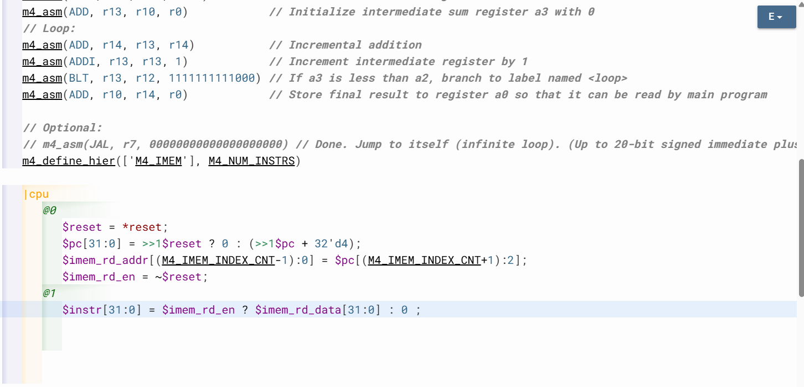
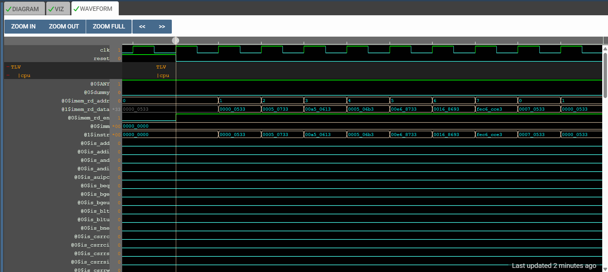

# 38-RV_D4SK2_L2_Lab_For_Instruction_Fetch_Logic

## Overview

This lecture implements instruction fetch logic for the RISC-V CPU. The lecture introduces:

- instruction memory hookup
- IMEM interfaces
- instruction fetch
- instruction addressing
- byte-addressed PCs
- aligned instruction access
- memory indexing
- CPU visualization integration
- interface debugging
- produced/consumed signals

This lecture is the first time the CPU actually fetches instructions from instruction memory. The CPU now progresses from instruction sequencing to actual instruction retrieval.

# Instruction Memory Already Provided

The shell already contains instruction memory infrastructure. The instruction memory already contains the summation test program.
Meaning - previously assembled RISC-V program is now stored inside instruction memory.

---

# IMEM Instantiation

We instantiate instruction memory.

---

# IMEM Interface Signals

The instruction memory requires:
| Signal            | Purpose                  |
| ----------------- | ------------------------ |
| IMEM Read Enable  | Enable instruction fetch |
| IMEM Read Address | Instruction address      |
| IMEM Data         | Instruction output       |

## IMEM Read Enable

The CPU must assert read enable to fetch instructions.

## IMEM Read Address

The PC provides instruction address.

### Address Width Consideration

Instruction memory array size determines address width.

### PC Used as Instruction Address

We're indexing by the PC to look up the instruction. We are going to assume that the PC properly is aligned to the instruction boundary.

### Lower Two Bits Always Zero

Since instructions are 4 bytes, aligned instruction addresses always have:
| Bit   | Value |
| ----- | ----- |
| PC[1] | 0     |
| PC[0] | 0     |

Lower bits are ignored becuase instruction memory indexes instruction words not individual bytes.

Instruction memory address becomes:
```text
IMEM_ADDR=PC[31:2]
```
This converts byte addresses into word addresses.

### Instruction Output Signal

The instruction memory outputs fetched instruction.

---

# Instruction Fetch Path

The fetch datapath now becomes:
```text
PC -> IMEM Address -> Instruction Memory -> Instruction
```

---

# Decode Logic Still Missing

Fetched instructions may not yet display properly
because decode logic incomplete. At this stage fetch works but instruction interpretation is incomplete.

---





[Click Here To Open the IMEM and Fetch implementation in Makerchip](https://makerchip.com/v132/ide/~0ADf9hjY/p-0vghED)

---

# Hardware Perspective

Instruction fetch converts control flow into executable data flow. The Program Counter selects memory address which then produces instructions which drive the rest of the processor pipeline.

---

# Key Learning Outcome

After this lecture, the learner understands:

- instruction fetch logic
- instruction memory interfaces
- IMEM hookup
- aligned instruction addressing
- byte-addressed PCs
- word indexing
- instruction fetch datapaths

This lecture establishes the instruction fetch stage of the RISC-V processor pipeline.

---

# Notes

This lecture introduces processor-memory interaction. The CPU now actively reads instructions from instruction memory using Program Counter driven addressing.


