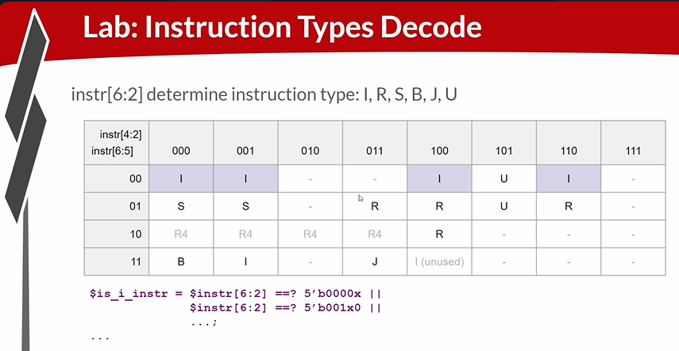
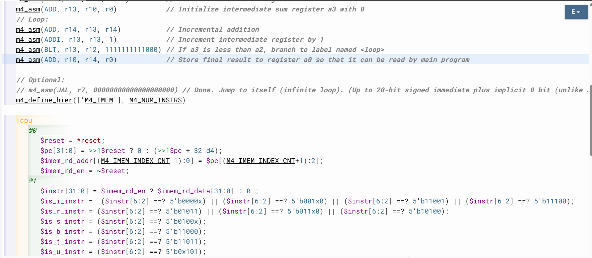

# 39-RV_D4SK2_L3_Lab_For_RV_Instruction_Types_IRSBJU_Decode_Logic

## Overview

This lecture introduces instruction decode logic for the RISC-V CPU. The lecture explains how binary instructions fetched from instruction memory
are interpreted in hardware. The lecture focuses on:

- opcode decoding
- instruction type identification
- instruction field interpretation
- RISC-V instruction formats
- decode signals
- wildcard matching
- don't care bits
- ISA classification

This lecture implements the first stage of instruction understanding inside the processor. The CPU now progresses from instruction fetch
to instruction interpretation.

---

# Role of Decode Logic

Decode logic determines:

- what instruction is being executed
- how instruction fields should be interpreted
- which datapath operations should occur

---

# Instruction Bits From Memory

The fetched instruction arrives as raw binary bits.The decoder converts bits into control signals.

---

# Instruction Types

 Instruction is divided into instruction fields. Different instruction types contain different field layouts. Therefore hardware must first determine instruction type. The instruction type in RISC-V is defined by the opcode field from bit six down to zero. The lower two bits are always
```text
2'b11
```
for base RISC-V ISA instructions.
Therefore decode logic examines:
```text
instr[6:2]
```

## Purpose of ==?

The operator allows wildcard comparisons using don't care bits.
Example:
```text
$instr[6:2] ==? 5'b0000x
```
This matches 
```text
5'b00000
```
and 
```text
5'b00001
```

## Hardware Pattern Matching

The decoder effectively behaves like large combinational pattern matcher. Instruction decoding is hardware pattern recognition. The decoder transforms binary encoding into semantic meaning.

---





[Click Here To Open the Decode implementation in Makerchip](https://makerchip.com/v132/ide/~0ADf9hjY/p-0vghED)

---

# Hardware Perspective

We interpret instructions primarily through combinational decode logic. Instruction decoding fundamentally consists of:

- binary pattern matching
- field extraction
- control signal generation

performed every cycle by combinational hardware.

---

# Key Learning Outcome

After this lecture, the learner understands:

- instruction decode logic
- opcode classification
- RISC-V instruction formats
- wildcard matching
- don't care bits
- instruction type identification
- decode signal generation
- ISA-driven hardware behavior
- combinational decode logic
- waveform-based decode debugging

This lecture establishes the decode stage of the RISC-V processor pipeline.

---

# Notes

This lecture introduces the semantic interpretation stage of the processor. The CPU now reads binary instructions and classifies them into operations. This decode stage ultimately controls every major datapath component:

- ALU
- register file
- memories
- branch logic
- writeback logic

and therefore forms the central control mechanism
of the processor.