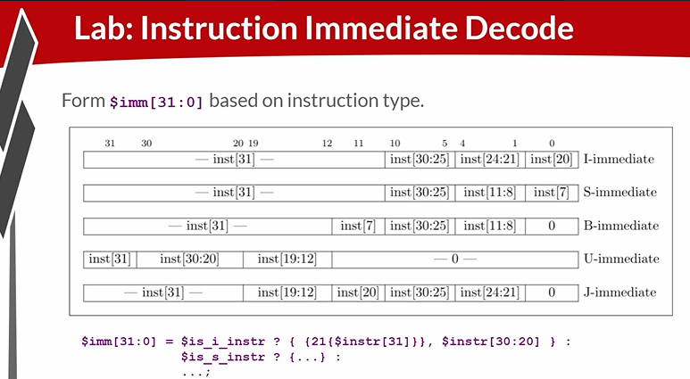
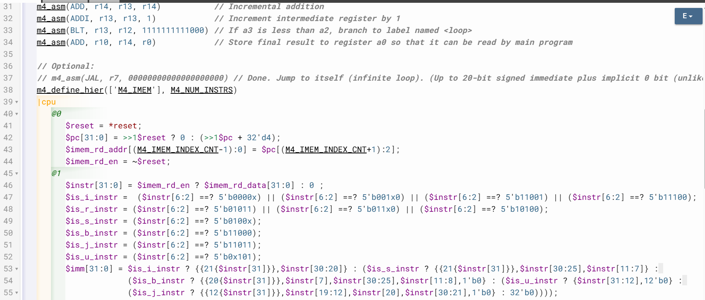

# 40-RV_D4SK2_L4_Lab_For_Instruction_Immediate_Decode_Logic_For_RV-ISBUJ

## Overview

This lecture implements immediate decode logic for RV-ISBUJ instruction formats. The lecture explains how immediate values are extracted from RISC-V instructions. The lecture focuses on:

- immediate field construction
- instruction-type dependent decoding
- sign extension
- concatenation
- bit replication
- 32-bit immediate generation

Immediate operands are required by:
  - ALU operations
  - loads/stores
  - branches
  - jumps
  - upper immediate instructions

  ---

  # Immediate Fields Depend On Instruction Type

Based on the instruction type, the instruction will have immediate bits in different locations.

---

# RV-ISBUJ Formats

| Type | Meaning         |
| ---- | --------------- |
| I    | Immediate       |
| S    | Store           |
| B    | Branch          |
| U    | Upper Immediate |
| J    | Jump            |

Each format places immediate bits in different instruction locations. However, regardless of instruction type final immediate always becomes a 32-bit value. Not all instructions are going to have immediate values.
Example - R-type instructions do not use immediates.

## Immediate Decode Multiplexing

The decoder effectively performs:
```text
If instruction type is X,
use immediate construction Y.
```

## Sign Extension

We make 21 copies of instruction bit 31. This is sign extension. Bit 31 represents sign bit for signed immediates. To preserve negative values upper bits are replicated.

## Concatenation

The lecture introduces concatenation syntax:
```text
{a,b,c}
```
This joins multiple bit fields into one larger field.

## Bit Replication Syntax

The lecture introduces:
```text
{21{instr[31]}}
```
Meaning - create 21 copies of instr[31].

## Decode Logic Flow

The immediate decode process becomes:
```text
Instruction →
Instruction Type →
Immediate Bit Selection →
Sign Extension →
32-bit Immediate
```





[Click Here To Open the Decode implementation in Makerchip](https://makerchip.com/v132/ide/~0ADf9hjY/p-0vghED)

---

# Hardware Perspective

Immediate values are reconstructed entirely through combinational bit manipulation logic. The CPU does not "compute" immediates mathematically. Instead it:

- rearranges bits
- concatenates fields
- performs sign extension

using combinational wiring logic.

---

# Key Learning Outcome

After this lecture, the learner understands:

- immediate field extraction
- sign extension
- concatenation syntax
- replication syntax
- RV-ISBUJ immediate formats
- instruction-type dependent decode
- 32-bit immediate generation
- combinational immediate construction
- bit manipulation

---

# Notes

This lecture introduces the immediate operand. The processor now gains the ability to:

- interpret constants
- compute offsets
- perform address calculations
- execute PC-relative instructions

which are all essential for full instruction execution.

 