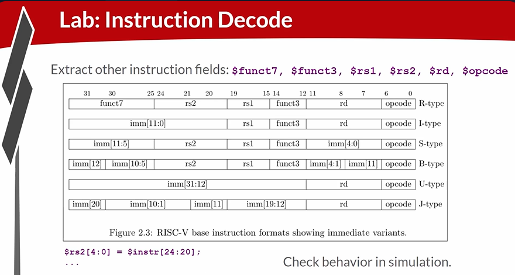
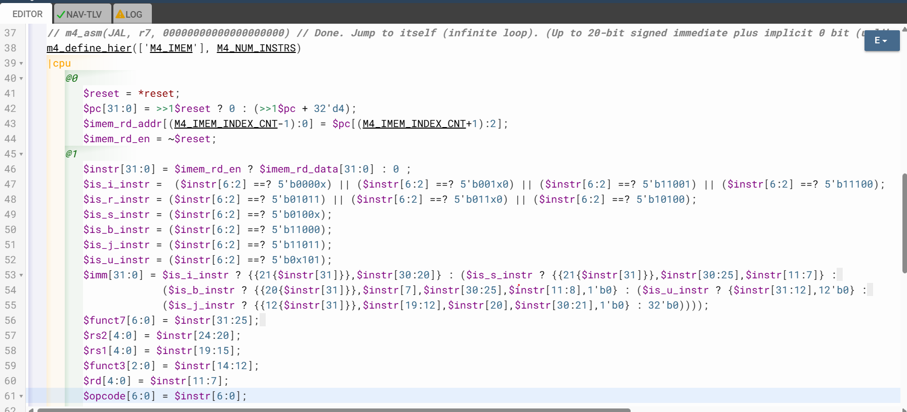
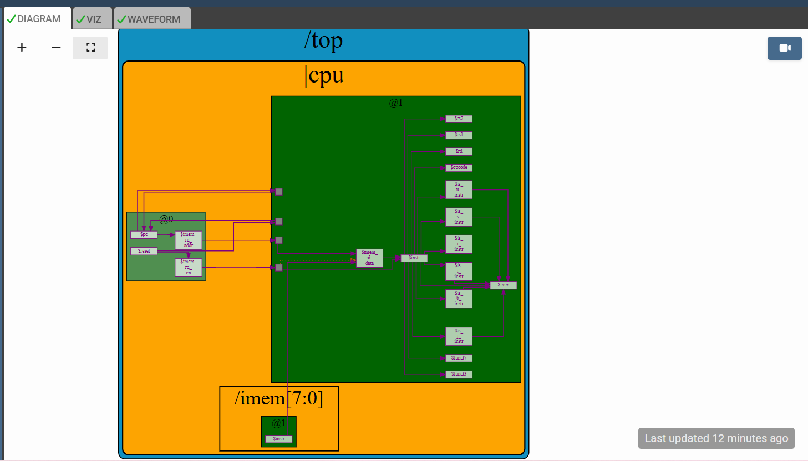

# 41-RV_D4SK2_L5_Lab_To_Decode_other_Fields_of_Instructions_For_RV-ISBUJ

## Overview

This lecture continues instruction decode logic by implementing extraction of all remaining instruction fields for RV-ISBUJ instruction formats. The lecture focuses on:

- register field extraction
- funct field extraction
- opcode extraction
- uniform field positioning
- ISA-friendly encoding
- instruction bit slicing
- decode datapaths

This lecture completes the structural decode stage
of the RISC-V processor.

---

# Relevant Fields

The decoder extracts:
| Field  | Purpose                    |
| ------ | -------------------------- |
| opcode | instruction category       |
| rd     | destination register       |
| rs1    | source register 1          |
| rs2    | source register 2          |
| funct3 | operation subtype          |
| funct7 | extended operation subtype |

---

# RISC-V ISA Property

Each of the fields in the instruction is always coming from the same place regardless of the instruction type. This is an intentional RISC-V design choice. However, Unlike:

- rs1
- rs2
- rd
- funct fields
- opcode

immediate fields vary across instruction formats.

---

# Why Uniform Field Placement Matters

Uniform field positioning greatly simplifies hardware decode logic. The decoder can directly slice bits without instruction-type conditionals. There's no conditioning based on the instruction type.
Meaning - field extraction becomes direct combinational wiring.

---

# Decode Datapath

The decode flow now becomes:
```text
Instruction →
Field Extraction →
Control Logic →
Execution
```

---







[Click Here To Open the Decode implementation in Makerchip](https://makerchip.com/v132/ide/~0ADf9hjY/p-0vghED)

---

# Hardware Perspective

RISC-V simplifies hardware by keeping most instruction fields in fixed bit positions. This dramatically reduces:

- decode complexity
- timing overhead
- combinational logic depth

inside the processor front-end.

---

# Key Learning Outcome

After this lecture, the learner understands:

- instruction field extraction
- bit slicing
- register field decode
- funct field decode
- opcode extraction
- RISC-V encoding philosophy
- ISA-driven hardware simplification
- combinational decode datapaths
- decode-stage wiring logic

---

# Notes

This lecture demonstrates an engineering strength of RISC-V ISA design. By keeping:

- rs1
- rs2
- rd
- funct3
- funct7

in fixed positions across instruction formats RISC-V enables:

- simpler decoders
- faster hardware
- smaller logic
- cleaner pipelines

which are all critical for efficient CPU implementation.