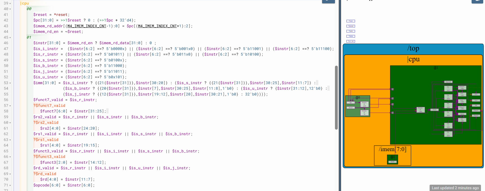

# 42-ISBUJ

## Overview

This lecture improves instruction field decode logic by introducing validity-aware field decoding
using when conditions. The lecture focuses on:

- conditional field validity
- valid decode signals
- instruction-type-aware decoding
- waveform cleanliness
- validity propagation
- decode correctness
- conditional field generation

This lecture applies TL-Verilog validity concepts to RISC-V instruction decode logic.

---

[Click Here To Open the Decode implementation in Makerchip](https://makerchip.com/v132/ide/~0ADf9hjY/p-0vghED)

---

# Hardware Perspective

Decoded fields should only propagate when architecturally meaningful. This is fundamental to:

- clean pipelines
- correct control logic
- scalable CPU verification
- efficient hardware implementation

---

# Key Learning Outcome

After this lecture, the learner understands:

- validity-conditioned decode
- when conditions
- field validity signals
- decode gating
- architecturally meaningful signals
- waveform-oriented verification
- TL-Verilog validity integration
- instruction-aware field propagation

---

# Notes

This lecture demonstrates how TL-Verilog validity concepts integrate naturally into CPU design. The decode stage now behaves semantically correctly rather than merely structurally correctly.