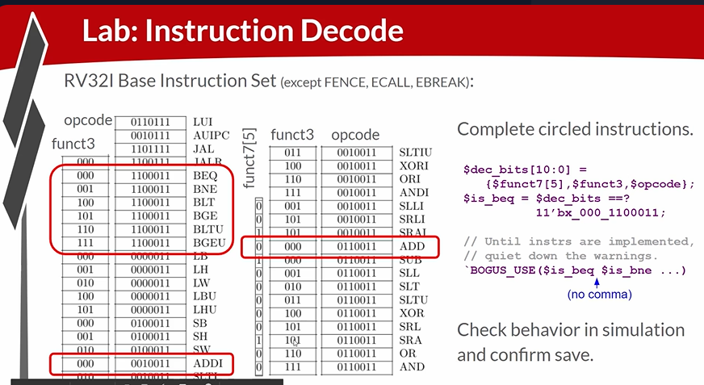
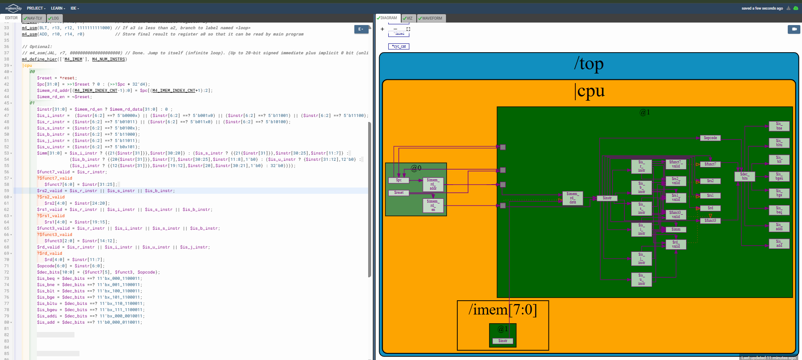

# 43-RV_D4SK2_L7_Lab_To_Decode_Individual_Instruction

## Overview

This lecture implements individual instruction decode logic for the RISC-V CPU. The lecture focuses on:

- instruction-specific decode signals
- funct7/funct3/opcode matching
- decode bit vectors
- wildcard decoding
- branch instruction decoding
- instruction classification
- Verilog `==?` operator
- don't care bits

This lecture is the point where the CPU begins identifying exact instructions instead of only instruction types.

---

# Starting With Test Program Instructions

We're going to start by just decoding the instructions that are relevant to our particular test program.

---

# Initial Instructions To Decode

The ones circled in red are the initial instructions to decode:



---

# Decode Vector Formula

Combined decode vector:
```text
$dec_bits[16:0] = {$funct7, $funct3, $opcode};
```

## Why Combine Decode Fields?

This simplifies instruction matching. Instead of multiple comparisons, the CPU performs one large pattern match.

---

# Instruction Decode Strategy

The processor now performs:
```text
Instruction →
Extract Fields →
Create Decode Vector →
Pattern Match →
Generate Instruction Signal
```

---



[Click Here To Open the Decode implementation in Makerchip](https://makerchip.com/v132/ide/~0ADf9hjY/p-0vghED)

---

# Hardware Perspective

Instruction decoding fundamentally consists of combinational pattern matching against ISA encodings. The CPU identifies instructions by comparing extracted fields against predefined ISA bit patterns.

---

# Key Learning Outcome

After this lecture, the learner understands:

- individual instruction decode
- decode vectors
- wildcard matching
- Verilog ==?
- don't care bits
- funct3/funct7/opcode decoding
- branch instruction decode
- instruction-specific signals
- tooling warning suppression

This lecture completes semantic instruction decode
for the RISC-V processor pipeline.

---

# Notes

This lecture marks the transition from structural decode to semantic decode. The CPU now understands exactly which instruction is being executed. This enables the processor to:

- control datapaths
- select ALU operations
- redirect branches
- perform writeback
- execute program

and therefore forms the core control intelligence
of the processor.
