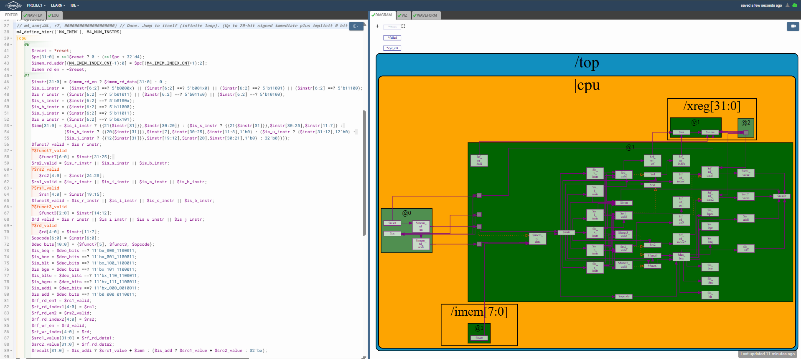

# 46-RV_D4SK3_L3_Lab_For_ALU_Operations_For_add_addi

## Overview

This lecture implements the Arithmetic Logic Unit (ALU) for the RISC-V CPU. The lecture focuses on:

- ALU result generation
- instruction-controlled computation
- ternary operator based ALU selection
- arithmetic execution
- immediate arithmetic
- datapath computation flow
- mux-based operation selection

The ALU now receives source operands from the register file and produces computation results based on decoded instruction signals.

The lecture specifically implements:

- ADD
- ADDI

while noting that:
- BLT does not generate a destination result.

This lecture marks the beginning of actual instruction execution inside the processor datapath.

The ALU performs computations based on:

- decoded instruction type
- source operands
- immediate values

---

# ALU As A Mux

The lecture explains that the ALU symbol looks similar to a mux because:

Computation is followed by a mux selecting the appropriate computation.

Different computations are performed in parallel and the final result is selected based on the instruction decode signals.

---

# ADDI Instruction

For the ADDI instruction:
```text
Result = Source1 + Immediate
```
The ADDI operation uses:

- source operand from RS1
- immediate operand

to produce the final ALU result.

---

# ADD Instruction

The ADD instruction is very similar to ADDI except that both operands come from registers.
```text
Result = Source1 + Source2
```

---

# BLT Instruction

The BLT (Branch Less Than) instruction:

- does not produce a destination result
- does not write into the register file

Therefore no ALU result assignment is required for BLT at this stage.

---

# ALU Datapath

The datapath now becomes:
```text
Instruction →
Decode →
Register File →
ALU →
Result
```

---

# Hardware Perspective

The ALU is the execution engine of the processor datapath. It performs arithmetic and logical computations based on the decoded instruction. The ALU structurally behaves like multiple parallel computations followed by mux-based result selection.

---



[Click Here To Open the ALU implementation in Makerchip](https://makerchip.com/v132/ide/~0ADf9hjY/p-0vghED)

# Key Learning Outcome

After this lecture, the learner understands:

- ALU implementation
- ternary-operator-based ALU selection
- ADD instruction execution
- ADDI instruction execution
- mux-style ALU datapaths
- result generation
- execution-stage datapath flow

This lecture establishes the first real execution hardware inside the RISC-V processor.

---

# Notes

This lecture marks the point where the processor begins performing actual computations on operand values fetched from the register file.