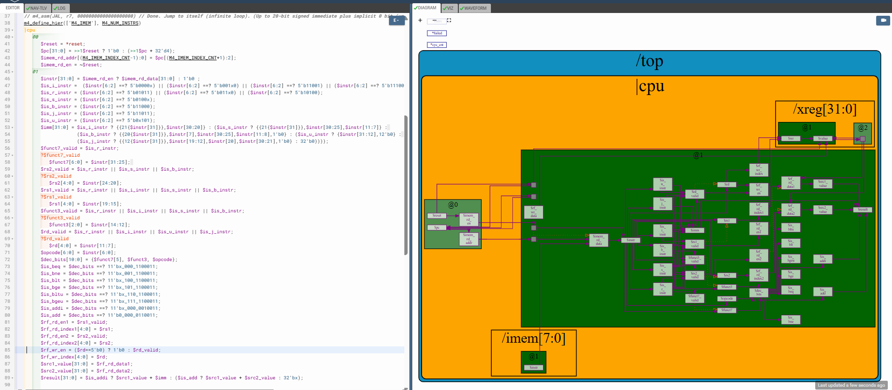

# 47-RV_D4SK3_L4_Lab_For_Register_File_Write

## Overview

This lecture implements register file write control logic for the RISC-V CPU. The lecture focuses on:

- register file write interfaces
- write enable signals
- destination register handling
- ALU result connection
- x0 register behavior
- write suppression logic
- architectural register semantics

The lecture connects ALU results to the register file inputs and controls when register writes are allowed.

The CPU now becomes capable of:
- reading operands
- executing instructions
- storing computation results into architectural registers

---

# Register File Write Logic

The register file already exists and now the CPU must:
- connect write control signals
- connect destination register index
- connect write data

## Register File Write Signals

The register file write interface contains:

| Signal | Purpose |
| --- | --- |
| Write Enable | controls register write |
| Write Index | destination register number |
| Write Data | value to be written |

## Destination Register

The decoded `rd` field specifies which architectural register receives the result.

---

# Write Enable Logic

The register file should only be written when destination register is valid.

Therefore:
- `rd_valid`
controls write enable generation.

---

# x0 Register Behavior

x0 is an always-zero register. Whenever x0 is read the value returned is always zero. Therefore writes to x0 must be blocked.

---

[Click Here To Open the ALU implementation in Makerchip](https://makerchip.com/v132/ide/~0ADf9hjY/p-0vghED)

---

# Hardware Perspective

The processor now supports:

- operand reads
- instruction execution
- architectural register updates

The register file stores processor-visible architectural state.

---

# Key Learning Outcome

After this lecture, the learner understands:

- register file write interfaces
- write enable generation
- destination register handling
- ALU result connection
- x0 architectural behavior
- write suppression logic
- architectural state updates

This lecture establishes register update capability inside the RISC-V processor pipeline.

# Notes

This lecture introduces the immutable x0 register behavior defined by the RISC-V ISA.