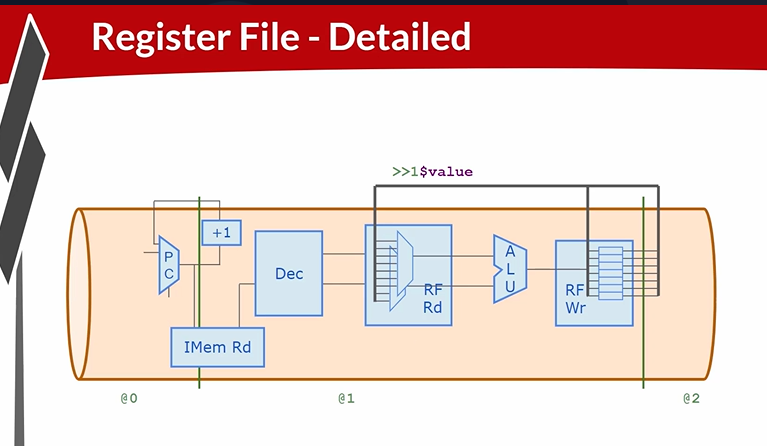

# 48-RV_D4SK3_L5_Concept_Of_Array_And_Register_File_Details

## Overview

This lecture explains the internal architecture and timing behavior of the register file used inside the RISC-V CPU. The lecture focuses on:

- internal structure of register file arrays
- array entry organization
- register write logic
- register read logic
- recirculation behavior
- pipeline timing association
- state update timing
- instruction-to-instruction register dependency

The lecture explains:
- what exists inside the register file macro
- how writes occur
- how reads occur
- how pipeline timing affects register visibility

This lecture builds intuition for:
- register file timing behavior
- state propagation
- pipeline-aware register accesses

---

# Register File Internal Structure

The lecture expands the internal implementation of the register file array. For a RISC-V CPU the register file contains 32 entries. corresponding to x0 through x31.

---

# Register File Entries

Each register entry contains:

- storage flip-flops
- write selection logic
- recirculation logic

---

# Register File Write Logic

Each register entry checks:
```text
Is the write index equal to my index?
```
If true, the entry captures incoming write data. Otherwise it recirculates its previous stored value.

---

# Recirculation Concept

The register maintains state by feeding old values back into storage when no write occurs.

---

# Register Reset Value

The register file entries initialize to zero during reset.

---

# Register File Read Logic

The read logic selects one register value based on read index. The register file output is enabled only when read enable is asserted.

---

# Pipeline Timing Behavior

The CPU should be reading registers written by the previous instruction. If read and write happen in the same stage then an instruction could incorrectly read its own newly-written value. This is not desired CPU behavior. The correct behavior is that the previous instruction writes register file and the next instruction reads the updated value. Therefore instruction in stage 2 updates state and instruction in stage 1 reads updated state. This creates instruction-to-instruction dependency flow.



---

# Hardware Perspective

The register file is fundamentally state storage plus indexed selection logic. The CPU pipeline interacts with this state using timing-aware reads and writes.

---

# Key Learning Outcome

After this lecture, the learner understands:

- internal RF architecture
- RF entry behavior
- register write selection
- register recirculation
- RF read selection
- pipeline timing relationships
- state update timing
- instruction dependency timing
- ahead-by-one references

---

# Notes

This lecture is primarily conceptual and focuses on understanding the timing semantics of register file state interactions inside a pipelined processor.

