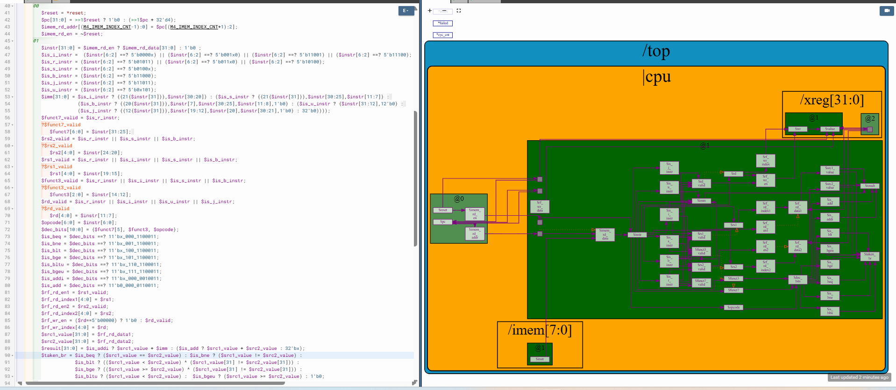

# 49-RV_D4SK3_L6_Lab_For_Implementing_Branch_Instructions

## Overview

This lecture begins implementation of branch instruction support for the RISC-V CPU. The lecture focuses on:

- conditional branch instructions
- branch condition evaluation
- signed vs unsigned comparisons
- branch-taken logic
- branch instruction decoding
- source register comparisons
- branch decision generation

The lecture explains:
- how branch instructions determine control flow
- how branch conditions are evaluated
- how the CPU decides whether a branch should be taken

At this point:
- the processor pipeline is mostly functional
- but execution stops correctly looping only after branch support is added.

This lecture enables:
- loop execution
- iterative program flow
- conditional control transfer

inside the processor.

---

# Branch vs Jump

An ISA distinction:
| Instruction Type | Behavior      |
| ---------------- | ------------- |
| Branch           | Conditional   |
| Jump             | Unconditional |

---

# Branch Conditions

Branch instructions compare:

- source register 1
- source register 2

and determine whether control flow changes.

---

# Supported Branch Instructions

| Instruction | Meaning                             |
| ----------- | ----------------------------------- |
| BEQ         | Branch if Equal                     |
| BNE         | Branch if Not Equal                 |
| BLT         | Branch if Less Than                 |
| BGE         | Branch if Greater or Equal          |
| BLTU        | Branch if Less Than Unsigned        |
| BGEU        | Branch if Greater or Equal Unsigned |

---

# Signed vs Unsigned Comparisons

Verilog comparisons are unsigned by default. Therefore signed comparisons require special handling.

---

# Branch Taken Signal

```text
taken_branch
```
This signal determines whether branch redirection occurs.

---

# Default Branch Behavior

Non-branch instructions must default to not taken.

---

# Branch Datapath

The datapath now becomes:
```text
Instruction →
Decode →
Register Read →
Comparison →
Branch Decision
```

---

# Loop Execution

Branch support is necessary for loop iteration. Without branches the CPU cannot repeat instructions.

---



[Click Here To Open the Taken Branch Signal implementation in Makerchip](https://makerchip.com/v132/ide/~0ADf9hjY/p-0vghED)

---

# Hardware Perspective

Branch instructions are the foundation of control flow inside processors. Branch decisions dynamically alter program execution order.

---

# Key Learning Outcome

After this lecture, the learner understands:

- branch instruction semantics
- conditional control flow
- signed vs unsigned comparison logic
- branch condition evaluation
- branch-taken generation
- branch decode integration
- loop execution support

This lecture establishes conditional execution capability inside the RISC-V processor.

---

# Notes

This lecture introduces the first form of dynamic control flow inside the processor datapath.