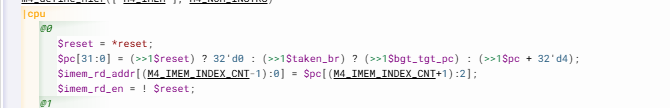
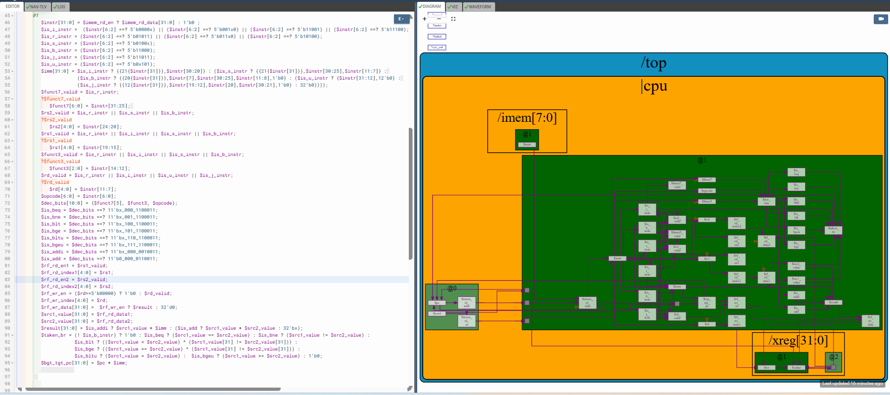
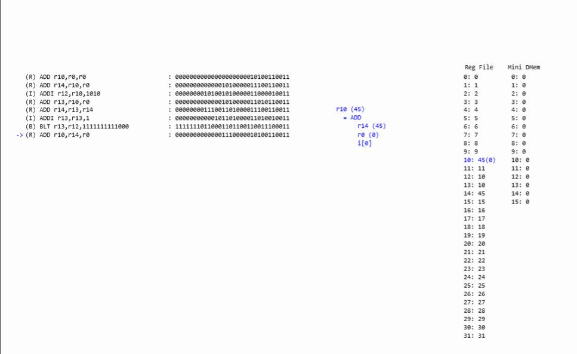

# 50-RV_D4SK3_L7_Lab_For_Completing_Branch_Instruction_Implementation

## Overview

This lecture completes branch instruction support for the RISC-V CPU. The lecture focuses on:

- branch target PC computation
- branch immediate usage
- branch PC redirection
- signed branch offsets
- branch target generation
- PC mux modification
- ahead-by-one pipeline timing
- control flow redirection

The lecture explains:

- how the CPU computes the destination address of a branch
- how the PC gets redirected after a taken branch
- how branch instructions influence the next instruction fetch

At this stage the processor becomes capable of:

- executing loops
- performing conditional control flow
- iterating program execution

The program should now successfully sum numbers from 1 to 9 using looping branch logic.

---

# Branch Target PC

After computing whether a branch is taken, the CPU must determine where to branch.

---

# Branch Target Formula

The lecture explains:

```text id="v7l5gk"
Branch Target PC =
PC of branch instruction
+
branch immediate
```

----

# Branch Immediate

Branch instructions contain signed immediate offsets which may represent forward branches or backward branches. The branch offset may be:
| Offset Type | Meaning         |
| ----------- | --------------- |
| Positive    | forward branch  |
| Negative    | backward branch |
It doesn't actually matter whether you're treating this as signed or unsigned. Because two's complement arithmetic preserves correctness for addition.

---

# PC Mux Modification

The PC mux must now support branch target selection. Previously PC only incremented sequentially. Now taken branches redirect PC flow.

---

# Next PC Logic

The processor now chooses between:
| Condition        | Next PC          |
| ---------------- | ---------------- |
| Normal execution | PC + 4           |
| Taken branch     | Branch target PC |

---

# Ahead-By-One Timing

The branch instruction provides the PC for the next instruction. The branch instruction exists one cycle earlier than the instruction currently being fetched. Therefore PC mux logic uses previous instruction branch result.

---

# Branch Pipeline Flow

The datapath now becomes:
```text
Instruction →
Branch Decision →
Branch Target Computation →
PC Redirect →
Next Instruction Fetch
```

---

# Loop Execution

After branch support loops begin functioning correctly. The learner should observe:

- repeated execution
 -iterative accumulation
- changing sum values

inside simulation. The summation program should now execute successfully.

---

# Simulation Verification

Initially The output of the ALU wasn't feeding into the write data port of the register file, because of which the registers weren't updating correctly. Therefore, the following line of TLV code was added in Stage 1:
```text
$rf_wr_data[31:0] =  $rf_wr_en ? $result : 32'd0;
```
The program  was now successfully summing numbers from 1 to 9.







[Click Here To Open the Updated PC implementation in Makerchip](https://makerchip.com/v132/ide/~0ADf9hjY/p-0vghED)

---

# Hardware Perspective

Branch instructions dynamically redirect program execution flow. This introduces non-linear instruction execution inside the CPU. Branch support is fundamental for:

- loops
- conditionals
- program control structures

inside software execution.

---

# Key Learning Outcome

After this lecture, the learner understands:

- branch target computation
- signed branch offsets
- PC redirection
- branch-controlled instruction fetch
- ahead-by-one timing
- branch pipeline timing
- loop execution support
- branch mux integration

This lecture completes conditional control-flow execution inside the RISC-V processor.

---

# Notes

This lecture introduces dynamic control-flow support. The processor can now:

- execute iterative programs
- follow conditional execution paths
- perform looping behavior

which are fundamental capabilities required for real software execution.
