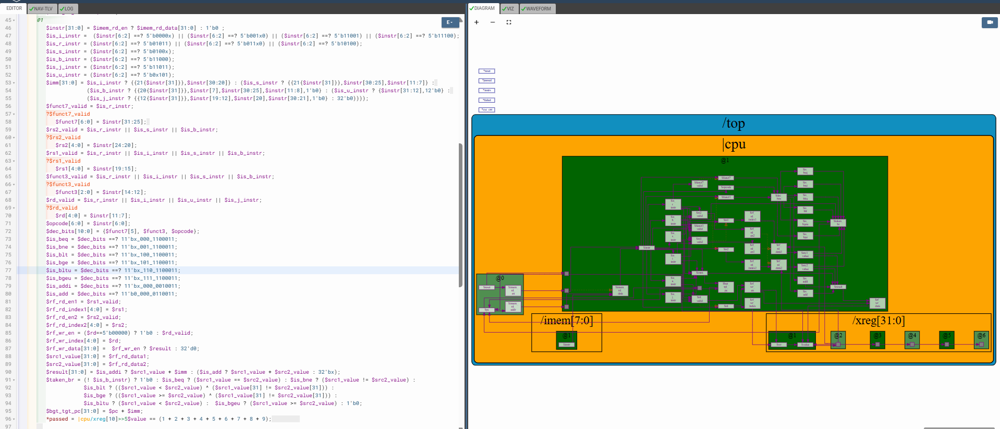
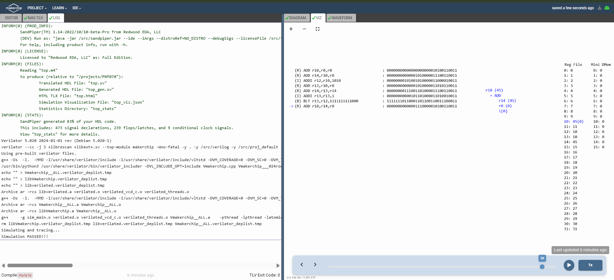

# 51-RV_D4SK3_L8_Lab_To_Create_Simple_Testbench

## Overview

This lecture implements a simple testbench validation mechanism for the RISC-V CPU using:
- `*passed`

signals in MakerChip. The lecture focuses on:

- simulation pass/fail signaling
- observing register values
- validating program correctness
- automatic simulation termination
- testbench-based verification

The testbench checks whether:
- register `x10`
contains the correct summation result.

---

# Register Monitoring

The testbench directly observes the register file entry:
- `x10`

which stores the accumulated sum.

---

# Delayed Pass Detection

The lecture uses ahead by five to:

- delay simulation termination
- allow additional waveform visibility.

---

[Click Here To Open the entire implementation in Makerchip](https://makerchip.com/v132/ide/~0ADf9hjY/p-0vghED)

---

# Key Learning Outcome

After this lecture, the learner understands:

- MakerChip pass signaling
- register observation
- simulation-based validation
- automated correctness checking
- basic CPU testbench construction

This lecture completes basic functional verification of the RISC-V processor.

---

# Notes

This lecture introduces simple architectural-state-based CPU verification using simulation testbench logic.

