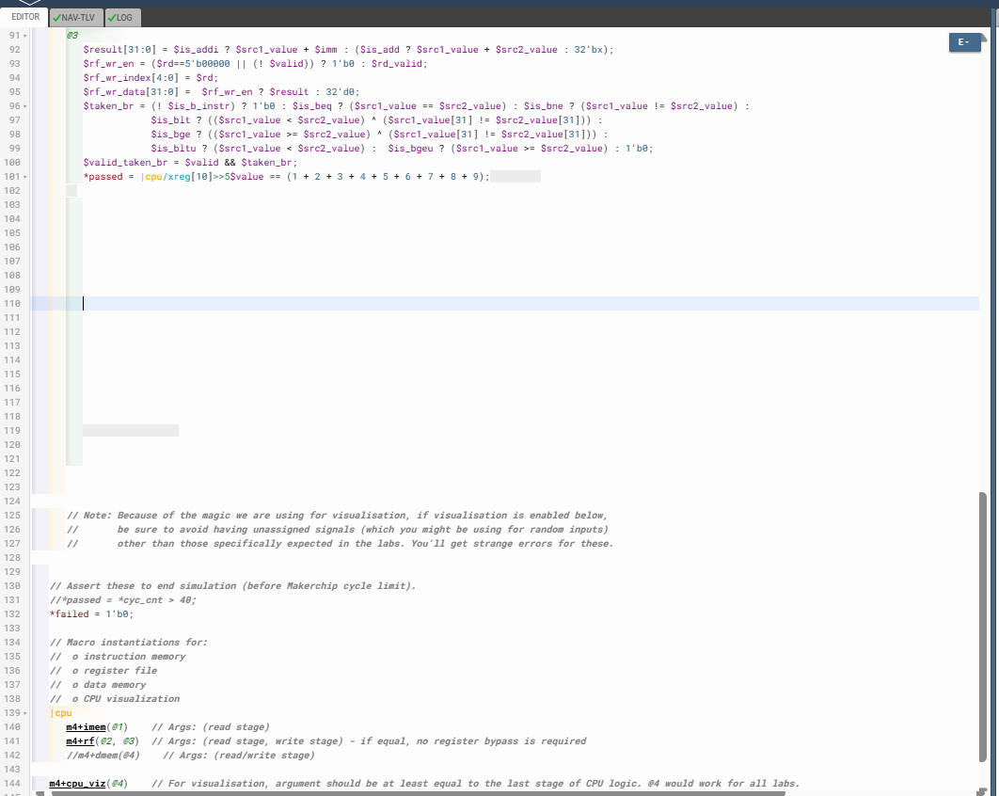

# 54-Cycle_RISC-V_To_Take_Care_Of_Invalid_Cycles

## Overview

This lecture converts the previously working single/dual-stage RISC-V CPU into a 3-cycle pipelined processor.
The primary focus is on introducing instruction validity tracking, handling invalid pipeline slots, and correctly aligning inter-stage dependencies across a deeper pipeline.

The lecture focuses on:

- 3-cycle instruction cadence
- pipeline validity management
- invalid instruction suppression
- multi-cycle PC redirection
- branch validity handling
- register file write protection
- inter-stage dependency alignment
- pipeline timing correctness
- control-flow hazard alignment
- deeper pipeline execution

This lecture is the first major transition from a simple sequential pipeline into a properly timed pipelined CPU architecture.

---

# Core Pipeline Change

Earlier, instructions flowed continuously every cycle. Now, the CPU introduces a 3-cycle cadence using:
```text
$valid
```
This validity token determines whether the current pipeline slot actually contains a real instruction.

---

# Major Architectural Changes

## Valid Signal Injection

A new validity token is introduced:
```text
$start = $reset ? 1'b0 : (>>1$reset) ? 1'b1 : 1'b0;

$valid = $reset ? 1'b0 :
         $start ? 1'b1 :
         (>>3$valid);
```
This creates a repeating valid pulse every 3 cycles because one instruction now takes 3 cycles to complete execution. So instead of an instruction every cycle the CPU now operates as:
```text
Valid → Invalid → Invalid → Valid
```

## Updated PC logic:
```text
$pc[31:0] =
   (>>1$reset) ? 32'd0 :
   (>>3$valid_taken_br) ? (>>3$br_tgt_pc) :
   (>>3$pc + 32'd4);
```
Earlier PC updates used:
```text
>>1
```
because the next instruction arrived one cycle later. Now the pipeline depth is 3 cycles.

## Branch Validity Protection

Invalid instructions must never redirect the PC. So branch logic is upgraded from:
```text
$taken_br
```
to:
```text
$valid_taken_br = $valid && $taken_br;
```
We do so because an invalid pipeline slot might accidentally decode as a branch instruction. Without validity protection:

- garbage instructions could redirect the PC
- pipeline control would corrupt
- execution would fail

## Register File Write Protection

Invalid instructions must never modify architectural state. So RF write enable becomes:
```text
$rf_wr_en =
   ($rd==5'b00000 || (! $valid))
      ? 1'b0
      : $rd_valid;
```

## Branch Target Timing Alignment

Branch target generation now feeds forward across 3 stages:
```text
$br_tgt_pc[31:0] = $pc + $imm;
```
and is consumed using:
```text
>>3$br_tgt_pc
```
This aligns branch resolution timing with the deeper pipeline.

## Pipeline Timing Perspective

The instruction now behaves like:
```text
Cycle 1 → Fetch
Cycle 2 → Decode/Register Read
Cycle 3 → Execute/Writeback
```
Therefore:

- results appear later
- branches resolve later
- dependencies must shift further ahead

## Invalid Instructions

Two out of every three pipeline slots are intentionally invalid.

These invalid slots:

- must not write RF
- must not redirect PC
- must not affect architectural state

This is the first exposure to real pipeline bubble management.

## Result

After these changes:

- the loop executes correctly
- x10 accumulates the sum properly
- branches work with proper timing
- the testbench finally passes





[Click Here To Open the entire implementation of Pipelined CPU using Valid in Makerchip](https://makerchip.com/v132/ide/~0ADf9hjY/p-0Vmh2r)

---

# Key Learning Outcomes

After this lecture, the learner understands:

- deep pipeline timing
- multi-cycle dependencies
- validity tracking
- branch timing alignment
- architectural state protection
- invalid instruction handling
- inter-stage synchronization
- control hazard timing
- pipelined execution cadence

This lecture establishes the foundation for scalable pipelined CPU design.
