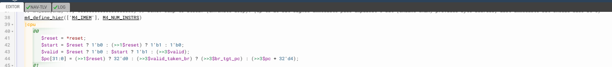
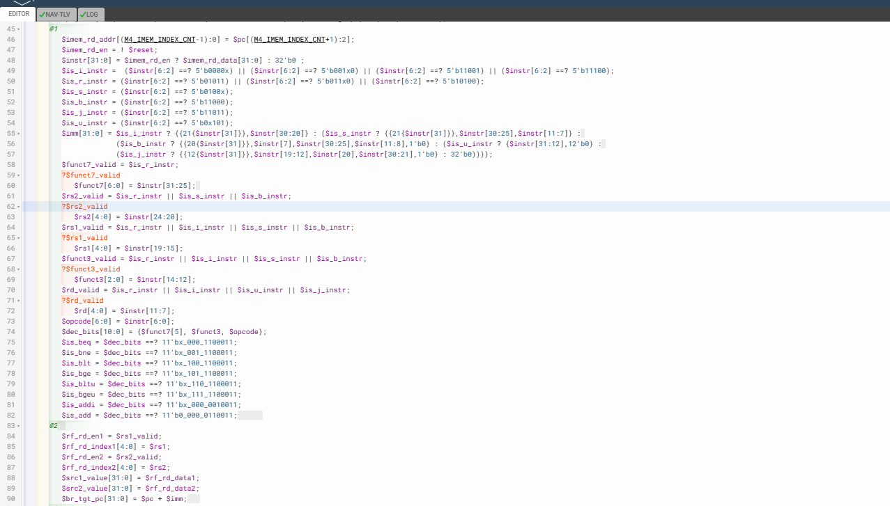
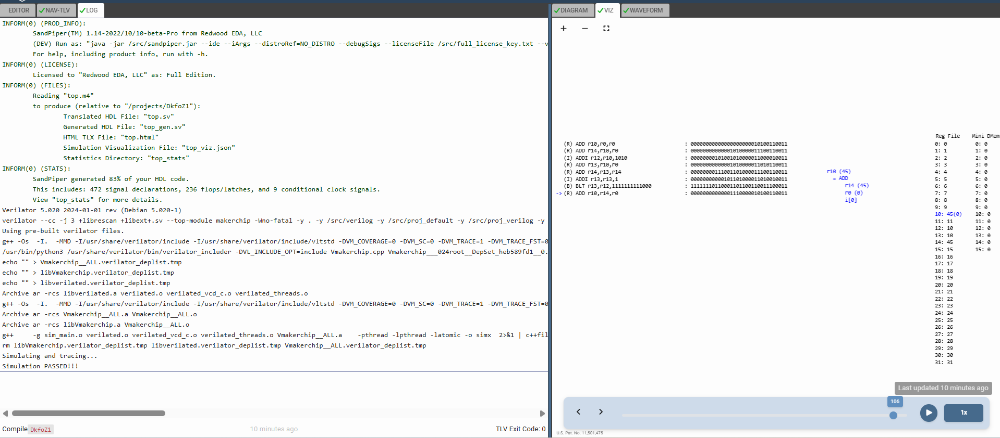

# 55-Cycle_RISC-V_To_Distribute_Logic

## Overview

This lecture reorganizes the CPU logic into a properly partitioned 3-cycle pipeline structure.

The lecture focuses on:

- pipeline stage partitioning
- logic redistribution
- execution stage organization
- register file timing placement
- inter-stage dependency movement
- pipeline readability
- multi-stage execution flow
- staged datapath organization

The CPU datapath is now distributed across:

| Stage | Function |
| --- | --- |
| `@0` | PC generation |
| `@1` | Fetch + Decode |
| `@2` | Register File Read |
| `@3` | Execute + Register Write |

---

# Important Note

Most of the implementation for this lecture was already completed in the previous lecture while debugging and stabilizing the 3-cycle CPU pipeline.

This lecture mainly formalizes:
- stage partitioning
- logic redistribution
- RF macro timing alignment

rather than introducing entirely new functionality.

Refer to the link below for documentation and explanations of the screenshots of TLV code and simulation:
[54-Cycle RISC-V To Take Care Of Invalid Cycles](day5/54-Cycle_RISC-V_To_Take_Care_Of_Invalid_Cycles.md)








[Click Here To Open the entire implementation of Pipelined CPU using Valid in Makerchip](https://makerchip.com/v132/ide/~0ADf9hjY/p-0Vmh2r)

---

# Dependency Alignment

The register file now creates an effective:
```
>>2
```
instruction dependency.

This means results written by one instruction become visible to another instruction two cycles later. The workshop mentions that:
```text
>>1, >>2 and >>3
```
become functionally equivalent for this specific design. This is because only one instruction is valid every three cycles. So even though the register file update happens later the next two pipeline slots are invalid, therefore no real instruction attempts to consume stale data. This naturally avoids RAW (Read After Write) hazards.

---

# Result

After repartitioning:

- the CPU maintains correct execution
- pipeline timing becomes cleaner
- inter-stage dependencies become properly aligned

# Key Learning Outcomes

After this lecture, the learner understands:

- datapath partitioning
- stage-based execution organization
- multi-cycle timing alignment
- pipelined logic structuring
- RF timing placement
- staged CPU architecture

This lecture establishes the structural organization of the pipelined RISC-V CPU.