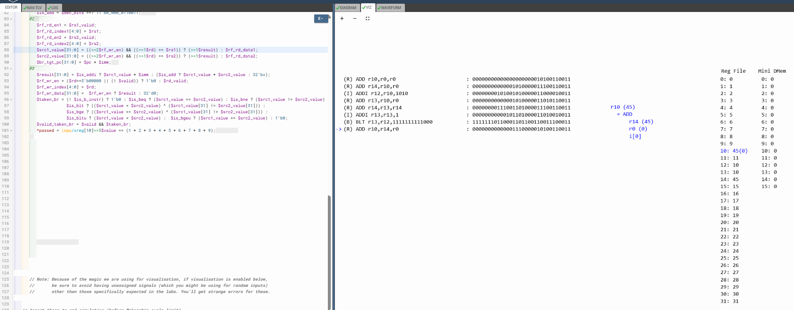

# 56-After-Wr_Hazard

## Overview

This lecture upgrades the pipelined RISC-V CPU to support future back-to-back instruction execution by solving the Read After Write (RAW) hazard using register bypassing.

The lecture focuses on:

- RAW hazard handling
- register bypassing
- ALU result forwarding
- dependency hazard resolution
- register file timing correction
- operand forwarding muxes
- inter-instruction dependencies
- back-to-back execution support
- bypass path generation
- hazard-aware datapath design

This lecture introduces one of the most fundamental optimization techniques used in pipelined processors.

---

# Problem Being Solved

The current CPU still operates with a:
```text
Valid → Invalid → Invalid
```
execution cadence. However, the next goal is to support:
```text
Valid → Valid → Valid
```
continuous instruction execution. This immediately creates a hazard.

---

# The RAW Hazard

Suppose:
```text
Instruction 1:
add x5, x1, x2
```
```text
Instruction 2:
add x6, x5, x3
```
Instruction 2 needs the updated value of x5. But,the register file has not yet been updated. This creates a Read After Write (RAW) Hazard.

---

# Existing Problem

Previously, register reads used:
```text
>>1
```
or equivalent timing assumptions. In a deeper pipeline, the previous instruction has not yet completed RF write, therefore the RF contains stale data.

---

# Key Architectural Change

The lecture removes direct dependency on previous instruction RF write and replaces it with ALU result bypassing.

---

# Register File Timing Update

The register file read path is now shifted further back:
```text
>>2
```
This means normal RF reads observe architectural state from two instructions earlier.

---

# Source Operand Muxes

The ALU source operands now come from muxes instead of directly from the register file. The mux selects between:
| Source              | Condition               |
| ------------------- | ----------------------- |
| RF read value       | normal case             |
| previous ALU result | RAW dependency detected |

---

# Hazard Detection Logic

The bypass path is selected when:
```text
Previous destination register == Current source register
```
and previous instruction actually writes RF.

---

# New Dependency Structure

Earlier:
```text
RF Write → RF Read
```
Now:
```text
Previous ALU Result → Current ALU
```
This significantly reduces dependency latency.

---

# Important Observation

At this stage, the CPU still operates with 3-cycle valid spacing, therefore the bypass path is not yet actively exercised. The lecture intentionally introduces the hardware first, continuous execution later. This allows debugging the bypass network independently.

# Register Bypass Logic

A new bypass path is introduced from Previous instruction ALU result directly into current instruction ALU input. This bypass avoids waiting for the RF write.

---

[Click Here To Open the RAW Hazard Prevention implementation using Register Bypassing in Makerchip](https://makerchip.com/v132/ide/~0ADf9hjY/p-0Vmh2r)



---

# Key Learning Outcomes

After this lecture, the learner understands:

- RAW hazards
- register forwarding
- ALU bypass networks
- operand muxing
- hazard-aware datapaths
- RF timing separation
- inter-instruction dependencies
- forwarding-based optimization
- pipelined performance enhancement

This lecture establishes the foundation for high-throughput pipelined execution.
