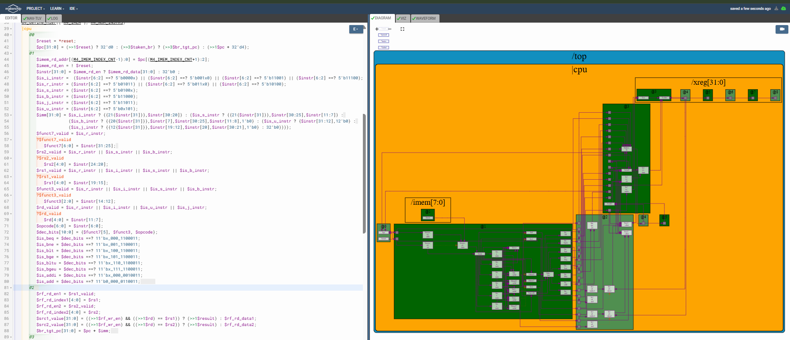
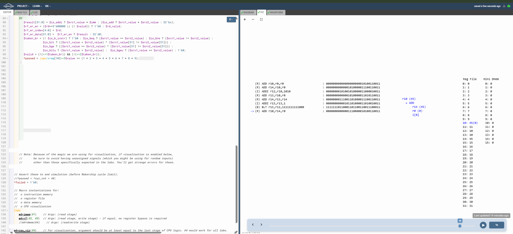

# 57-RV_D5SK2_L2_Lab_For_Branches_To_Correct_The_Branch_Target_Path

## Overview

This lecture upgrades the RISC-V CPU from an artificially spaced 3-cycle execution model into a near continuous pipelined processor with dynamic branch hazard handling. The lecture focuses on:

- branch hazard handling
- speculative execution
- branch flushing
- valid signal generation
- branch penalties
- pipeline recovery
- control-flow correction
- branch shadow invalidation
- near single-cycle throughput
- register bypass integration

This lecture removes the earlier forced:
```text
Valid → Invalid → Invalid
```
instruction cadence and allows the CPU to execute instructions almost every cycle.

---

# Major Changes Introduced

## Continuous PC Progression

Earlier, the PC increment path used:
```text
>>3$pc
```
because valid instructions only appeared every third cycle. Now the CPU executes instructions nearly every cycle, so the PC loop becomes:
```text
>>1$pc
```
Updated PC logic:
```text
$pc[31:0] =
   (>>1$reset) ? 32'd0 :
   (>>3$taken_br) ? (>>3$br_tgt_pc) :
   (>>1$pc + 32'd4);
```
This enables continuous instruction fetch.

## Dynamic Valid Signal Generation

The old periodic valid generation logic was removed completely. Instead, validity is now dynamically determined using branch activity:
```text
$valid = (!(>>1$taken_br)) && (!(>>2$taken_br));
```
This suppresses invalid branch-shadow instructions.

## Branch Hazard Resolution

The CPU now speculatively executes sequential instructions using:
```text
PC + 4
```
until branch resolution completes. When a taken branch is detected, the next two instructions are invalidated, execution redirects to the correct branch target. This introduces a 2-cycle branch penalty for taken branches.

## Register Bypass Logic Activation

Earlier pipeline spacing naturally avoided most RAW hazards. Now back-to-back execution requires true forwarding support. Register bypass logic was added:
```text
$src1_value[31:0] =
   ((>>1$rf_wr_en) && ((>>1$rd) == $rs1))
      ? (>>1$result)
      : $rf_rd_data1;
```
and similarly for $src2_value. This allows dependent instructions to immediately consume freshly computed results before register file writeback completes.

## Real Pipeline Partitioning

The processor logic is now fully partitioned into pipeline stages:
| Stage | Function                |
| ----- | ----------------------- |
| `@0`  | PC generation           |
| `@1`  | Fetch + Decode          |
| `@2`  | Register File Read      |
| `@3`  | ALU + Branch + RF Write |

## Branch Shadow Instructions

While a branch is being resolved, later instructions already enter the pipeline. These are called Branch Shadow Instructions. If the branch is taken, these instructions become invalid,
and are flushed using the valid suppression logic.

---

# Result

The CPU now successfully:

- executes continuously
- handles RAW hazards
- resolves branches correctly
- flushes invalid instructions
- still produces the correct final sum:
```text
x10 = 45
```





[Click Here To Open the implementation in Makerchip](https://makerchip.com/v132/ide/~0ADf9hjY/p-0Y6hDy)

---

# Key Learning Outcomes

After this lecture, the learner understands:

- control hazards
- speculative execution
- branch penalties
- pipeline flushing
- dynamic validity control
- register forwarding
- RAW hazard handling
- branch recovery
- realistic pipelined execution

This lecture establishes a functioning near single-cycle throughput pipelined RISC-V CPU.