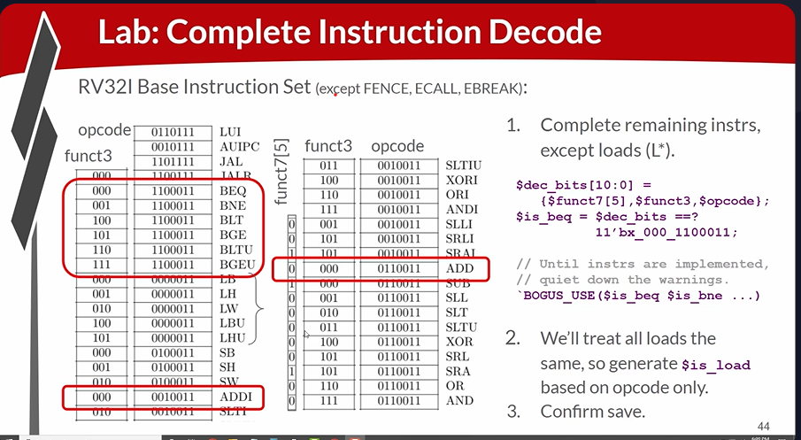
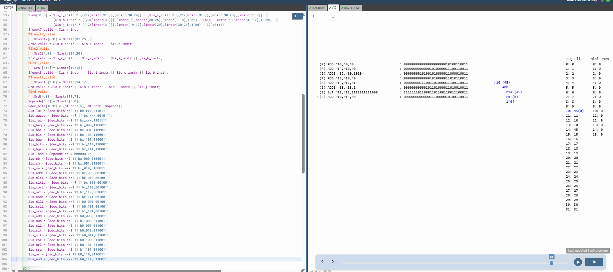

# 58-RV_D5SK2_L3_Lab_To_Complete_Instruction_Decode_Except_Fence_Ecall_Ebreak

## Overview

This lecture completes the remaining instruction decode logic for the RV32I base instruction set. The lecture focuses on:

- remaining arithmetic instructions decode
- logical instruction decode
- shift instruction decode
- comparison instruction decode
- store instruction decode
- load instruction grouping
- opcode + funct3 + funct7 decoding
- decode signal expansion

This lecture extends the processor from supporting only a minimal test-program subset to supporting almost the complete RV32I ISA.

---

# Main Addition

Previously, only a few instructions were decoded:

- add
- addi
- branch instructions

This lecture adds decode support for:

- stores
- logical operations
- comparisons
- shifts
- remaining arithmetic instructions

---

# Load Simplification

Instead of decoding all load variants separately, the workshop simplifies them into a single signal:
```text
$is_load = $opcode == 7'b0000011;
```
All loads are temporarily treated identically.

---





[Click Here To Open the implementation in Makerchip](https://makerchip.com/v132/ide/~0ADf9hjY/p-0Y6hDy)

---

# Key Learning Outcomes

After this lecture, the learner understands:

- large-scale instruction decoding
- RV32I opcode organization
- funct3/funct7 usage
- compact decode construction
- wildcard decode matching
- ISA-driven hardware decode logic

