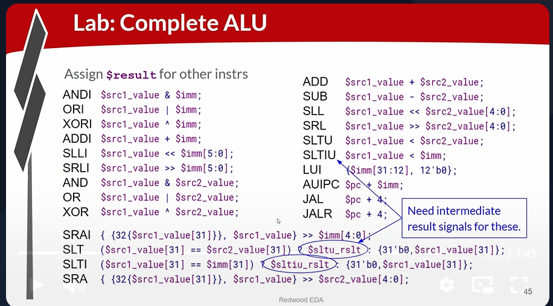
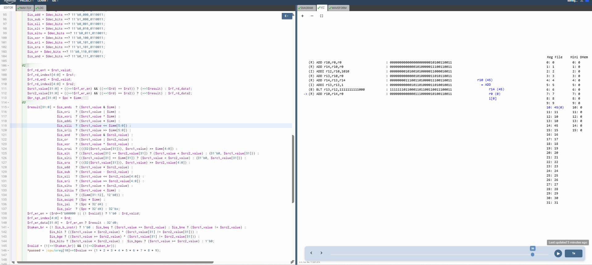

# 59-RV_D5SK2_L4_Lab_To_Code_Complete_ALU

Overview

This lecture completes the Arithmetic Logic Unit (ALU) implementation for the remaining concerned RV32I instructions.

The lecture focuses on:

- complete ALU functionality for concerned instructions
- arithmetic operations
- logical operations
- comparison operations
- shift operations
- immediate instruction execution
- register-register operations
- ALU result selection

This lecture extends the ALU from supporting only a few instructions (ADD, ADDI) into supporting the complete concerned RV32I instruction set.

---

# Verilog Operator Mapping

Most RV32I instructions directly map onto native Verilog operators:
| Operation   | Verilog Operator |   |
| ----------- | ---------------- | - |
| Add         | `+`              |   |
| Subtract    | `-`              |   |
| AND         | `&`              |   |
| OR          | `Pipe operator`  |   |
| XOR         | `^`              |   |
| Shift Left  | `<<`             |   |
| Shift Right | `>>`             |   |

---

[Click Here To Open the implementation in Makerchip](https://makerchip.com/v132/ide/~0ADf9hjY/p-0Y6hDy)

---

# Key Learning Outcomes

After this lecture, the learner understands:

- ALU construction
- instruction execution logic
- Verilog operator mapping
- shift implementations
- comparison implementations
- ISA-driven datapath behavior
- ALU result selection

