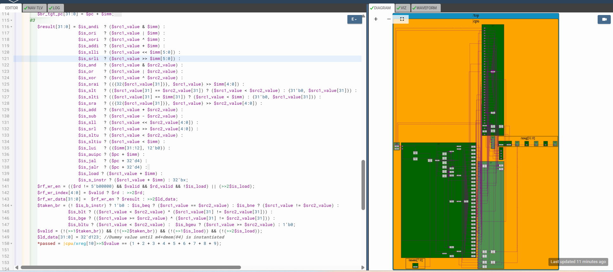

# 61-RV_D5SK3_L2_Lab_To_Load_Data_From_Memory_To_Register_File

## Overview

This lecture completes the load instruction pipeline by implementing delayed load data writeback into the register file.

The lecture focuses on:

- delayed load writeback
- load data routing
- RF writeback muxing
- delayed destination register propagation
- delayed RF write enable
- load replay timing
- memory-return synchronization

Previously, the CPU only:

- created load shadows
- replayed the PC
- invalidated dependent instructions

This lecture now actually writes the returned load data into the architectural register file.

---

# Major Code Additions

## Load/Store Address Generation Added To ALU

Loads and stores now compute memory addresses using:
```text
$is_load ? ($src1_value + $imm) :
$is_s_instr ? ($src1_value + $imm) :
```
The ALU is now reused for:

- arithmetic
- memory addressing

## RF Writeback Data Mux Added

```text
$rf_wr_data[31:0] =
   $rf_wr_en ? $result :
   >>2$ld_data;
```

## Delayed RF Write Enable Added

To allow load instructions to write RF two cycles later after memory data returns.

## Delayed Destination Register Propagation

The destination register index must also be delayed. The RF write index path now supports:
```text
>>2$rd
```
so that the load data is written into the correct architectural register.

## Load Shadow Timing Fully Utilized

The earlier load shadow mechanism now becomes meaningful:
```text
Load
↓
2 invalid cycles
↓
Memory data return
↓
Delayed RF writeback
```
The invalid cycles provide time for:

- memory latency,
- data return,
- RF synchronization.

---



[Click Here To Open the implementation in Makerchip](https://makerchip.com/v132/ide/~0ADf9hjY/p-0Y6hDy)

---

# Hardware Perspective

The processor now supports:

- load address generation
- delayed load replay
- delayed RF update
- memory-return writeback timing

This transforms the CPU from ALU-only execution into memory-based execution.

---

# Key Learning Outcomes

After this lecture, the learner understands:

- delayed writeback
- memory-return synchronization
- RF writeback muxing
- delayed control propagation
- load replay timing
- load-to-register transfer
