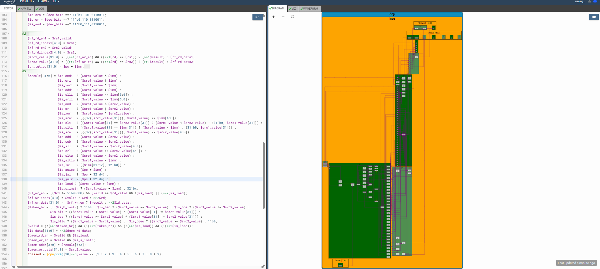

# 62-RV_D5SK3_L3_Lab_To_Instantiate_Data_Memory_To_The_CPU

## Overview

This lecture integrates an actual data memory (DMEM) into the RISC-V CPU pipeline. The lecture focuses on:

- DMEM instantiation
- load/store memory hookup
- memory address indexing
- store data routing
- memory read/write enables
- real load-data return path
- memory-backed load execution

Previously, load used:

- dummy load data
- placeholder value
- and replay logic only 

This lecture connects the CPU to a real memory structure.

---

# Major Code Additions

## DMEM Macro Instantiation

The data memory macro is enabled:
```text
m4+dmem(@4)
```
This provides:

- 16-entry memory
- 32-bit word storage
- single read/write operation per cycle

## DMEM Read Enable Added

Loads now trigger memory reads:
```text
$dmem_rd_en = $valid && $is_load;
```
Only valid load instructions access memory.

## DMEM Write Enable Added

Stores now trigger memory writes:
```text
$dmem_wr_en = $valid && $is_s_instr;
```
Only valid store instructions modify memory.

## Memory Address Hookup Added

The ALU-generated address is now connected to DMEM:
```text
$dmem_addr[3:0] = $result[5:2];
```
Memory is word-addressed, lower two bits [1:0] are ignored, bits [5:2] select one of 16 words.

## Store Data Path Added

Store instructions now write:
```text
$dmem_wr_data[31:0] = $src2_value;
```
RS2 becomes the store payload.

## Dummy Load Data Removed

Earlier:
```text
$ld_data = 32'd123;
```
was used temporarily. Now replaced with:
```text
$ld_data[31:0] = >>2$dmem_rd_data;
```
The load data now comes from actual memory.

## Existing Delayed Load Writeback Reused

The earlier RF writeback mux remains unchanged:
```text
$rf_wr_data =
   $rf_wr_en ? $result :
   >>2$ld_data;
```
The load shadow mechanism now works with real memory-returned data.

---

# Result

The CPU now supports:

- real memory reads
- real memory writes
- functional loads
- functional stores
- memory-backed register updates

This transforms the processor into a memory-access capable custom RV32I CPU.



[Click Here To Open the implementation in Makerchip](https://makerchip.com/v132/ide/~0ADf9hjY/p-0Y6hDy)

---

# Key Learning Outcomes

After this lecture, the learner understands:

- DMEM integration
- load/store hookup
- word-addressed memories
- memory interface signaling
- memory-backed load execution
- store data routing

This lecture completes the memory subsystem integration for the RISC-V CPU.