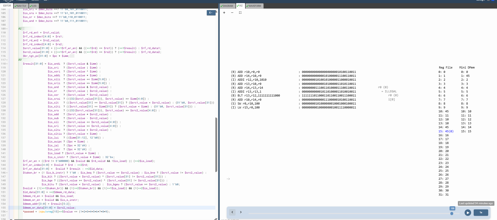

# 63-RV_D5SK3_L4_Lab_To_Add_Stores_And_Loads_To_The_Test_Program

## Overview

This lab extends the existing RISC-V test program to verify the correctness of:

- store instructions
- load instructions
- data memory writes
- data memory reads
- load replay/writeback
- load shadow handling
- delayed register file updates

The CPU previously verified only arithmetic and branch execution. This lab now validates the complete load-store datapath.

---

# # Changes Made To The Test Program

Two instructions were added after loop completion:

```assembly
m4_asm(SW, r0, r10, 100)
m4_asm(LW, r15, r0, 100)
```

---

# Store Instruction

```assembly
SW r0, r10, 100
```
Stores the final summation result into data memory.
```text
Address = r0 + 100
```
Since:
```text
r0 = 0
```
the memory address becomes:
```text
100 (binary) = 4 (decimal)
```
The mini data memory uses word indexing:
```text
Address Index = Address[5:2]
              = 4 >> 2
              = 1
```
Therefore:
```text
Mini DMem[1] = 45
```

---

# Load Instruction

```assembly
LW r15, r0, 100
```
Loads the stored value back from memory into register r15. This verifies:

- memory read path
- delayed load replay
- register file writeback after load
- load shadow cycles
- load hazard handling

---

# Updated Pass Condition

The pass condition was updated to monitor r15 instead of r10. Previous:
```text
*passed = |cpu/xreg[10]>>5$value == 45;
```
Updated:
```text
*passed = |cpu/xreg[15]>>5$value == 45;
```
This ensures the test only passes if:

- the summation loop completed correctly
- the store succeeded
- the load succeeded
- the loaded value was written back properly

---

# Load Shadow Behavior

The load instruction introduces two invalid pipeline slots while memory data returns. During these cycles:

- invalid instructions appear in visualization
- the pipeline waits for memory data
- delayed writeback logic updates r15

---



[Click Here To Open the implementation in Makerchip](https://makerchip.com/v132/ide/~0ADf9hjY/p-0Y6hDy)


---

# Key Learning Outcome

After this lab, the learner understands:

- store operations
- load operations
- effective address generation
- memory indexing
- delayed load writeback
- load replay logic
- load shadow cycles
- memory-to-register datapaths

This lab validates the complete load-store functionality of the CPU.

