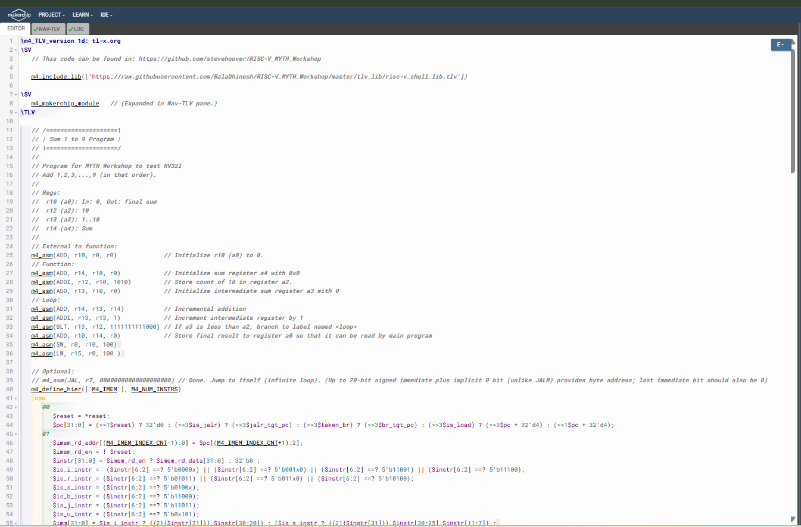
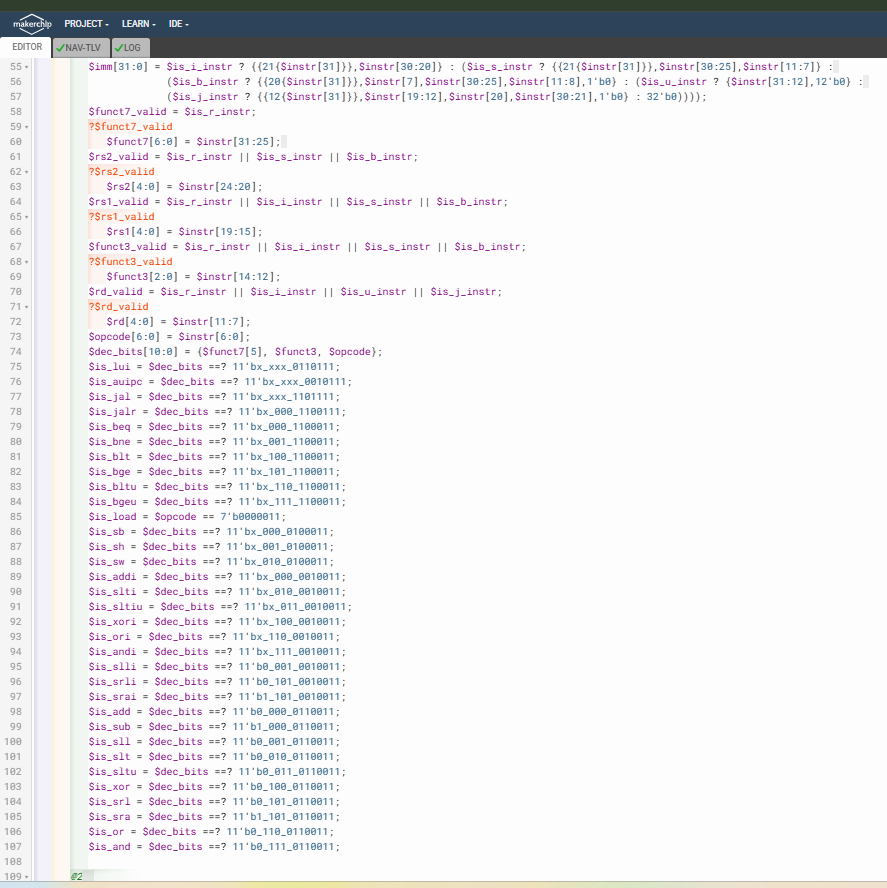
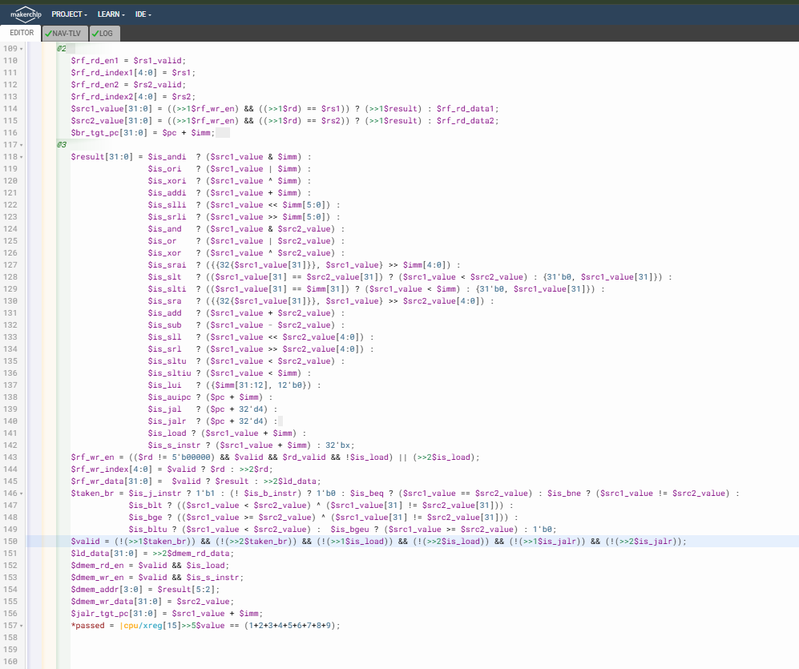
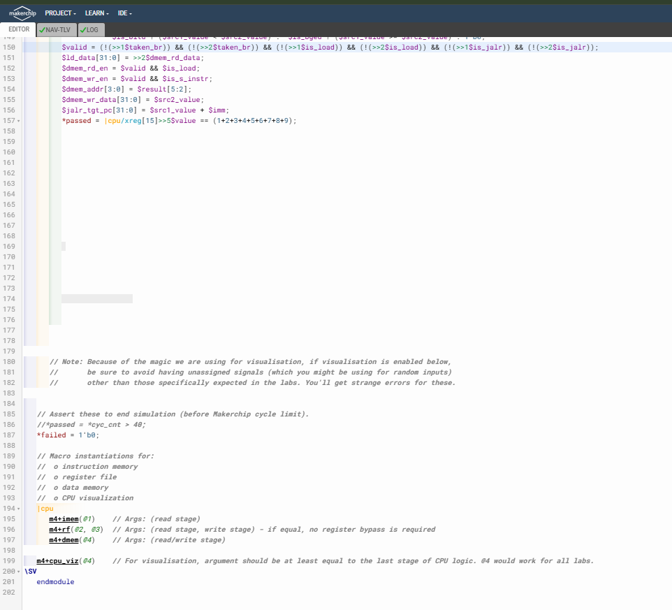
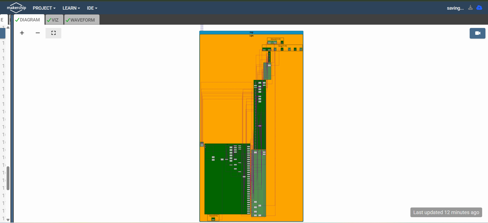
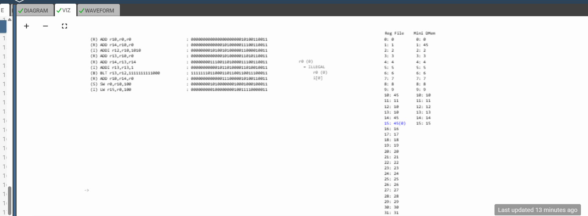
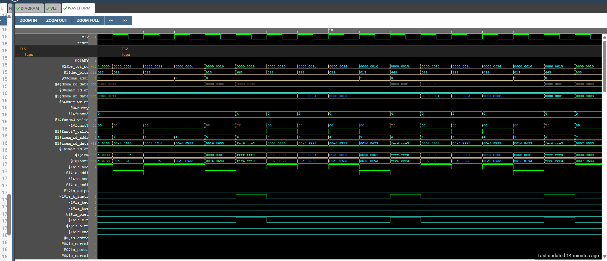
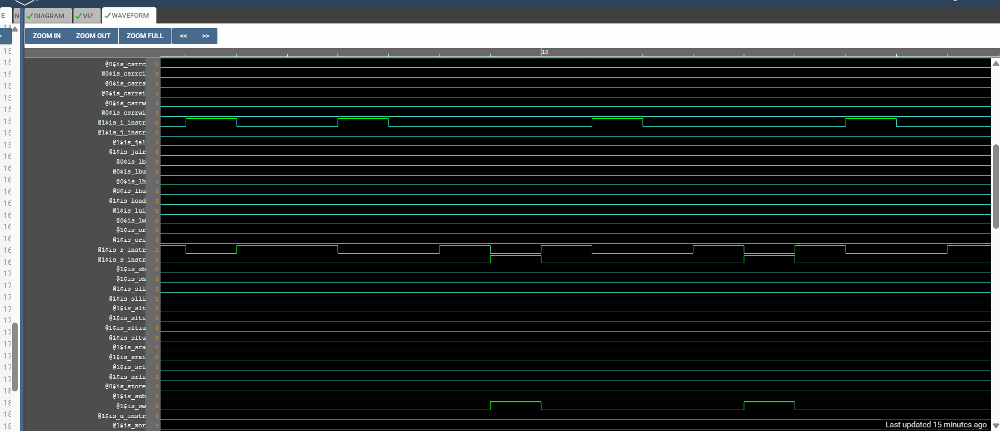
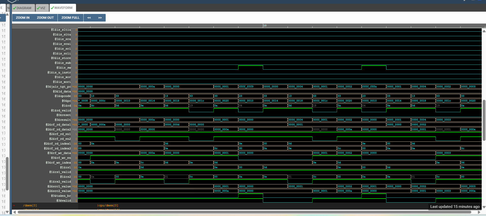

# 65-RV_D5SK3_L6_Wrap_Up

## Overview 

This was wrap up lecture that concluded the RISC-V MYTH workshop journey.

---

# Important Takeaways

The lecture emphasizes:

- modern open-source hardware ecosystems
- timing-abstract hardware design
- repipelining flexibility in TL-Verilog
- industry relevance of RISC-V
- advanced hardware design methodologies

---

# Key Learning Outcome

The workshop concludes with detailed understanding of:

- RV32I CPU construction
- pipelined processor design
- TL-Verilog methodology
- hardware/software co-design fundamentals

---

# Screenshots And MakerChip Link

[Click Here To Open the Custom RV32I CPU implementation in Makerchip](https://makerchip.com/v132/ide/~0ADf9hjY/p-0Y6hDy)